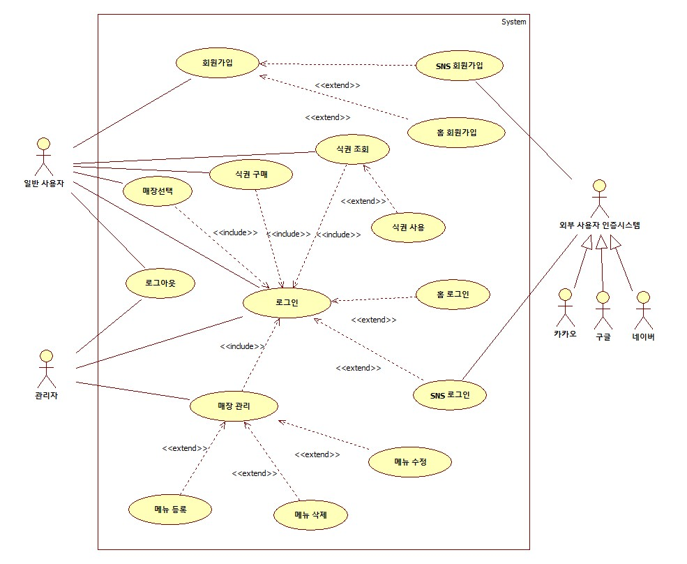

유스케이스 다이어그램은 요구사항 분석 단계에서 사용할 수 있는 다이어그램 중 하나다. 이는 사용자의 관점에서 사용할 수 있는 기능을 분석하며, 구현해야 할 기능을 구체화하는데 활용할 수 있다.

아래는 “Yummy Pass”의 시스템에 존재하는 15개의 유스케이스를 구체화한 명세서이다. 

- 전 단계에서 발생 가능한 서버와의 통신 오류, 네트워크 오류는 Extension Scenario에 포함하지 않았다.
- Extension Scenario에는 특정 유스케이스에서만 발생할 수 있는 사항을 작성하였다.

---

### **Use case #1 : Sign up**

| **GENERAL CHARACTERISTICS** |  |
| --- | --- |
| **Summary** | Yummy Pass를 이용하기 위해 회원 가입을 한다. |
| **Scope** | YP(Yummy Pass) |
| **Level** | User level |
| **Author** | 이연수 |
| **Last Update** | 2025. 10. 27. |
| **Status** | Analysis |
| **Primary Actor** | 사용자 |
| **Preconditions** | YP를 이용하기 위하여 서비스에 접속한 상태이며, 서비스의 데이터베이스에 회원 정보가 등록되지 않은 사용자여야 한다. |
| **Trigger** | 메인 화면에서 회원 가입 버튼을 클릭한다. |
| **Success Post Condition** | 로그인할 때 회원 가입에서 등록한 정보를 토대로 YP 서비스에 로그인할 수 있다. |
| **Failed Post Condition** | 사용자는 로그인이 불가능하며 YP 서비스를 이용할 수 없다. |
| **MAIN SUCCESS SCENARIO** |  |
| **Step** | **Action** |
| S | 사용자가 회원 가입 페이지에 접근한다. |
| 1 | 사용자는 홈 회원 가입, SNS 회원 가입 중 한 가지를 선택한다. |
| 2 | 사용자는 자신이 선택한 회원 가입을 한다. |
| **EXTENSION SCENARIOS** |  |
| **Step** | **Branching Action** |
|  |  |
| **RELATED INFORMATION** |  |
| **Performance** | ≤ 2 seconds |
| **Frequency** | Variable (사용자당 1번으로 예상하나 본인이 입력한 정보를 잊은 경우 횟수가 증가할 가능성이 있음) |
| **<Concurrency>** | None |
| **Due Date** | 2025.11.03. |

---

### **Use case #2 : Home sign up**

| **GENERAL CHARACTERISTICS** |  |
| --- | --- |
| **Summary** | Yummy Pass를 이용하기 위해 홈 회원 가입을 한다. |
| **Scope** | YP(Yummy Pass) |
| **Level** | User level |
| **Author** | 이연수 |
| **Last Update** | 2025. 10. 27. |
| **Status** | Analysis |
| **Primary Actor** | 사용자 |
| **Preconditions** | YP를 이용하기 위하여 서비스에 접속한 상태이며, 서비스의 데이터베이스에 회원 정보가 등록되지 않은 사용자여야 한다. |
| **Trigger** | 회원 가입 페이지에서 “홈 회원 가입” 항목을 선택해야 한다. |
| **Success Post Condition** | 로그인할 때 홈 회원 가입에서 등록한 정보를 토대로 YP 서비스에 로그인할 수 있다. |
| **Failed Post Condition** | 사용자는 로그인이 불가능하며 YP 서비스를 이용할 수 없다. |
| **MAIN SUCCESS SCENARIO** |  |
| **Step** | **Action** |
| S | 사용자가 회원 가입 페이지에서 홈 회원 가입을 선택한다. |
| 1 | 사용자가 회원 가입에 필요한 정보를 작성한다. |
| 2 | 시스템은 데이터베이스에서 이 사용자가 입력한 정보를 확인하고, 존재하지 않으면 회원으로 신규 등록한다. |
| 3 | 시스템은 사용자의 회원 가입이 완료되었음을 알리는 메시지를 출력한다. |
| 4 | 시스템은 사용자를 메인 페이지로 이동시킨다. |
| **EXTENSION SCENARIOS** |  |
| **Step** | **Branching Action** |
| 1 | 1-(가). 사용자가 올바르지 않은 양식의 정보를 입력한다.     1-(가)-1. 시스템은 사용자에게 양식에 맞춰 작성해야 함을 알린다.     1-(가)-2. 사용자는 양식에 맞추어 정보를 다시 입력한다. |
| 2 | 2-(가). 입력한 정보가 데이터베이스에 이미 존재할 경우, 시스템이 이를 사용자에게 알린다.     2-(가)-1. 사용자는 새로운 정보를 활용하거나, 존재하는 정보로 로그인을 할 수 있다. |
| **RELATED INFORMATION** |  |
| **Performance** | ≤ 2 seconds |
| **Frequency** | Variable (사용자당 1번으로 예상하나 본인이 입력한 정보를 잊은 경우 횟수가 증가할 가능성이 있음) |
| **<Concurrency>** | None |
| **Due Date** | 2025.11.03. |

---

### **Use case #3 : SNS sign up**

| **GENERAL CHARACTERISTICS** |  |
| --- | --- |
| **Summary** | Yummy Pass를 이용하기 위해 SNS 회원 가입을 한다. |
| **Scope** | YP(Yummy Pass) |
| **Level** | User level |
| **Author** | 이연수 |
| **Last Update** | 2025. 10. 27. |
| **Status** | Analysis |
| **Primary Actor** | 사용자 |
| **Preconditions** | YP를 이용하기 위하여 서비스에 접속한 상태이며, 서비스의 데이터베이스에 회원 정보가 등록되지 않은 사용자여야 한다. |
| **Trigger** | 회원 가입 페이지에서 “SNS 회원 가입” 항목을 선택해야 한다. |
| **Success Post Condition** | 로그인할 때 “SNS 로그인” 버튼을 클릭해 로그인할 수 있다. |
| **Failed Post Condition** | 사용자는 로그인이 불가능하며 YP 서비스를 이용할 수 없다. |
| **MAIN SUCCESS SCENARIO** |  |
| **Step** | **Action** |
| S | 사용자가 회원 가입 페이지에서 SNS 회원 가입을 선택한다. |
| 1 | 사용자가 원하는 외부 채널을 선택해 회원 가입을 시도한다. |
| 2 | 시스템은 외부 시스템에 사용자의 정보를 요청한다. |
| 3 | 외부 시스템에서 시스템에 사용자의 정보를 반환한다. |
| 4 | 사용자는 전화번호를 입력받는 페이지로 이동한다. |
| 5 | 사용자는 전화번호를 입력한다. |
| 6 | 시스템은 반환된 정보를 토대로 데이터베이스를 확인하고, 사용자에 대한 정보가 존재하지 않으면 회원으로 신규 등록한다. |
| 7 | 사용자는 인증 과정을 마치고 메인 페이지로 이동한다. |
| **EXTENSION SCENARIOS** |  |
| **Step** | **Branching Action** |
| 2 | 2-(가). 반환된 정보가 데이터베이스에 이미 존재할 경우, 시스템이 이를 사용자에게 알린다.     2-(가)-1. 사용자는 새로운 정보를 활용하거나, 존재하는 정보로 로그인을 할 수 있다. |
| **RELATED INFORMATION** |  |
| **Performance** | ≤ 2 seconds |
| **Frequency** | Variable (사용자당 1번으로 예상하나 본인이 입력한 정보를 잊은 경우 횟수가 증가할 가능성이 있음) |
| **<Concurrency>** | None |
| **Due Date** | 2025.11.03. |

---

### **Use case #4 : Log in**

| **GENERAL CHARACTERISTICS** |  |
| --- | --- |
| **Summary** | Yummy Pass를 이용하기 위해 로그인을 한다. |
| **Scope** | YP(Yummy Pass) |
| **Level** | User level |
| **Author** | 이연수 |
| **Last Update** | 2025. 10. 27. |
| **Status** | Analysis |
| **Primary Actor** | 사용자 |
| **Preconditions** | YP를 이용하기 위하여 서비스에 접속한 상태이며, 서비스의 데이터베이스에 회원 정보가 등록된 사용자여야 한다. |
| **Trigger** | 메인 페이지에서 로그인 컴포넌트에서 원하는 로그인 방법을 고른다. |
| **Success Post Condition** | 데이터베이스에 저장된 회원 정보와 일치할 경우 로그인에 성공하고, “YP” 서비스를 사용할 수 있다. |
| **Failed Post Condition** | 데이터베이스에 저장된 회원 정보와 일치하지 않을 경우 로그인이 불가능하며 “YP” 서비스를 사용할 수 없다. |
| **MAIN SUCCESS SCENARIO** |  |
| **Step** | **Action** |
| S | 사용자가 메인 페이지에서 로그인 컴포넌트에 접근한다. |
| 1 | 사용자가 원하는 방식의 로그인 방법을 선택한다. |
| 2 | 사용자는 자신이 선택한 방식의 로그인을 진행한다. |
| **EXTENSION SCENARIOS** |  |
| **Step** | **Branching Action** |
|  |  |
| **RELATED INFORMATION** |  |
| **Performance** | ≤ 2 seconds |
| **Frequency** | Variable |
| **<Concurrency>** | None |
| **Due Date** | 2025.11.03. |

---

### **Use case #5 : Home log in**

| **GENERAL CHARACTERISTICS** |  |
| --- | --- |
| **Summary** | Yummy Pass를 이용하기 위해 홈 로그인을 한다. |
| **Scope** | YP(Yummy Pass) |
| **Level** | User level |
| **Author** | 이연수 |
| **Last Update** | 2025. 10. 27. |
| **Status** | Analysis |
| **Primary Actor** | 사용자 |
| **Preconditions** | YP를 이용하기 위하여 서비스에 접속한 상태이며, 서비스의 데이터베이스에 회원 정보가 등록된 사용자여야 한다. |
| **Trigger** | 메인 페이지에서 로그인 컴포넌트에서 홈 로그인 방법을 고른다. |
| **Success Post Condition** | 데이터베이스에 저장된 회원 정보와 일치할 경우 로그인에 성공하고, “YP” 서비스를 사용할 수 있다. |
| **Failed Post Condition** | 데이터베이스에 저장된 회원 정보와 일치하지 않을 경우 로그인이 불가능하며 “YP” 서비스를 사용할 수 없다. |
| **MAIN SUCCESS SCENARIO** |  |
| **Step** | **Action** |
| S | 사용자가 로그인 컴포넌트에서 “홈 로그인” 방식을 선택한다. |
| 1 | 사용자는 로그인에 필요한 정보를 입력한다. |
| 2 | 시스템은 사용자가 데이터베이스에 존재하는 회원인지 확인한다. |
| 3 | 시스템은 데이터베이스에 사용자의 정보가 존재하면 사용자의 로그인 요청을 승인한다. |
| 4 | 홈 로그인에 성공한 사용자는 매장 선택 페이지로 이동한다. |
| **EXTENSION SCENARIOS** |  |
| **Step** | **Branching Action** |
| 1 | 1-(가). 사용자가 올바르지 않은 양식의 정보를 입력한다.     1-(가)-1. 시스템은 사용자에게 양식에 맞춰 작성해야 함을 알린다.     1-(가)-2. 사용자는 양식에 맞추어 정보를 다시 입력한다. |
| 2 | 2-(가). 시스템이 데이터베이스에서 입력된 정보와 일치하는 사용자를 찾을 수 없다.     2-(가)-1. 시스템은 사용자에게 해당하는 정보가 없음을 알린다.     2-(가)-2. 사용자는 회원 가입 페이지로 이동한다. |
| **RELATED INFORMATION** |  |
| **Performance** | ≤ 2 seconds |
| **Frequency** | Variable |
| **<Concurrency>** | None |
| **Due Date** | 2025.11.03. |

---

### **Use case #6 : SNS log in**

| **GENERAL CHARACTERISTICS** |  |
| --- | --- |
| **Summary** | Yummy Pass를 이용하기 위해 SNS 로그인을 한다. |
| **Scope** | YP(Yummy Pass) |
| **Level** | User level |
| **Author** | 이연수 |
| **Last Update** | 2025. 10. 27. |
| **Status** | Analysis |
| **Primary Actor** | 사용자 |
| **Preconditions** | YP를 이용하기 위하여 서비스에 접속한 상태이며, 서비스의 데이터베이스에 회원 정보가 등록된 사용자여야 한다. |
| **Trigger** | 메인 페이지에서 로그인 컴포넌트에서 SNS 로그인 방법을 고른다. |
| **Success Post Condition** | 데이터베이스에 저장된 회원 정보와 일치할 경우 로그인에 성공하고, “YP” 서비스를 사용할 수 있다. |
| **Failed Post Condition** | 데이터베이스에 저장된 회원 정보와 일치하지 않을 경우 로그인이 불가능하며 “YP” 서비스를 사용할 수 없다. |
| **MAIN SUCCESS SCENARIO** |  |
| **Step** | **Action** |
| S | 사용자가 로그인 컴포넌트에서 “SNS 로그인” 방식을 선택한다. |
| 1 | 사용자는 로그인 하고자 하는 채널을 선택한다. |
| 2 | 시스템에서 외부 시스템에 정보를 요청한다. |
| 3 | 외부 시스템은 시스템에게 사용자에 대한 정보를 반환한다. |
| 4 | 시스템이 반환된 정보를 기반으로 데이터베이스에서 “YP”의 회원 여부를 확인하고, 정보가 존재한다면 사용자의 로그인 요청을 승인한다. |
| 5 | SNS 로그인에 성공한 사용자는 “YP” 서비스를 이용할 수 있다. |
| 6 | SNS 로그인에 성공한 사용자는 매장 선택 페이지로 이동한다. |
| **EXTENSION SCENARIOS** |  |
| **Step** | **Branching Action** |
| 4 | 4-(가). 시스템이 데이터베이스에서 반환된 정보와 일치하는 사용자를 찾을 수 없다.     4-(가)-1. 시스템은 사용자에게 해당하는 정보가 없음을 알린다.     4-(가)-2. 사용자는 회원 가입 페이지로 이동한다. |
| **RELATED INFORMATION** |  |
| **Performance** | ≤ 2 seconds |
| **Frequency** | Variable |
| **<Concurrency>** | None |
| **Due Date** | 2025.11.03. |

---

### **Use case #7 : Log out**

| **GENERAL CHARACTERISTICS** |  |
| --- | --- |
| **Summary** | Yummy Pass 서비스 이용을 종료하기 위해 로그아웃 한다. |
| **Scope** | YP(Yummy Pass) |
| **Level** | User level |
| **Author** | 이연수 |
| **Last Update** | 2025. 10. 27. |
| **Status** | Analysis |
| **Primary Actor** | 사용자 |
| **Preconditions** | YP 서비스에 로그인한 사용자여야 한다. |
| **Trigger** | 페이지 상단에 존재하는 로그아웃 버튼을 클릭한다. |
| **Success Post Condition** | 사용자는 로그아웃하고 메인 페이지로 이동한다. |
| **Failed Post Condition** | 사용자는 로그아웃에 실패한다. |
| **MAIN SUCCESS SCENARIO** |  |
| **Step** | **Action** |
| S | 사용자는 YP 서비스 이용을 마치고 로그아웃 버튼을 클릭한다. |
| 1 | 시스템은 사용자의 상태를 로그아웃 시킨다. |
| 2 | 사용자는 메인 페이지로 이동한다. |
| **EXTENSION SCENARIOS** |  |
| **Step** | **Branching Action** |
|  |  |
| **RELATED INFORMATION** |  |
| **Performance** | ≤ 2 seconds |
| **Frequency** | Variable |
| **<Concurrency>** | None |
| **Due Date** | 2025.11.03. |

---

### **Use case #8 : Choose store**

| **GENERAL CHARACTERISTICS** |  |
| --- | --- |
| **Summary** | 사용자는 Yummy pass에서 식권을 구매하기 위해 학식을 먹을 식당을 선택한다. |
| **Scope** | YP(Yummy Pass) |
| **Level** | User level |
| **Author** | 이연수 |
| **Last Update** | 2025. 10. 27. |
| **Status** | Analysis |
| **Primary Actor** | 사용자 |
| **Preconditions** | YP 서비스에 로그인한 사용자여야 한다. |
| **Trigger** | 로그인을 완료한 사용자가 매장 선택 페이지로 이동한다. |
| **Success Post Condition** | 사용자는 선택한 매장의 페이지로 이동하고, 해당 매장에서 제공하는 메뉴를 확인할 수 있다. |
| **Failed Post Condition** | 사용자는 선택한 매장의 페이지로 이동할 수 없다. |
| **MAIN SUCCESS SCENARIO** |  |
| **Step** | **Action** |
| S | 사용자는 로그인에 성공한 시점에서 매장 선택 페이지로 이동한다. |
| 1 | 시스템은 사용자에게 데이터베이스에 존재하는 매장 목록을 보여준다. |
| 2 | 사용자는 시스템이 제공한 매장에서 원하는 매장을 선택한다. |
| 3 | 사용자가 고른 매장의 페이지로 이동한다. |
| **EXTENSION SCENARIOS** |  |
| **Step** | **Branching Action** |
|  |  |
| **RELATED INFORMATION** |  |
| **Performance** | ≤ 2 seconds |
| **Frequency** | Variable |
| **<Concurrency>** | None |
| **Due Date** | 2025.11.03. |

---

### **Use case #9 : Buy ticket**

| **GENERAL CHARACTERISTICS** |  |
| --- | --- |
| **Summary** | 사용자는 선택한 매장에서 판매 중인 식권을 구매한다. |
| **Scope** | YP(Yummy Pass) |
| **Level** | User level |
| **Author** | 이연수 |
| **Last Update** | 2025. 10. 27. |
| **Status** | Analysis |
| **Primary Actor** | 사용자 |
| **Preconditions** | 사용자는 매장 선택을 완료한 상태여야 한다. |
| **Trigger** | 사용자가 매장 페이지에서 구매하고자 하는 메뉴를 선택한다. |
| **Success Post Condition** | 사용자는 생성된 식권을 사용할 수 있다. |
| **Failed Post Condition** | 사용자는 원하는 식권을 구매할 수 없다. |
| **MAIN SUCCESS SCENARIO** |  |
| **Step** | **Action** |
| S | 사용자는 선택한 매장의 페이지로 이동한다. |
| 1 | 시스템은 사용자에게 매장에서 판매 중인 메뉴 목록과 현재 가장 판매량이 높은 메뉴를 보여준다. |
| 2 | 사용자는 원하는 메뉴를 선택, 장바구니에 넣는다. |
| 3 | 사용자가 선택한 메뉴를 결제하기 위해 “결제” 버튼을 클릭한다. |
| 4 | 사용자는 결제 진행 페이지로 이동해 결제한다. |
| 5 | 시스템은 매장에서 사용할 수 있는 QR코드를 생성한다. |
| 6 | 사용자는 결제 완료 페이지로 이동한다. |
| **EXTENSION SCENARIOS** |  |
| **Step** | **Branching Action** |
| 2 | (가) 사용자가 메뉴의 수량을 변경한다.     (가)-1. 사용자가 한 메뉴에 대해 식권의 잔여 수량보다 많을 수를 선택한다면 초과하는 수는 반영되지 않는다.     (가)-2. 사용자가 메뉴 1개를 선택한 상황에서 수량을 감소시킬 경우 장바구니에서 제외된다.     (가)-3. 그 외의 경우 정상적으로 반영된다. (나) 사용자가 "이전으로" 버튼을 클릭한다.     (나)-1. 메뉴 선택을 진행하지 않고 매장 선택 페이지로 돌아간다. |
| 4 | (가) 사용자가 "이전으로" 버튼을 클릭한다.     (가)-1. 결제를 진행하지 않고 메뉴 선택 페이지로 돌아간다. |
| **RELATED INFORMATION** |  |
| **Performance** | ≤ 2 seconds |
| **Frequency** | Variable |
| **<Concurrency>** | None |
| **Due Date** | 2025.11.03. |

---

### **Use case #10 : Check ticket**

| **GENERAL CHARACTERISTICS** |  |
| --- | --- |
| **Summary** | 사용자는 “My 식권” 메뉴에서 현재까지 구매한 식권 목록을 조회한다. |
| **Scope** | YP(Yummy Pass) |
| **Level** | User level |
| **Author** | 이연수 |
| **Last Update** | 2025. 10. 27. |
| **Status** | Analysis |
| **Primary Actor** | 사용자 |
| **Preconditions** | YP 서비스에 로그인한 사용자여야 한다. |
| **Trigger** | 사용자가 “My 식권” 메뉴 버튼을 클릭한다. |
| **Success Post Condition** | 사용자는 “My 식권”에서 식권 목록을 조회할 수 있다. |
| **Failed Post Condition** | 사용자는 “My 식권”에서 식권 목록을 조회할 수 없다. |
| **MAIN SUCCESS SCENARIO** |  |
| **Step** | **Action** |
| S | 사용자는 식권 QR코드를 조회할 수 있는 페이지로 이동한다. |
| 1 | 시스템은 사용자가 현재까지 구매한 식권 목록을 보여준다. |
| 2 | 사용자는 시스템이 반환한 식권 목록을 확인한다. |
| **EXTENSION SCENARIOS** |  |
| **Step** | **Branching Action** |
| 1 | 1-(가). 사용자가 구매한 식권이 존재하지 않는다.     1-(가)-1. 시스템은 사용자에게 식권 목록이 빈 화면을 보여준다. 1-(나). 사용자가 만료된 식권을 확인하고자 한다.     1-(나)-1. 사용자는 식권 조회 페이지의 tab 버튼을 클릭한다.     1-(나)-2. 시스템은 사용자에게 만료된 식권을 보여준다. |
| **RELATED INFORMATION** |  |
| **Performance** | ≤ 2 seconds |
| **Frequency** | Variable |
| **<Concurrency>** | None |
| **Due Date** | 2025.11.03. |

---

### **Use case #11 : Use ticket**

| **GENERAL CHARACTERISTICS** |  |
| --- | --- |
| **Summary** | 사용자는 학식을 먹기 위해 식권을 매장에서 사용한다. |
| **Scope** | YP(Yummy Pass) |
| **Level** | User level |
| **Author** | 이연수 |
| **Last Update** | 2025. 10. 27. |
| **Status** | Analysis |
| **Primary Actor** | 사용자 |
| **Preconditions** | YP 서비스에 로그인한 사용자여야 한다. |
| **Trigger** | 사용자가 “My 식권” 메뉴 버튼을 클릭한다. |
| **Success Post Condition** | 사용자는 식권을 사용하여 학식을 먹을 수 있으며, 시스템은 식권의 사용 가능 여부를 “불가능”으로 바꾼다. |
| **Failed Post Condition** | 사용자는 식권을 사용할 수 없으며, 시스템은 식권의 사용 가능 여부를 바꾸지 않는다. |
| **MAIN SUCCESS SCENARIO** |  |
| **Step** | **Action** |
| S | 사용자는 “My 식권” 페이지로 이동한다. |
| 1 | 시스템은 사용자가 구매한 식권 목록을 보여준다. |
| 2 | 사용자는 사용 가능한 식권을 매장의 스캐너에 인식시킨다. |
| 3 | 시스템은 QR 코드를 인식 후, 식권의 사용 가능 여부를 변경한다. |
| **EXTENSION SCENARIOS** |  |
| **Step** | **Branching Action** |
|  |  |
| **RELATED INFORMATION** |  |
| **Performance** | ≤ 2 seconds |
| **Frequency** | Variable |
| **<Concurrency>** | None |
| **Due Date** | 2025.11.03. |

---

### **Use case #12 : Manage store**

| **GENERAL CHARACTERISTICS** |  |
| --- | --- |
| **Summary** | 관리자는 관리하고 싶은 매장을 선택한다. |
| **Scope** | YP(Yummy Pass) |
| **Level** | Administrator level |
| **Author** | 김나연 |
| **Last Update** | 2025. 10. 29. |
| **Status** | Analysis |
| **Primary Actor** | Administrator |
| **Preconditions** | 관리자 계정으로 “YP" 웹사이트에 로그인 된 상태여야 한다. |
| **Trigger** | 관리자가 “관리자 페이지”를 클릭했을 때 |
| **Success Post Condition** | 관리자는 관리하고 싶은 매장을 선택할 수 있는 “관리자 페이지”로 이동한다. |
| **Failed Post Condition** | “관리자 페이지”로 이동하지 못하고 현재 페이지가 유지된다. |
| **MAIN SUCCESS SCENARIO** |  |
| **Step** | **Action** |
| S | 관리자는 Use case #5. 홈 로그인을 이용해 관리자 계정으로 로그인한다. |
| 1 | 관리자가 “관리자 페이지”를 클릭한다. |
| 2 | 관리자는 관리자 페이지로 이동한다. |
| **EXTENSION SCENARIOS** |  |
| **Step** | **Branching Action** |
|  |  |
| **RELATED INFORMATION** |  |
| **Performance** | ≤ 2 seconds |
| **Frequency** | Variable |
| **<Concurrency>** | None |
| **Due Date** | 2025.10.29. |

---

### **Use case #13 : Register menu**

| **GENERAL CHARACTERISTICS** |  |
| --- | --- |
| **Summary** | 관리자는 선택한 매장의 메뉴를 추가로 등록한다. |
| **Scope** | YP(Yummy Pass) |
| **Level** | Administrator level |
| **Author** | 김나연 |
| **Last Update** | 2025. 10. 29. |
| **Status** | Analysis |
| **Primary Actor** | Administrator |
| **Preconditions** | 관리자 계정으로 “YP" 웹사이트에 로그인 된 상태여야 한다.
관리자는 메뉴를 등록할 매장을 선택해야 한다. (Use case #12. 매장 관리) |
| **Trigger** | 관리자가 메뉴 목록에서 “등록” 버튼을 클릭했을 때 |
| **Success Post Condition** | 시스템에 새 메뉴가 등록되며 현재 매장의 메뉴 목록에서 새 메뉴를 확인 할 수 있다. |
| **Failed Post Condition** | 시스템에 새 메뉴가 등록되지 않으며 현재 매장의 메뉴 목록에서 새 메뉴를 확인 할 수 없다. |
| **MAIN SUCCESS SCENARIO** |  |
| **Step** | **Action** |
| S | 관리자는 Use case #12. 매장 관리를 이용해 매장을 선택한다. |
| 1 | 관리자는 “등록” 버튼을 누른다. |
| 2 | 관리자는 팝업창에서 메뉴명, 가격, 식권 매수, 카테고리, 메뉴 이미지를 입력한다. |
| 3 | 관리자는 팝업창에서 “등록하기” 버튼을 누른다. |
| 4 | 시스템은 새로운 메뉴가 등록된 메뉴 목록을 보여준다. |
| 5 | 관리자는 “완료” 버튼을 누른다. |
| 6 | 시스템은 새로운 메뉴를 저장하고 새로운 메뉴가 등록된 메뉴 목록을 보여준다. |
| **EXTENSION SCENARIOS** |  |
| **Step** | **Branching Action** |
| 3 | 3a. 필수 입력 항목이 누락되어 메뉴가 등록되지 않는다. 3a1. 시스템은 필수 입력 항목 중에서 누락된 항목을 알려준다. |
| **RELATED INFORMATION** |  |
| **Performance** | ≤ 2 seconds |
| **Frequency** | Variable |
| **<Concurrency>** | None |
| **Due Date** | 2025.10.29. |

---

### **Use case #14 : Delete menu**

| **GENERAL CHARACTERISTICS** |  |
| --- | --- |
| **Summary** | 관리자는 선택한 매장의 메뉴를 삭제한다. |
| **Scope** | YP(Yummy Pass) |
| **Level** | Administrator level |
| **Author** | 김나연 |
| **Last Update** | 2025. 10. 29. |
| **Status** | Analysis |
| **Primary Actor** | Administrator |
| **Preconditions** | 관리자 계정으로 “YP" 웹사이트에 로그인 된 상태여야 한다.
관리자는 메뉴를 삭제할 매장을 선택해야 한다. (Use case #12. 매장 관리) |
| **Trigger** | 관리자가 메뉴 목록에서 삭제 아이콘을 클릭했을 때 |
| **Success Post Condition** | 시스템에서 해당 메뉴가 삭제되며 현재 매장의 메뉴 목록에서 해당 메뉴를 더 이상 확인 할 수 없다. |
| **Failed Post Condition** | 시스템에서 해당 메뉴가 삭제되지 않으며 현재 매장의 메뉴 목록에서 해당 메뉴가 삭제되지 않는다. |
| **MAIN SUCCESS SCENARIO** |  |
| **Step** | **Action** |
| S | 관리자는 Use case #12. 매장 관리를 이용해 매장을 선택한다. |
| 1 | 관리자는 메뉴 목록에서 삭제할 메뉴의 삭제 아이콘을 누른다. |
| 2 | 시스템은 해당 메뉴가 삭제된 메뉴 목록을 보여준다. |
| 3 | 관리자는 “완료” 버튼을 누른다. |
| 4 | 시스템은 해당 메뉴를 삭제하고 해당 메뉴가 삭제된 메뉴 목록을 보여준다. |
| **EXTENSION SCENARIOS** |  |
| **Step** | **Branching Action** |
|  |  |
| **RELATED INFORMATION** |  |
| **Performance** | ≤ 2 seconds |
| **Frequency** | Variable |
| **<Concurrency>** | None |
| **Due Date** | 2025.10.29. |

---

### **Use case #15 : Edit menu**

| **GENERAL CHARACTERISTICS** |  |
| --- | --- |
| **Summary** | 관리자는 선택한 매장의 메뉴를 수정한다. |
| **Scope** | YP(Yummy Pass) |
| **Level** | Administrator level |
| **Author** | 김나연 |
| **Last Update** | 2025. 10. 29. |
| **Status** | Analysis |
| **Primary Actor** | Administrator |
| **Preconditions** | 관리자 계정으로 “YP" 웹사이트에 로그인 된 상태여야 한다.
관리자는 메뉴를 수정할 매장을 선택해야 한다. (Use case #12. 매장 관리) |
| **Trigger** | 관리자가 메뉴 목록에서 “수정” 버튼을 클릭했을 때 |
| **Success Post Condition** | 시스템에 해당 메뉴가 수정되어 저장되며 현재 매장의 메뉴 목록에서 수정된 메뉴를 확인 가능하다. |
| **Failed Post Condition** | 시스템에서 해당 메뉴가 수정되지 않으며 현재 매장의 메뉴 목록에서 수정되지 않은 상태의 메뉴를 확인 가능하다. |
| **MAIN SUCCESS SCENARIO** |  |
| **Step** | **Action** |
| S | 관리자는 Use case #12. 매장 관리를 이용해 매장을 선택한다. |
| 1 | 관리자는 메뉴 목록에서 수정 아이콘을 누른다. |
| 2 | 관리자는 팝업창에서 메뉴명, 가격, 식권 매수, 카테고리, 메뉴 이미지를 수정한다. |
| 3 | 관리자는 팝업창에서 “수정하기” 버튼을 누른다. |
| 4 | 시스템은 해당 메뉴가 수정된 메뉴 목록을 보여준다. |
| 5 | 관리자는 “완료” 버튼을 누른다. |
| 6 | 시스템은 해당 메뉴를 수정하고 해당 메뉴가 수정된 메뉴 목록을 보여준다. |
| **EXTENSION SCENARIOS** |  |
| **Step** | **Branching Action** |
| 3 | 3a. 필수 입력 항목이 누락되어 메뉴가 등록되지 않는다. 3a1. 시스템은 필수 입력 항목 중에서 누락된 항목을 알려준다. |
| **RELATED INFORMATION** |  |
| **Performance** | ≤ 2 seconds |
| **Frequency** | Variable |
| **<Concurrency>** | None |
| **Due Date** | 2025.10.29. |