# User interface prototype
사용자 인터페이스 프로토타입은 사용자와 시스템 간의 상호작용 방식을 구체화하기 위해 필요하다. 이는 시스템의 사용자 인터페이스 설계를 시각적으로 제시하고, 최종 사용자의 관점에서 시스템의 기능과 흐름 이해를 도우며 개발자 입장에서는 구현 단계에서 활용할 수 있는 최소한의 기준점 역할을 한다.

 Yummy Pass의 사용자 인터페이스 프로토타입은 Wix와 Figma, 두 가지 도구를 활용하여 제작되었다. Wix는 서비스의 전체적인 화면 흐름을 제시하기 위해 사용되었으며, 사용자가 실제로 경험하게 될 페이지 간 이동과 상호작용을 시뮬레이션할 수 있도록 하였다. Figma는 개별 UI 컴포넌트와 화면 요소의 상세한 디자인 방향을 제시하기 위해 활용되었으며, 색상, 타이포그래피, 아이콘 등 시각적 요소의 일관성을 확보하는 데 중점을 두었다.

  Yummy Pass 서비스 개발에서 사용자 인터페이스 프로토타입은 다음의 세 가지 핵심 목적을 가진다.

 첫 번째, 사용자 경험 검증이다. 설계 과정에서 개발자가 사용자의 관점을 재고하고, 실제 사용자의 작업 흐름과 요구사항이 인터페이스에 적절히 반영되었는지 판단할 수 있다. 개발자 스스로가 다른 서비스의 사용자이기도 하므로, 이러한 경험을 바탕으로 직관적이고 사용하기 편리한 인터페이스를 설계할 수 있다.

 두 번째, 개발 가이드라인 제공이다. 프로토타입을 제작함으로써 화면 구성, 레이아웃, 내비게이션 구조를 명확히 정의하여 개발팀이 일관성 있게 구현할 수 있도록 구체적인 지침 제공이 가능하다. 이를 통해 구현 단계에서의 혼선을 최소화하고 효율적인 개발을 진행할 수 있다.

 세 번째, 프론트엔드와 백엔드 개발자 사이의 원활한 의사소통이다. 백엔드 개발자는 각 기능에 필요한 데이터와 API 요구사항을 파악할 수 있으며, 프론트엔드 개발자는 백엔드 기능을 호출하기 위한 UI 요소(버튼, 폼, 트리거 등)의 배치와 동작 방식을 명확히 이해할 수 있다.

---

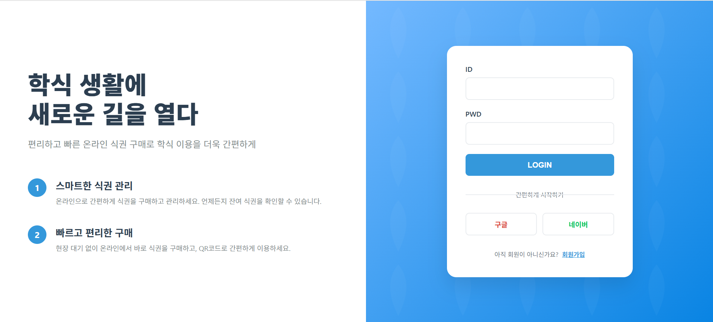

로그인 페이지 (메인 페이지)

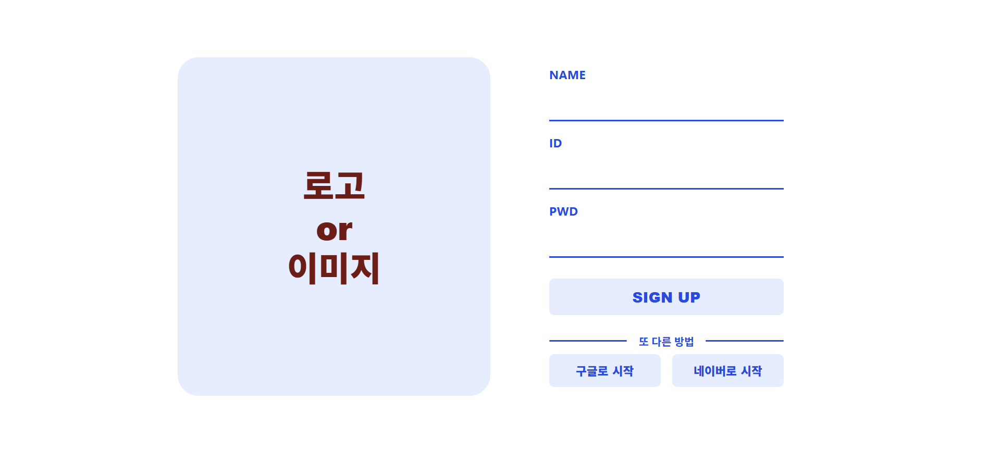

회원가입 페이지 (Wix로 제작)

 처음 Yummy Pass에 접속하면 사용자는 로그인 페이지를 확인할 수 있다. 해당 페이지에서 로그인을 진행해야 서비스 이용이 가능하며, 회원이 아닌 사용자는 회원가입 버튼을 클릭해 회원가입 페이지로 이동할 수 있다.

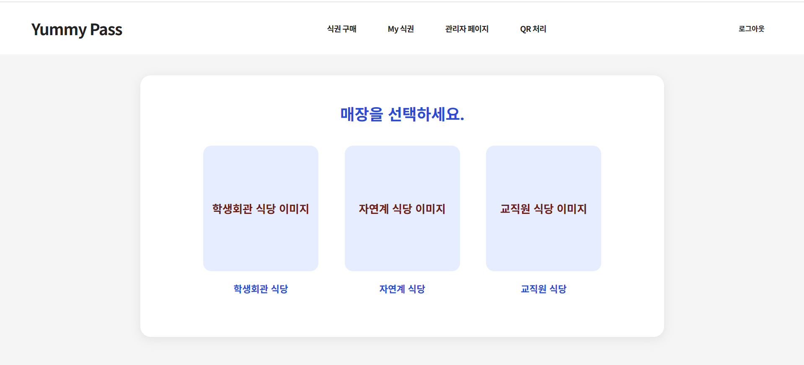

“식권 구매” 페이지 

 로그인을 완료한 사용자는 위와 같은 페이지로 이동한다. 다른 페이지에서 해당 페이지로 이동할 때는 상단 내비게이션바의 “식권 구매”를 클릭한다. 사용자는 “식권 구매” 페이지에서 식권을 구매할 매장을 선택할 수 있다.

 프로토타입에서는 관리자 계정으로 로그인했을 때만 확인할 수 있는 "관리자 페이지", "QR 처리" 페이지"를 내비게이션바에 함께 구현하였다. 

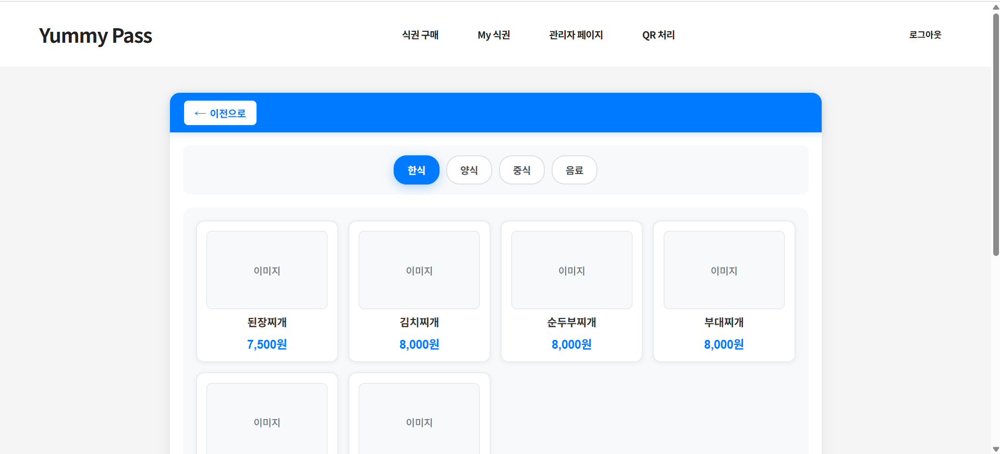

메뉴 선택 페이지

 사용자가 매장은 선택하면 위와 같은 키오스크 형식의 페이지로 이동한다. 메뉴 선택 페이지는 사용자 인터페이스를 고려하여 일반적인 식당에서 접할 수 있는 디자인을 활용하였다. 메뉴 선택 페이지에서 메뉴를 선택하면 메뉴에 대한 설명을 확인할 수 있는 메뉴 상세 페이지로 이동한다.

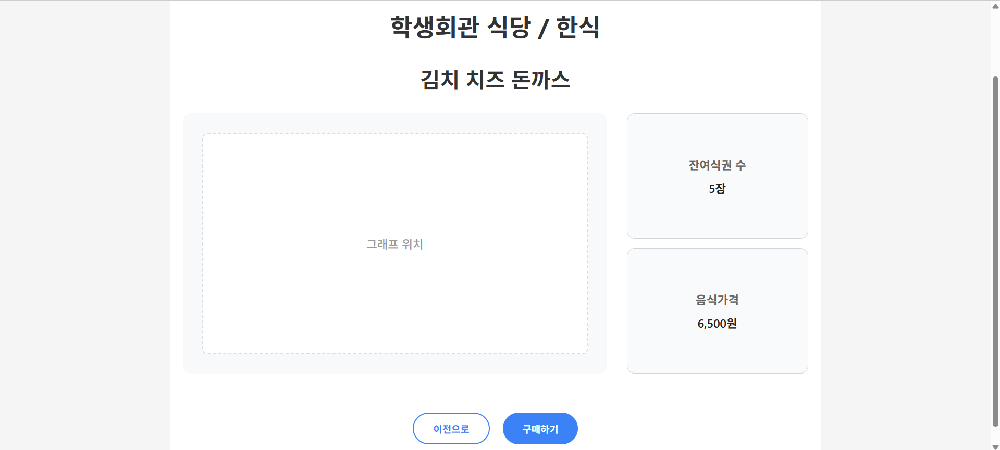

메뉴 상세 페이지

 메뉴 상세 페이지에서는 메뉴와 관련된 정보를 확인할 수 있다. 잔여 식권 수, 가격, 시간대 별로 해당 메뉴가 얼마나 판매되었는지를 나타내는 그래프가 존재한다. "이전으로" 버튼을 클릭했을 때는 메뉴 선택 페이지로, "구매하기" 버튼을 클릭했을 때는 장바구니(구매하고자 하는 메뉴 목록)에 해당하는 메뉴가 담긴다.

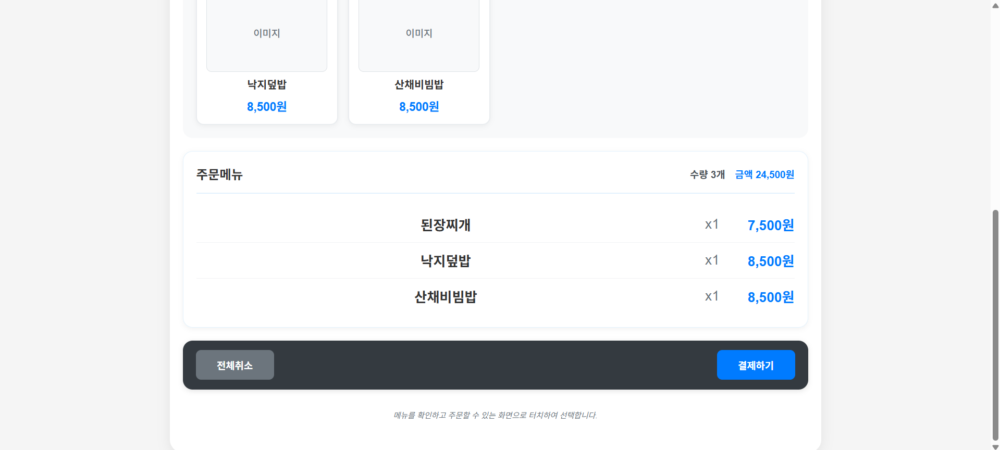

메뉴 선택 페이지 하단에 위치하는 “장바구니”

  "장바구니"에서는 사용자가 선택한 메뉴의 이름, 개수, 최종 결제금액을 확인할 수 있다. "전체취소" 버튼을 클릭했을 때 "장바구니"가 초기화되며, "결제하기"를 클릭했을 때는 결제 페이지로 이동한다.

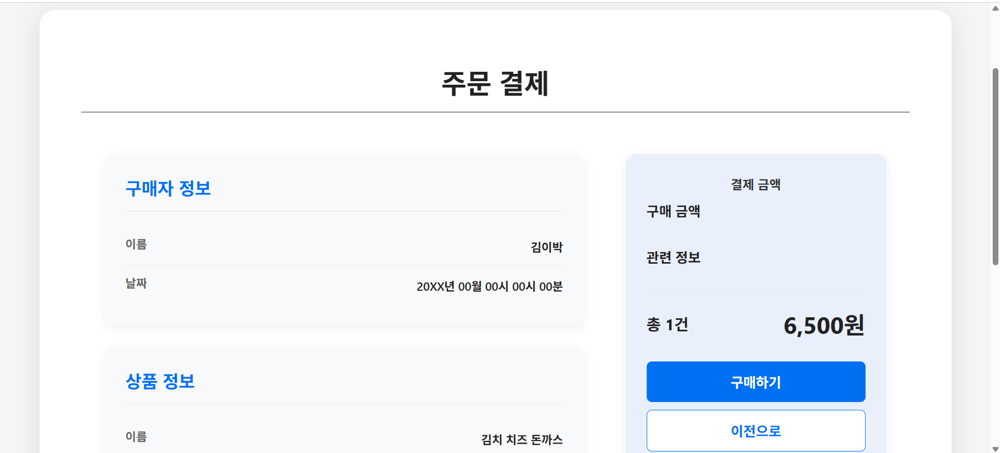

결제 페이지

결제 페이지(하단)

 결제 페이지는 기존에 존재하는 쇼핑 사이트의 인터페이스를 참고하여 디자인했다. 왼쪽에는 이름과 날짜를 포함한 구매자 정보, 구매하는 메뉴의 정보, 결제 방식을 배치했다. 오른쪽에는 최종 결제 금액을 제시하는 것으로 사용자가 자신이 결제할 금액을 다시 한 번 확인할 수 있도록 하였다. 최하단에는 사용자에게 유의할 점을 명시할 수도 있도록 디자인하였다. 이 페이지에서 "이전으로"를 클릭했을 때는 메뉴 선택 페이지로 이동하며, "구매하기"를 클릭한다면 결제가 진행된다.

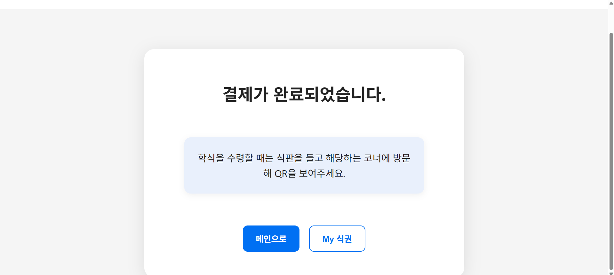

결제 완료 페이지

 선택한 메뉴 결제가 완료되면 시스템은 해당하는 식권을 위한 QR코드를 생성하고, 사용자는는 결제 완료 페이지로 이동한다. 이 페이지는 사용자에게 결제가 성공적으로 진행되었음을 알린다. "메인으로"를 클릭한다면 "식권 구매" 페이지로, "My 식권"을 클릭한다면 구매한 식권의 QR코드를 확인할 수 있는 "My 식권" 페이지로 이동한다. 

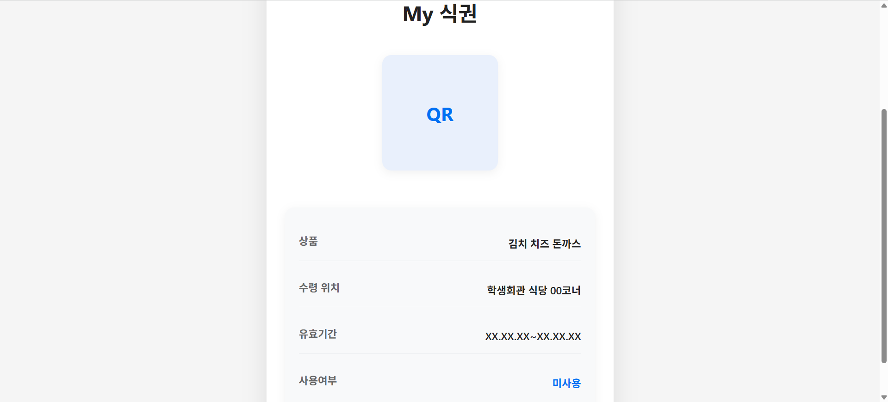

“My 식권” 페이지

 "My 식권" 페이지에서는 사용자가 구매한 식권을 실질적으로 사용하기 위한 QR코드를 확인할 수 있다. 이 페이지에서는 상품 정보, 수령 위치, 유효기간, 사용여부와 같은 정보가 기입되어 있으며 매장에서 활용하기 위한 QR코드 이미지 역시 존재한다.

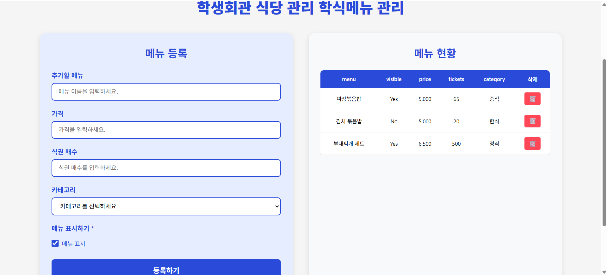

“관리자 페이지”

 내비게이션바에서 “관리자 페이지”를 클릭하는 경우 관리자만이 접근할 수 있는 페이지로 이동한다. 프로토타입에서는 일반 사용자와 관리자가 볼 수 있는 내비게이션바를 분리하지 않았기 때문에 접근이 가능하다.

 해당 페이지에서 관리자는 특정 매장의 메뉴를 수정, 추가, 삭제할 수 있다. 동시에 메뉴를 사용자에게 표시할지에 관한 여부도 설정할 수 있다. 

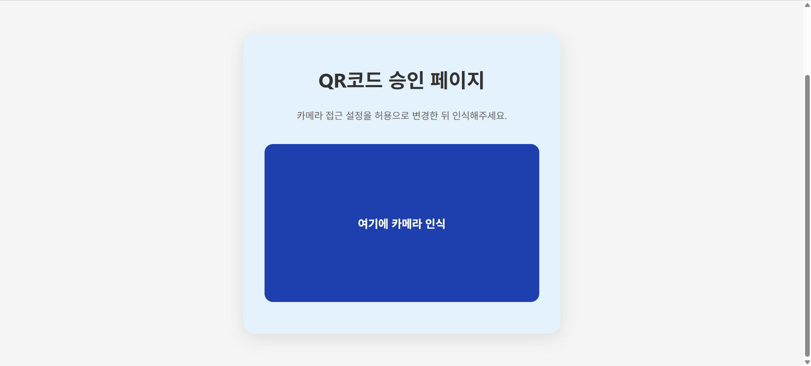

“QR 처리” 페이지

 “QR 처리”를 클릭한다면 식권의 QR코드를 인식할 수 있는 페이지로 이동한다. 해당 페이지에서는 외부의 카메라 모듈을 연결하여 사용자가 제시하는 QR코드를 인식, 시스템이 해당 식권을 사용처리하여 실제로 사용할 수 있게 된다.