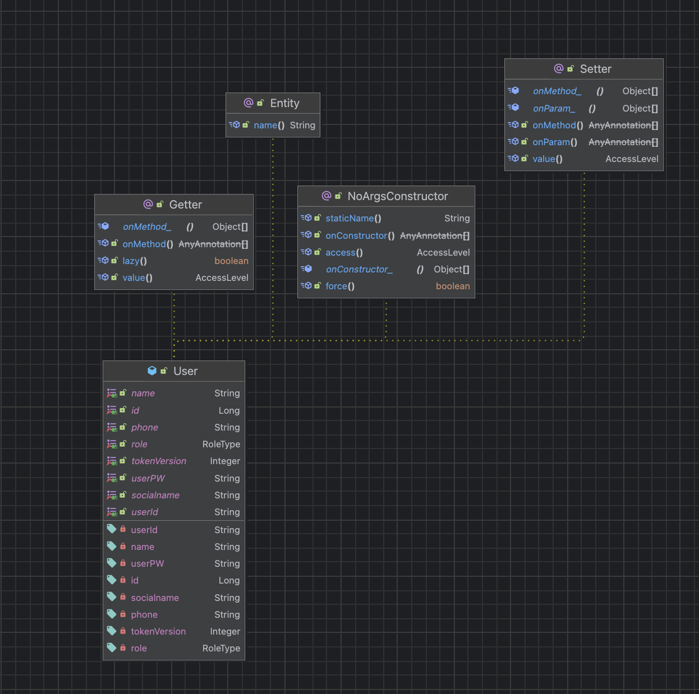

이번 장은 다양한 관점에서 바라본 Class diagram과 각각에 대한 설명을 기술한다. 본 문서의 Class diagram의 목차는 다음과 같다.

**3.1. 엔티티 클래스 다이어그램 정의**

: 엔티티 간의 관계를 나타낸다.

**3.2. 여러 클래스 다이어그램에서 공유되는 모듈 클래스 다이어그램 정의**

: 여러 곳에서 공유되는 서비스 계층에서 클래스 간의 관계를 나타낸다.

**3.3. 기능별로 나눈 클래스 다이어 그램**

: 주요 기능들로 묶인 클래스 다이어그램을 정의한다.

전제는 다음과 같다.

1. *한 번 정의된 클래스는 다시 정의하지 않는다.*
2. *이미 정의된 클래스 및 연관관계일 시, 시각적 편의성을 위해 클래스 다이어그램 내에서 클래스 이름으로만 표기하는 것을 허용한다.*

# 3.1 엔티티 클래스 다이어그램 정의

Class Diagram #1 : User

class Description : 사용자 로그인 정보와 권한을 관리하는 엔티티 클래스

|  |
|:-----------------------------------------:|
|     <b>User Entity Class Diagram</b>      |

| 구분            | Name         | Type     | Visibility | Description                          |
|---------------|--------------|----------|------------|--------------------------------------|
| **Attribute** | id           | Long     | private    | 사용자 고유 식별번호 (Primary Key)            |
|               | userId       | String   | private    | 사용자가 로그인 시 사용하는 아이디 (중복 불가)          |
|               | userPW       | String   | private    | 로그인 시 사용되는 비밀번호                      |
|               | name         | String   | private    | 사용자의 실제 이름                           |
|               | socialname   | String   | private    | 소셜 로그인 시 계정 식별용 이름 (중복 불가)           |
|               | role         | RoleType | private    | 사용자의 권한 구분 (예: STUDENT, ADMIN)       |
|               | phone        | String   | private    | 사용자의 연락처 (중복 불가)                     |
|               | tokenVersion | Integer  | private    | JWT 버전 관리용 필드. 로그아웃 시 증가하여 기존 토큰 무효화 |

Class Diagram #2 : Restaurant

class Description : 영남대학교에 위치한 학식당 종류 엔티티 클래스

|  |
|:---------------------------------------------:|
|    <b>Restaurant Entity Class Diagram</b>     |

| 구분             | Name    | Type              | Visibility | Description         |
|----------------|---------|-------------------|------------|---------------------|
| **Attribute**  | id      | Long              | private    | 고유 식별자              |
|                | name    | String            | private    | 식당 이름               |
|                | menus   | List<Menu>        | private    | 해당 학식당에서 판매하는 메뉴 목록 |
| **Operations** | builder | RestaurantBuilder | public     | Restaurant 객체 빌더 생성 |

Class Diagram #3 : Menu

class Description : 식당에서 판매를 위해 등록한 메뉴 관리 엔티티 클래스

|  |
|:---------------------------------------------:|
|       <b>Menu Entity Class Diagram</b>        |

| 구분             | Name                   | Type                    | Visibility | Description                 |
|----------------|------------------------|-------------------------|------------|-----------------------------|
| **Attribute**  | id                     | Long                    | private    | 고유 식별자                      |
|                | name                   | String                  | private    | 메뉴 이름                       |
|                | photoUrl               | String                  | private    | 메뉴 사진 URL                   |
|                | price                  | int                     | private    | 메뉴 가격                       |
|                | totalQuantity          | int                     | private    | 메뉴 재고 수량                    |
|                | cumulativeSoldQuantity | int                     | private    | 누적 판매된 식권 수량                |
|                | category               | Enum                    | private    | 메뉴 카테고리 (ex. 한식, 양식, 스페셜 등) |
|                | visible                | Boolean                 | private    | 사용자에게 노출 여부                 |
|                | restaurant             | Restaurant              | private    | 해당 메뉴가 속한 식당 객체             |
|                | salesSnapshots         | List<MenuSalesSanpshot> | private    | 메뉴의 일자별 판매 스냅샷 목록           |
|                | restaurant             | Restaurant              | private    | 해당 메뉴가 속한 식당 객체             |
| **Operations** | builder                | MenuBuilder             | public     | Menu 객체 빌더 생성               |
|                | update                 | void                    | public     | 관리자 요청에 따라 메뉴 정보 수정         |
|                | sellTicket             | void                    | public     | 메뉴 판매 시 누적 판매 수 증가 및 재고 검증  |
|                | setPhotoUrl            | void                    | public     | 메뉴 사진 URL 변경                |

Class Diagram #4 : Order

class Description : 주문 정보를 관리하는 엔티티 클래스

|  |
|:---------------------------------------------:|
|       <b>Order Entity Class Diagram</b>       |

| 구분             | Name               | Type            | Visibility | Description      |
|----------------|--------------------|-----------------|------------|------------------|
| **Attribute**  | id                 | Long            | private    | 주문 고유 식별자        |
|                | orderedAt          | LocalDateTime   | private    | 주문 일시            |
|                | totalQuantity      | int             | private    | 총 주문 수량          |
|                | totalAmount        | int             | private    | 총 주문 금액          |
|                | user               | User            | private    | 주문한 사용자          |
|                | items              | List<OrderItem> | private    | 주문 항목 목록         |
| **Operations** | addItem(OrderItem) | void            | public     | 주문 항목 추가 및 합계 계산 |
|                | builder            | OrderBuilder    | public     | Order 객체 빌더 생성   |

Class Diagram #5 : OrderItem

class Description : 주문 내 개별 메뉴 항목을 나타내는 엔티티 클래스, 하나의 주문 안에 포함된 각각의 메뉴를 표현 가능

|  |
|:---------------------------------------------:|
|     <b>OrderItem Entity Class Diagram</b>     |

| 구분             | Name                   | Type             | Visibility | Description        |
|----------------|------------------------|------------------|------------|--------------------|
| **Attribute**  | id                     | Long             | private    | 주문항목 고유 식별자        |
|                | menuNameSnapshot       | String           | private    | 주문 시점 메뉴명 스냅샷      |
|                | restaurantNameSnapshot | String           | private    | 주문 시점 식당명 스냅샷      |
|                | unitPrice              | int              | private    | 단가                 |
|                | quantity               | int              | private    | 수량                 |
|                | lineTotal              | int              | private    | 항목별 총액             |
|                | menu                   | Menu             | private    | 메뉴 참조              |
|                | order                  | Order            | private    | 주문 참조              |
|                | tickets                | List<Ticket>     | private    | 발급된 식권 목록          |
| **Operations** | of(Menu, int)          | OrderItem        | public     | 정적 팩토리 메서드         |
|                | builder                | OrderItemBuilder | public     | OrderItem 객체 빌더 생성 |

Class Diagram #6 : MenuSalesSnapshot

class Description : 기간별 메뉴 판매량을 나타내는 엔티티 클래스

|  |
|:---------------------------------------------:|
| <b>MenuSalesSnapshot Entity Class Diagram</b> |

| 구분             | Name                                      | Type              | Visibility | Description |
|----------------|-------------------------------------------|-------------------|------------|-------------|
| **Attribute**  | id                                        | Long              | private    | 스냅샷 고유 식별자  |
|                | menu                                      | Menu              | private    | 메뉴 참조       |
|                | snapshotTime                              | LocalDateTime     | private    | 스냅샷 생성 시간   |
|                | salesInInterval                           | Integer           | private    | 해당 구간 판매량   |
|                | cumulativeSales                           | Integer           | private    | 누적 판매량      |
| **Operations** | of(Menu, LocalDateTime, Integer, Integer) | MenuSalesSnapshot | public     | 정적 팩토리 메서드  |

Class Diagram #7 : **Ticket**

class Description : 식권의 구매·수령·사용 상태를 관리하는 엔티티 클래스

|  |
|:---------------------------------------------:|
|      <b>Ticket Entity Class Diagram</b>       |

| 구분             | Name                                                            | Type                   | Visibility | Description              |
|----------------|-----------------------------------------------------------------|------------------------|------------|--------------------------|
| **Attribute**  | id                                                              | Long                   | private    | 식권 고유 식별번호 (Primary Key) |
|                | qrCode                                                          | String                 | private    | 식권 고유 QR 코드 문자열          |
|                | isUsed                                                          | Boolean                | private    | 식권 사용 여부                 |
|                | purchaseTime                                                    | LocalDateTime          | private    | 식권이 구매된 시각               |
|                | receivedTime                                                    | LocalDateTime          | private    | 식권이 수령 완료된 시각            |
|                | usedTime                                                        | LocalDateTime          | private    | 식권이 실제 사용된 시각            |
|                | user                                                            | User                   | private    | 식권을 구매한 사용자 (FK)         |
|                | orderItem                                                       | OrderItem              | private    | 해당 식권이 속한 주문 항목 (FK)     |
| **Operations** | use()                                                           | void                   | public     | 식권을 사용 처리하고 사용 시각을 기록    |
|
|                | completeReceive()                                               |                        |            |                          |
| void           | public                                                          | 식권 수령 완료 처리 (수령 시각 저장) |            |                          |
|
|                | Ticket(String, String, boolean, LocalDateTime, User, OrderItem) |                        |            |                          |
| Ticket         | Public                                                          | 빌더 패턴을 통한 식권 객체 생성자    |            |                          |

# 3.2. 여러 클래스 다이어그램에서 공유되는 모듈 클래스 다이어그램 정의

Class Diagram #8 : SecurityConfig

class Description : Spring Security 설정 관리하는 구성 클래스. JWT 기반 인증 및 OAuth2 로그인 설정 담당

|  |
|:---------------------------------------------:|
|        <b>Auth & JWT Class Diagram</b>        |

| 구분             | Name                      | Type                    | Visibility    | Description          |
|----------------|---------------------------|-------------------------|---------------|----------------------|
| **Attribute**  | customOAuth2UserService   | CustomOAuth2UserService | private final | OAuth2 사용자 정보 처리 서비스 |
|                | customSuccessHandler      | CustomSuccessHandler    | private final | OAuth2 로그인 성공 처리 핸들러 |
|                | jwtService                | JWTService              | private final | JWT 토큰 생성 및 검증 서비스   |
|                | userRepository            | UserRepository          | private final | 사용자 인증용 리포지토리        |
| **Operations** | webSecurityCustomizer()   | WebSecurityCustomizer   | public        | 특정 경로를 보안 필터에서 제외    |
|                | passwordEncoder()         | PasswordEncoder         | public        | 비밀번호 암호화용 인코더 등록     |
|                | filterChain(HttpSecurity) | SecurityFilterChain     | public        | 보안 필터 체인과 인증 설정 정의   |

Class Diagram #9 : CustomOAuth2UserService

class Description : OAuth2 로그인 시 사용자 정보를 처리하는 서비스 클래스

| 구분             | Name                        | Type           | Visibility    | Description                |
|----------------|-----------------------------|----------------|---------------|----------------------------|
| **Attribute**  | userRepository              | UserRepository | private final | 사용자 정보를 조회·저장하는 리포지토리      |
| **Operations** | loadUser(OAuth2UserRequest) | OAuth2User     | public        | 소셜 로그인 요청을 처리하고 사용자 정보를 반환 |

Class Diagram #10 : CustomSuccessHandler

class Description : OAuth2 로그인 성공 시 JWT 토큰을 발급·저장하는 핸들러 클래스

| 구분             | Name                                                                             | Type           | Visibility    | Description                        |
|----------------|----------------------------------------------------------------------------------|----------------|---------------|------------------------------------|
| **Attribute**  | jwtService                                                                       | JWTService     | private final | JWT 토큰 생성 및 검증 서비스                 |
|                | userRepository                                                                   | UserRepository | private final | 사용자 정보를 조회하기 위한 JPA 리포지토리          |
| **Operations** | onAuthenticationSuccess(HttpServletRequest, HttpServletResponse, Authentication) | void           | public        | OAuth2 로그인 성공 시 JWT 토큰을 생성해 쿠키에 저장 |

Class Diagram #11 : JWTService

class Description : JWT 토큰의 생성·검증·파싱을 담당하는 서비스 계층 클래스. JWTUtil을 내부적으로 호출하여 실제 JWT 로직을 처리함.

| 구분             | Name                            | Type    | Visibility    | Description                                    |
|----------------|---------------------------------|---------|---------------|------------------------------------------------|
| **Attribute**  | jwtUtil                         | JWTUtil | private final | JWT 서명·검증·클레임 파싱 등 실제 JWT 관련 로직을 수행하는 유틸리티 클래스 |
| **Operations** | createToken(Long, String)       | String  | public        | 사용자 ID와 권한 정보를 기반으로 JWT 토큰을 생성                 |
|                | isExpired(String)               | Boolean | public        | 주어진 토큰의 만료 여부를 확인                              |
|                | parseUserId(String)             | Long    | public        | 토큰에서 사용자 ID를 추출                                |
|                | parseTokenVersion(String token) | Integer | public        | 토큰에서 tokenVersion을 추출                          |

Class Diagram #12 : JWTFilter

class Description : HTTP 요청마다 JWT를 검증하고, 유효 시 SecurityContext에 인증 정보를 설정하는 필터 클래스

| 구분             | Name                                                                   | Type                                         | Visibility    | Description                           |
|----------------|------------------------------------------------------------------------|----------------------------------------------|---------------|---------------------------------------|
| **Attribute**  | jwtService                                                             | JWTService                                   | private final | JWT 생성·검증 및 파싱 기능을 담당하는 서비스           |
|                | userRepository                                                         | UserRepository                               | private final | 사용자 정보 및 tokenVersion을 조회하는 JPA 리포지토리 |
| **Operations** | doFilterInternal(HttpServletRequest, HttpServletResponse, FilterChain) |                                              |               |                                       |
| void           | protected                                                              | 쿠키의 JWT를 검증하고, 유효한 경우 인증 컨텍스트를 설정하는 핵심 필터 로직 |               |                                       |

Class Diagram #13 : JWTUtil

class Description : JWT 토큰의 생성, 서명, 검증, 클레임 파싱 등의 실제 로직을 수행하는 유틸리티 클래스

| 구분             | Name                                                                      | Type                              | Visibility | Description                                                |
|----------------|---------------------------------------------------------------------------|-----------------------------------|------------|------------------------------------------------------------|
| **Attribute**  | secretKey                                                                 | SecretKey                         | private    | JWT 서명 및 검증에 사용되는 비밀키 객체. 환경 변수(spring.jwt.secret)로부터 초기화됨 |
| **Operations** | isExpired(String)                                                         | Boolean                           | public     | 주어진 토큰이 만료되었는지 검사                                          |
|                | createJwt(Long userId, String role, Long expiredMs, Integer tokenVersion) | String                            | public     | 사용자 ID, 역할, 만료시간, 토큰 버전을 포함한 JWT 생성                        |
|                | createJwt(Long userId, String role, Long expiredMs)                       | String                            | public     | 토큰 버전 없이 JWT 생성 (오버로딩 메서드)                                 |
|                | parseUserId(String)                                                       |                                   |            |                                                            |
| Long           | public                                                                    | JWT의 payload에서 사용자 ID(userId)를 추출 |            |                                                            |
|                | parseTokenVersion(String token)                                           | Integer                           | public     | JWT의 payload에서 토큰 버전(ver) 값을 추출 및 파싱                       |

Class Diagram #14 : UserDTO

class Description : 사용자 정보(ID, 이름, 권한, 소셜명)를 전달하는 데이터 전송 객체(DTO) 클래스

| 구분            | Name       | Type     | Visibility | Description                    |
|---------------|------------|----------|------------|--------------------------------|
| **Attribute** | id         | Long     | private    | 사용자 고유 식별번호 (Primary Key)      |
|               | name       | String   | private    | 사용자의 실제 이름                     |
|               | socialname | String   | private    | 소셜 로그인 시 계정 식별용 이름 (중복 불가)     |
|               | role       | RoleType | private    | 사용자의 권한 구분 (예: STUDENT, ADMIN) |

Class Diagram #15 : CustomOAuth2UserDTO

class Description : OAuth2 인증 후 사용자 정보를 Spring Security 표준 OAuth2User 형태로 래핑하는 DTO 클래스

| 구분             | Name             | Type                         | Visibility    | Description                      |
|----------------|------------------|------------------------------|---------------|----------------------------------|
| **Attribute**  | userDTO          | UserDTO                      | private final | 사용자 ID, 이름, 권한 정보를 담은 내부 DTO 객체  |
| **Operations** | getAttributes()  | Map<String, Object>          | public        | OAuth2 사용자 속성을 반환 (현재 null 반환)   |
|                | getAuthorities() | Collection<GrantedAuthority> | public        | 사용자 권한(Role)을 Security 인증 객체로 변환 |
|                | getName()        | String                       | public        | 사용자 이름 반환                        |
|                | getId()          | Long                         | public        | 사용자 고유 ID 반환                     |

Class Diagram #16 : GoogleResDTO

class Description : Google OAuth2 인증 응답 데이터를 표준화된 형태로 매핑하는 DTO 클래스

| 구분             | Name            | Type                | Visibility    | Description                               |
|----------------|-----------------|---------------------|---------------|-------------------------------------------|
| **Attribute**  | attribute       | Map<String, Object> | private final | Google에서 반환된 사용자 속성 데이터 (OAuth2 response) |
| **Operations** | getProvider()   | String              | public        | OAuth 제공자 이름 "google" 반환                  |
|                | getProviderId() | String              | public        | Google OAuth 응답의 사용자 고유 ID(sub) 반환        |
|                | getName()       | String              | public        | Google 계정의 사용자 이름(name) 반환                |

Class Diagram #17 : KakaoResDTO

class Description : Kakao OAuth2 인증 응답 데이터를 표준화된 형태로 매핑하는 DTO 클래스

| 구분             | Name            | Type                | Visibility    | Description                              |
|----------------|-----------------|---------------------|---------------|------------------------------------------|
| **Attribute**  | attribute       | Map<String, Object> | private final | Kakao에서 반환된 사용자 속성 데이터 (OAuth2 response) |
| **Operations** | getProvider()   | String              | public        | OAuth 제공자 이름 "kakao" 반환                  |
|                | getProviderId() | String              | public        | Kakao OAuth 응답의 사용자 고유 ID(sub) 반환        |
|                | getName()       | String              | public        | Kakao 계정의 사용자 이름(name) 반환                |

Class Diagram #18 : NaverResDTO

class Description : Naver OAuth2 인증 응답 데이터를 표준화된 형태로 매핑하는 DTO 클래스

| 구분             | Name            | Type                | Visibility    | Description                                 |
|----------------|-----------------|---------------------|---------------|---------------------------------------------|
| **Attribute**  | attribute       | Map<String, Object> | private final | Naver OAuth 응답 속성을 초기화하고 response 내부 객체를 매핑 |
| **Operations** | getProvider()   | String              | public        | OAuth 제공자 이름 "kakao" 반환                     |
|                | getProviderId() | String              | public        | Kakao OAuth 응답의 사용자 고유 ID(sub) 반환           |
|                | getName()       | String              | public        | Kakao 계정의 사용자 이름(name) 반환                   |

Class Diagram #19 : OAuth2ResDTO

class Description : OAuth2 인증 응답 데이터를 표준화하기 위한 인터페이스

| 구분             | Name            | Type   | Visibility | Description                               |
|----------------|-----------------|--------|------------|-------------------------------------------|
| **Operations** | getProvider()   | String | public     | OAuth 제공자 이름 반환 (예: Naver, Google, Kakao) |
|                | getProviderId() | String | public     | OAuth 제공자 내의 사용자 고유 ID 반환                 |
|                | getName()       | String | public     | OAuth 계정의 사용자 이름 반환                       |

Class Diagram #20 : CorsMvcConfig

class Description : 웹 애플리케이션의 CORS정책 설정(Spring 설정 클래스)

|  |
|:---------------------------------------------:|
|           <b>CORS Class Diagram</b>           |

| 구분             | Name                          | Type | Visibility | Description                               |
|----------------|-------------------------------|------|------------|-------------------------------------------|
| **Operations** | addCorsMappings(corsRegistry) | void | public     | WebMvcConfigurer의 메서드를 재정의하여 CORS 정책을 설정함 |

Class Diagram #21 : S3Config

class Description : Amazon S3 설정 정보를 관리

|  |
|:---------------------------------------------:|
|         <b>S3Config Class Diagram</b>         |

| 구분             | Name      | Type     | Visibility | Description              |
|----------------|-----------|----------|------------|--------------------------|
| **Attribute**  | accessKey | String   | private    | S3 액세스 키                 |
|                | secretKey | String   | private    | S3 시크릿 키                 |
|                | region    | String   | private    | S3 리전(지역)                |
| **Operations** | amazonS3  | AmazonS3 | public     | Amazon S3 클라이언트를 생성하고 반환 |

# 3.3. 기능별로 나눈 클래스 다이어 그램

### 3.3.1. Auth 관련 클래스 다이어그램

- 다음 클래스들은 이미 위에서 정의되었기에 설명을 생략한다.
    - User 엔티티 클래스
    - JWT 관련 클래스

|  |
|:----------------------------------------------:|
|           <b>Auth Class Diagram</b>            |

Class Diagram #22 : AuthController

class Description : 회원가입·로그인·로그아웃 요청을 처리하는 인증 컨트롤러 클래스

| 구분             | Name                                     | Type                         | Visibility    | Description                      |
|----------------|------------------------------------------|------------------------------|---------------|----------------------------------|
| **Attribute**  | userService                              | UserService                  | private final | 사용자 회원가입 및 로그인 비즈니스 로직을 처리하는 서비스 |
|                | jwtService                               | JwtService                   | private final | JWT 토큰 생성 및 검증을 담당하는 서비스         |
|                | logoutService                            | LogoutService                | private final | 로그아웃 시 토큰 무효화를 담당하는 서비스          |
| **Operations** | signup(SignUpReqDto)                     | ResponseEntity<String>       | public        | 사용자 정보를 등록하여 회원가입을 처리            |
|                | login(SignInReqDto, HttpServletResponse) | ResponseEntity<SignInResDto> | public        | 로그인 요청을 처리하고 JWT 토큰을 반환          |
|                | logout(String authorizationHeader)       | ResponseEntity<String>       | public        | JWT 토큰을 검증하고 로그아웃 처리(토큰 무효화)를 수행 |

Class Diagram #23 : LogoutService

class Description : 사용자의 로그아웃 처리를 담당하는 서비스 클래스. 로그아웃 시 User 엔티티의 tokenVersion을 증가시켜 기존 JWT를 무효화

| 구분             | Name                        | Type           | Visibility    | Description                                              |
|----------------|-----------------------------|----------------|---------------|----------------------------------------------------------|
| **Attribute**  | userRepository              | UserRepository | private final | 사용자 정보를 데이터베이스에서 조회·갱신하기 위한 JPA 리포지토리                    |
| **Operations** | logoutByUserId(Long userId) | void           | public        | 지정된 사용자 ID의 tokenVersion을 +1 증가시켜 해당 사용자의 기존 JWT를 모두 무효화 |

Class Diagram #24 : UserService

class Description : 사용자 회원가입과 로그인 로직을 처리하는 서비스 클래스

| 구분             | Name                 | Type            | Visibility    | Description              |
|----------------|----------------------|-----------------|---------------|--------------------------|
| **Attribute**  | userRepository       | UserRepository  | private final | 사용자 정보를 관리하는 리포지토리       |
|                | passwordEncoder      | PasswordEncoder | private final | 사용자 비밀번호 암호화용 인코더        |
|                | jwtService           | JWTService      | private final | JWT 토큰 생성 및 검증 서비스       |
| **Operations** | signup(SignUpReqDto) | Long            | public        | 사용자 정보를 등록하여 회원가입을 처리    |
|                | login(SignInReqDto)  | SignInResDto    | public        | 사용자 인증 후 JWT 발급 및 로그인 처리 |

Class Diagram #25 : UserRepository

class Description : 사용자 엔티티에 대한 데이터 접근을 담당하는 리포지토리 인터페이스

| 구분             | Name                     | Type                      | Visibility | Description                 |
|----------------|--------------------------|---------------------------|------------|-----------------------------|
| **Attribute**  | *(상속)*                   | JpaRepository<User, Long> | —          | JPA 기능을 상속받아 기본 CRUD 메서드 제공 |
| **Operations** | findBySocialname(String) | User                      | public     | 소셜 로그인 이름으로 사용자 조회          |
|                | findByUserId(String)     | Optional<User>            | public     | 사용자 ID로 사용자 조회              |
|                | existsByUserId(String)   | boolean                   | public     | 주어진 사용자 ID 존재 여부 확인         |
|                | existsByPhone(String)    | boolean                   | public     | 주어진 전화번호 존재 여부 확인           |

Class Diagram #26 : SignUpReqDto

class Description : 회원가입 요청 시 사용자 정보를 전달하는 DTO 클래스

| 구분            | Name   | Type     | Visibility | Description                |
|---------------|--------|----------|------------|----------------------------|
| **Attribute** | userId | String   | private    | 회원가입 시 사용자의 로그인 아이디        |
|               | userPW | String   | private    | 회원가입 시 사용자의 비밀번호           |
|               | name   | String   | private    | 사용자의 이름                    |
|               | role   | RoleType | private    | 사용자 권한 (예: STUDENT, ADMIN) |
|               | phone  | String   | private    | 사용자의 전화번호                  |

Class Diagram #27 : SignInReqDto

class Description : 로그인 요청 시 사용자 아이디와 비밀번호를 전달하는 DTO 클래스

| 구분            | Name   | Type   | Visibility | Description         |
|---------------|--------|--------|------------|---------------------|
| **Attribute** | userId | String | private    | 회원가입 시 사용자의 로그인 아이디 |
|               | userPW | String | private    | 회원가입 시 사용자의 비밀번호    |

Class Diagram #28 : SignInResDto

class Description : 로그인 성공 시 JWT 토큰과 사용자 정보를 반환하는 DTO 클래스

| 구분            | Name        | Type     | Visibility | Description                |
|---------------|-------------|----------|------------|----------------------------|
| **Attribute** | accessToken | String   | private    | 로그인 성공 시 발급되는 JWT 액세스 토큰   |
|               | name        | String   | private    | 사용자의 이름                    |
|               | role        | RoleType | private    | 사용자 권한 (예: STUDENT, ADMIN) |

### 3.3.1.1. 소셜 회원가입 관련 클래스 다이어그램

|  |
|:----------------------------------------------:|
|          <b>OAuth2 Class Diagram</b>           |

Class Diagram #29 : OAuth2LoginController

class Description : 소셜 로그인 요청 및 인증 결과 처리를 담당하는 OAuth2 컨트롤러 클래스

| 구분             | Name           | Type   | Visibility | Description                    |
|----------------|----------------|--------|------------|--------------------------------|
| **Operations** | naverLogin()   | String | public     | 네이버 OAuth2 로그인 및 회원가입 리디렉션 경로  |
|                | googleLogin()  | String | public     | 구글 OAuth2 로그인 및 회원가입 리디렉션 경로   |
|                | kakaoLogin()   | String | public     | 카카오 OAuth2 로그인 및 회원가입 리디렉션 경로  |
|                | oauthSuccess() | String | public     | OAuth2 로그인 성공 후 JWT 토큰을 쿠키에 저장 |

### 3.3.1.2. 소셜 로그인 초기 설정관련 클래스 다이어그램

- 다음 클래스들은 이미 위에서 정의되었기에 설명을 생략한다.
    - User 엔티티 클래스
    - UserRepository 인터페이스

    - JWT 관련 클래스

|  |
|:----------------------------------------------:|
|        <b>OAuth Init Class Diagram</b>         |

Class Diagram #30 : AuthInitialSetupController

class Description : 소셜 로그인 후 역할과 전화번호를 초기 설정하는 통합 컨트롤러 클래스

| 구분             | Name                                                                      | Type                    | Visibility    | Description                 |
|----------------|---------------------------------------------------------------------------|-------------------------|---------------|-----------------------------|
| **Attribute**  | authInitialSetupService                                                   | AuthInitialSetupService | private final | 역할 및 전화번호 초기 설정을 처리하는 서비스   |
| **Operations** | initialSetup(InitialSetupReqDto, HttpServletRequest, HttpServletResponse) | ResponseEntity<?>       | public        | 역할과 전화번호를 등록하고 새 JWT 토큰을 발급 |

Class Diagram #31 : InitialSetupReqDTO

class Description : 초기 설정 시 역할과 전화번호를 전달하는 요청 DTO 클래스

| 구분            | Name  | Type     | Visibility | Description                |
|---------------|-------|----------|------------|----------------------------|
| **Attribute** | role  | RoleType | private    | 사용자 권한 (예: STUDENT, ADMIN) |
|               | phone | String   | private    | 사용자 전화번호 (11자리 숫자, 공백 불가)  |

### 3.3.2. 레스토랑 관련 클래스 다이어그램

- 다음 클래스들은 이미 위에서 정의되었기에 설명을 생략한다.
    - Restaurant 엔티티 클래스

|  |
|:----------------------------------------------:|
|        <b>Restaurant Class Diagram</b>         |

Class Diagram #32 : RestaurantController

class Description : 식당 관련 API를 제공하는 컨트롤러 클래스.

| 구분             | Name              | Type              | Visibility | Description                    |
|----------------|-------------------|-------------------|------------|--------------------------------|
| **Attribute**  | restaurantService | RestaurantService | private    | 식당 비즈니스 로직을 처리하는 서비스           |
| **Operations** | getRestaurants()  | ResponseEntity<?> | public     | 전체 식당 목록을 조회하고, 예외 상황을 처리하여 반환 |

Class Diagram #33 : RestaurantService

class Description : 식당 데이터 조회 로직을 수행하는 서비스 클래스.

| 구분             | Name                 | Type                        | Visibility | Description                     |
|----------------|----------------------|-----------------------------|------------|---------------------------------|
| **Attribute**  | restaurantRepository | RestaurantRepository        | private    | 식당 데이터를 관리하는 저장소 객체             |
| **Operations** | getAllRestaurants()  | List<RestaurantResponseDto> | public     | 모든 식당 정보를 조회하고 DTO 리스트로 변환하여 반환 |

Class Diagram #34 : RestaurantRepository

class Description : 식당 데이터를 데이터베이스에 저장하고 조회하는 JPA 리포지토리 인터페이스.

| 구분             | Name                        | Type                 | Visibility | Description  |
|----------------|-----------------------------|----------------------|------------|--------------|
| **Operations** | findAll()                   | List<Restaurant>     | public     | 모든 식당 목록을 조회 |
|                | findById(Long id)           | Optional<Restaurant> | public     | 식당 ID로 조회    |
|                | save(Restaurant restaurant) | Restaurant           | public     | 식당 정보를 저장    |
|                | deleteById(Long id)         | void                 | public     | 식당 정보를 삭제    |

Class Diagram #35 : RestaurantResponseDto

class Description : 식당 엔티티의 주요 정보(id, name)를 담아 API 응답용으로 전달하는 DTO 클래스.

| 구분             | Name                                         | Type        | Visibility | Description                     |
|----------------|----------------------------------------------|-------------|------------|---------------------------------|
| **Attribute**  | id                                           | Long        | private    | 식당의 고유 식별자                      |
|                | name                                         | String      | private    | 식당 이름                           |
| **Operations** | RestaurantResponseDto(Restaurant restaurant) | Constructor | public     | `Restaurant` 엔티티를 DTO로 변환하여 초기화 |

### 3.3.3. 메뉴 조회 관련 클래스 다이어그램

- 다음 클래스들은 이미 위에서 정의되었기에 설명을 생략한다.
    - Menu 엔티티 클래스

|  |
|:----------------------------------------------:|
|       <b>Menu for User Class Diagram</b>       |

Class Diagram #36 : MenuController

class Description : 고객용 메뉴 조회 API를 제공하는 컨트롤러 클래스

| 구분             | Name                   | Type                               | Visibility | Description             |
|----------------|------------------------|------------------------------------|------------|-------------------------|
| **Attribute**  | menuService            | MenuService                        | private    | 메뉴 조회 비즈시스 로직을 처리하는 서비스 |
| **Operations** | getMenus(Long, String) | ResponseEntity<List<MenuResponse>> | public     | 레스토랑별 카테고리 메뉴 목록 조회     |
|                | getMenuDetails(Long)   | ResponseEntity<MenuDetailResponse> | public     | 메뉴 상세 정보 조회             |

Class Diagram #37 : MenuService

class Description : 메뉴 조회 비즈니스 로직을 담당하는 서비스 클래스

| 구분             | Name                                         | Type               | Visibility | Description                    |
|----------------|----------------------------------------------|--------------------|------------|--------------------------------|
| **Attribute**  | menuRepository                               | MenuRepository     | private    | 메뉴 정보 저장소                      |
| **Operations** | getMenuByRestaurantAndCategory(Long, String) | List<MenuResponse> | public     | 특정 레스토랑의 특정 카테고리에 속하는 모든 메뉴 조회 |
|                | getMenuDetails(Long)                         | MenuDetailResponse | public     | 특정 메뉴의 상세 정보 조회(재고량 포함         |

Class Diagram #38 : MenuRes

class Description : 메뉴 목록 조회용 응답 DTO 클래스

| 구분            | Name     | Type   | Visibility    | Description |
|---------------|----------|--------|---------------|-------------|
| **Attribute** | id       | Long   | private final | 메뉴 ID       |
|               | name     | String | private final | 메뉴 이름       |
|               | photoUrl | String | private final | 메뉴 사진 URL   |
|               | price    | int    | private final | 메뉴 가격       |

Class Diagram #39 : MenuDetailRes

class Description : 메뉴 상세 조회용 응답 DTO 클래스

| 구분            | Name             | Type   | Visibility    | Description |
|---------------|------------------|--------|---------------|-------------|
| **Attribute** | id               | Long   | private final | 메뉴 ID       |
|               | name             | String | private final | 메뉴 이름       |
|               | price            | int    | private final | 메뉴 가격       |
|               | remainingTickets | int    | private final | 남은 재고 수량    |

### 3.3.4. 판매량 통계 및 인기메뉴 관련 클래스 다이어그램

|  |
|:----------------------------------------------:|
|    <b>Sales & Popularity Class Diagram</b>     |

Class Diagram #40 : MenuSalesSnapshotController

class Description : 판매량 통계 및 인기 메뉴 조회 API를 제공하는 컨트롤러 클래스

| 구분            | Name                        | Type                               | Visibility | Description                      |
|---------------|-----------------------------|------------------------------------|------------|----------------------------------|
| **Attribute** | menuSalesSnapshotRepository | MenuSalesSnapshotRepository        | private    | 메뉴 판매 스냅샷 저장소                    |
|               | menuRepository              | MenuRepository                     | private    | 메뉴 정보 저장소                        |
|               | menuSalesSnapshotService    | MenuSalesSnapshotService           | private    | 판매 스냅샷 서비스                       |
|               | menuPopularityService       | MenuPopularityService              | private    | 인기 메뉴 조회 서비스                     |
| **Operation** | getLatestIntervalSales()    | ResponseEntity<Map<Long, Integer>> | public     | 모든 메뉴의 최근 구간 판매량 조회              |
|               | getTodaySales(Long)         | ResponseEntity<MenuSalesGraphRes>  | public     | 특정 메뉴의 오늘 하루 시간대별 판매량 그래프 데이터 조회 |
|               | getPopularMenus(Long)       | ResponseEntity<PopularMenuListRes> | public     | 레스토랑별 최근 20분간 인기 메뉴 조회           |

Class Diagram #41 : MenuWaitTimeController

class Description : 메뉴별 에상 대기시간 조회 API를 제공하는 컨트롤러 클래스

| 구분            | Name                  | Type                            | Visibility | Description                         |
|---------------|-----------------------|---------------------------------|------------|-------------------------------------|
| **Attribute** | menuWaitTimeService   | MenuWaitTimeService             | private    | 메뉴 대기 시간 계산 서비스                     |
| **Operation** | getMenuWaitTime(Long) | ResponseEntity<MenuWaitTimeRes> | public     | 메뉴별 예상 대기시간 조회(사용/수령 샘플 기반 평균 처리시간) |

Class Diagram #42 : MenuSalesSnapshotService

class Description : 판매량 스냅샷 기록 및 조회 서비스 클래스

| 구분             | Name                        | Type                        | Visibility | Description             |
|----------------|-----------------------------|-----------------------------|------------|-------------------------|
| **Attribute**  | menuRepository              | MenuRepository              | private    | 메뉴 정보 저장소               |
|                | menuSalesSnapshotRepository | MenuSalesSnapshotRepository | private    | 메뉴 판매 스냅샷 저장소           |
| **Operations** | recordMenuSalesSnapshot()   | void                        | public     | 5분마다 모든 메뉴의 판매량 스냅샷 기록  |
|                | resetDailySnapshots()       | void                        | public     | 매일 자정에 모든 메뉴 판매 스냅샷 초기화 |

Class Diagram #43 : MenuPopularityService

class Description : 인기 메뉴 계산 서비스 클래스

| 구분             | Name                                 | Type                        | Visibility    | Description                                |
|----------------|--------------------------------------|-----------------------------|---------------|--------------------------------------------|
| **Attribute**  | menuRepository                       | MenuRepository              | private final | 메뉴 정보 저장소                                  |
|                | menuSalesSnapshotRepository          | MenuSalesSnapshotRepository | private final | 메뉴 판매 스냅샷 저장소                              |
| **Operations** | getMostPopularMenuByRestaurant(Long) | PopularMenuListRes          | public        | 레스토랑의 최근 20분간 가장 많이 팔린 메뉴 조회(동점 메뉴시 모두 반환) |

Class Diagram #44 : MenuWaitService

class Description : 메뉴별 대기시간 예측 서비스 클래스

| 구분             | Name                   | Type             | Visibility           | Description                          |
|----------------|------------------------|------------------|----------------------|--------------------------------------|
| **Attribute**  | menuRepository         | MenuRepository   | private final        | 메뉴 정보 저장소                            |
|                | ticketRepository       | TicketRepository | private final        | 티켓 정보 저장소                            |
|                | MAX_SAMPLES            | int              | private static final | 최대 샘플 수 (500개)                       |
|                | MAX_ACCEPTABLE_MINUTES | int              | private static final | 최대 허용 처리시간(180분)                     |
|                | RECENT_HOURS           | int              | private static final | 최근 데이터 조회 범위(1시간)                    |
| **Operations** | getMenuWaitTime(Long)  | MenuWaitTimeRes  | public               | 메뉴의 최근 1시간 티켓 사용/수령 샘플 기반 평균 대기시간 계산 |

Class Diagram #45 : MenuSalesGraphRes

class Description : 메뉴 판매 그래프 응답 DTO 클래스

| 구분            | Name            | Type                 | Visibility | Description         |
|---------------|-----------------|----------------------|------------|---------------------|
| **Attribute** | menuId          | Long                 | private    | 메뉴 ID               |
|               | menuName        | String               | private    | 메뉴 이름               |
|               | salesDatePoints | List<SalesDatePoint> | private    | 시간대별 판매 데이터 포인트 리스트 |
| **Operation** | builder         |                      |            |                     |

Class Diagram #46 : SalesDataPoint

class Description : 판매 데이터 포인트 DTO 클래스

| 구분            | Name              | Type          | Visibility | Description     |
|---------------|-------------------|---------------|------------|-----------------|
| **Attribute** | time              | LocalDateTime | private    | 스냅샷 시간          |
|               | salesInInterval   | Integer       | private    | 해당 구간(5분)의 판매량  |
|               | cumulativeAtPoint | Integer       | private    | 해당 시점까지의 누적 판매량 |

Class Diagram #47 : PopularMenuListRes

class Description : 인기 메뉴 리스트 응답 DTO 클래스

| 구분            | Name                    | Type         | Visibility | Description                 |
|---------------|-------------------------|--------------|------------|-----------------------------|
| **Attribute** | menuNames               | List<String> | private    | 인기 메뉴 이름 리스트(동점인 경우 여러개 포함) |
|               | totalSalesLast20Minutes | Integer      | private    | 최근 20분간 총 판매량               |

Class Diagram #48 : MenuWaitTimeRes

class Description : 메뉴 대기시간 응답 DTO 클래스

| 구분            | Name             | Type    | Visibility | Description   |
|---------------|------------------|---------|------------|---------------|
| **Attribute** | menuId           | Long    | private    | 메뉴 ID         |
|               | menuName         | String  | private    | 메뉴 이름         |
|               | expectedWaitTime | Integer | private    | 예상 대기시간(분 단위) |

Class Diagram #49 : MenuSalesSnapshotRepository

class Description :  메뉴 판매량 엔티티에 대한 접근 인터페이스

| 구분             | Name                                                                       | Type                            | Visibility | Description                          |
|----------------|----------------------------------------------------------------------------|---------------------------------|------------|--------------------------------------|
| **Attribute**  | *(상속)*                                                                     | JpaRepository<Restaurant, Long> | —          | 기본 CRUD 기능을 상속받음                     |
| **Operations** | findTopByMenuOrderBySnapshotTimeDesc(Menu)                                 | Optional<MenuSalesSnapshot>     | public     | 특정 메뉴의 가장 최근 스냅샷 조회(내림차순)            |
|                | findByMenuAndSnapshotTimeAfterOrderBySnapshotTimeAsc(Menu, LoalDataTime)   | List<MenuSalesSnapshot>         | public     | 특정 메뉴의 오늘 데이터만 조회(그래프용)              |
|                | findByMenuRestaurantIdAndSnapshotTimeGreaterThanEqual(Long, LocalDateTime) | List<MenuSalesSnapshot>         | public     | 특정 식당의 특정 시간 이후의 모든 메뉴 스냅샷 조회(인기메뉴용) |

### 3.3.5. 메뉴 관리 관련 클래스 다이어그램

- 다음 클래스들은 이미 위에서 정의되었기에 설명을 생략한다.
    - Menu 엔티티 클래스
    - MenuRepsitory와 MenuSalesSnapshotRepository 인터페이스를 기반으로 한 관련 클래스들(판매량 및 인기메뉴 관련 클래스)

|  |
|:----------------------------------------------:|
|      <b>Menu for Admin Class Diagram</b>       |

Class Diagram #50 : AdminMenuController

class Description : 관리자가 메뉴를 등록, 수정, 삭제, 조회할 수 있도록 하는 API를 제공하는 컨트롤러 클래스

| 구분             | Name                                            | Type                               | Visibility | Description              |
|----------------|-------------------------------------------------|------------------------------------|------------|--------------------------|
| **Attribute**  | menuService                                     | AdminMenuService                   | private    | 메뉴 관련 비즈니스 로직을 처리하는 서비스  |
|                | restaurantRepository                            | RestaurantRepository               | private    | 식당 정보를 조회하는 저장소 객체       |
| **Operations** | createMenu(AdminMenuCreateReq req)              | ResponseEntity<AdminMenuCreateRes> | public     | 새 메뉴를 등록하는 메서드           |
|                | deleteMenu(Long menuId)                         | ResponseEntity<?>                  | public     | 특정 메뉴를 삭제하는 메서드          |
|                | getMenus()                                      | ResponseEntity<List<AdminMenuRes>> | public     | 전체 메뉴 목록을 조회하는 메서드       |
|                | getMenu(Long menuId)                            | ResponseEntity<AdminMenuRes>       | public     | 특정 메뉴의 상세 정보를 조회하는 메서드   |
|                | updateMenu(Long menuId, AdminMenuUpdateReq req) | ResponseEntity<AdminMenuRes>       | public     | 특정 메뉴 정보를 수정하는 메서드       |
|                | getCategoriesByRestaurant(Long restaurantId)    | ResponseEntity<List<String>>       | public     | 특정 식당의 카테고리 목록을 조회하는 메서드 |

Class Diagram #51 : AdminMenuService

class Description : 관리자 메뉴 관리 로직을 수행하는 서비스 클래스.

| 구분             | Name                                            | Type                    | Visibility | Description                  |
|----------------|-------------------------------------------------|-------------------------|------------|------------------------------|
| **Attribute**  | menuRepository                                  | MenuRepository          | private    | 메뉴 데이터를 관리하는 저장소 객체          |
|                | restaurantRepository                            | RestaurantRepository    | private    | 식당 데이터를 관리하는 저장소 객체          |
|                | s3Service                                       | MenuS3Service           | private    | 메뉴 이미지 업로드 및 삭제를 담당하는 S3 서비스 |
| **Operations** | createMenu(AdminMenuCreateReq req)              | AdminMenuCreateResponse | public     | 새로운 메뉴를 등록하고 DB에 저장          |
|                | deleteMenu(Long menuId)                         | void                    | public     | 특정 메뉴를 삭제하고 S3 이미지도 함께 제거    |
|                | getMenus()                                      | List<AdminMenuResponse> | public     | 전체 메뉴를 카테고리 순서로 정렬하여 조회      |
|                | getMenu(Long menuId)                            | AdminMenuResponse       | public     | 특정 메뉴의 상세 정보를 조회             |
|                | updateMenu(Long menuId, AdminMenuUpdateReq req) | AdminMenuResponse       | public     | 기존 메뉴 정보를 수정 및 이미지 변경 처리     |
|                | getCategoriesByRestaurant(Long restaurantId)    | List<String>            | public     | 특정 식당의 메뉴 카테고리 목록을 반환        |

Class Diagram #52 : MenuS3Service

class Description : Amazon S3를 활용하여 메뉴 이미지를 업로드 및 삭제하는 기능을 제공하는 서비스 클래스

| 구분             | Name                                            | Type     | Visibility | Description              |
|----------------|-------------------------------------------------|----------|------------|--------------------------|
| **Attribute**  | amazonS3                                        | AmazonS3 | private    | AWS S3 클라이언트 객체          |
|                | bucket                                          | String   | private    | 업로드할 S3 버킷 이름            |
| **Operations** | uploadMenuImage(MultipartFile image, Menu menu) | String   | public     | 메뉴 이미지를 S3에 업로드하고 URL 반환 |
|                | deleteMenuImage(Menu menu)                      | void     | public     | 메뉴 이미지가 존재하면 S3에서 삭제     |
|                | getImageKey(String imageUrl)                    | String   | private    | 이미지 URL로부터 S3 객체 키 추출    |
|                | getImageExtension(MultipartFile image)          | String   | private    | 업로드할 이미지의 확장자 추출         |

Class Diagram #53 : AdminMenuCreateReq

class Description : 관리자가 새로운 메뉴를 등록할 때 필요한 정보를 담는 요청 DTO 클래스

| 구분            | Name         | Type          | Visibility | Description                 |
|---------------|--------------|---------------|------------|-----------------------------|
| **Attribute** | restaurantId | Long          | private    | 메뉴를 등록할 식당의 고유 식별자          |
|               | name         | String        | private    | 메뉴 이름                       |
|               | image        | MultipartFile | private    | 업로드할 메뉴 이미지 파일              |
|               | price        | Integer       | private    | 메뉴 가격                       |
|               | totalCount   | Integer       | private    | 메뉴의 총 재고 수량                 |
|               | category     | MenuCategory  | private    | 메뉴 카테고리 (KOREAN, SPECIAL 등) |
|               | visible      | Boolean       | private    | 사용자에게 노출 여부                 |

Class Diagram #54 : AdminMenuCreateRes

class Description : 새로운 메뉴가 생성된 후, 생성 결과를 응답으로 반환하는 DTO 클래스

| 구분             | Name            | Type                           | Visibility | Description            |
|----------------|-----------------|--------------------------------|------------|------------------------|
| **Attribute**  | id              | Long                           | private    | 생성된 메뉴의 고유 식별자         |
|                | name            | String                         | private    | 메뉴 이름                  |
|                | photoUrl        | String                         | private    | 메뉴 이미지 URL             |
|                | price           | int                            | private    | 메뉴 가격                  |
|                | totalCount      | int                            | private    | 메뉴의 총 재고 수량            |
|                | soldTicket      | int                            | private    | 누적 판매된 식권 수량           |
|                | category        | MenuCategory                   | private    | 메뉴 카테고리                |
|                | visible         | Boolean                        | private    | 사용자에게 노출 여부            |
| **Operations** | from(Menu menu) | static AdminMenuCreateResponse | public     | Menu 엔티티를 DTO로 변환하여 반환 |

Class Diagram #55 : AdminMenuRes

class Description : 관리자 페이지에서 메뉴 상세 조회 시 반환되는 응답 DTO 클래스

| 구분             | Name            | Type                     | Visibility | Description            |
|----------------|-----------------|--------------------------|------------|------------------------|
| **Attribute**  | id              | Long                     | private    | 메뉴의 고유 식별자             |
|                | name            | String                   | private    | 메뉴 이름                  |
|                | photoUrl        | String                   | private    | 메뉴 이미지 URL             |
|                | price           | int                      | private    | 메뉴 가격                  |
|                | totalCount      | int                      | private    | 메뉴의 총 재고 수량            |
|                | soldTicket      | int                      | private    | 누적 판매된 식권 수량           |
|                | category        | MenuCategory             | private    | 메뉴 카테고리                |
|                | visible         | Boolean                  | private    | 사용자에게 노출 여부            |
|                | restaurantName  | String                   | private    | 메뉴가 속한 식당 이름           |
| **Operations** | from(Menu menu) | static AdminMenuResponse | public     | Menu 엔티티를 DTO로 변환하여 반환 |

Class Diagram #56 : AdminMenuUpdateReq

class Description : 기존 메뉴의 정보를 수정할 때 필요한 요청 데이터를 담는 DTO 클래스

| 구분            | Name       | Type          | Visibility | Description       |
|---------------|------------|---------------|------------|-------------------|
| **Attribute** | name       | String        | private    | 수정할 메뉴 이름         |
|               | price      | Integer       | private    | 수정할 메뉴 가격         |
|               | totalCount | Integer       | private    | 수정할 메뉴 재고 수량      |
|               | category   | String        | private    | 수정할 메뉴 카테고리 이름    |
|               | visible    | Boolean       | private    | 메뉴 노출 여부          |
|               | image      | MultipartFile | private    | 새로 업로드할 메뉴 이미지 파일 |

Class Diagram #57 : MenuRepository

class Description : 메뉴 엔티티에 대한 데이터 접근 인터페이스

| 구분             | Name                                        | Type           | Visibility | Description        |
|----------------|---------------------------------------------|----------------|------------|--------------------|
| **Operations** | findByRestaurantIdAndCategory(Long, String) | List<Menu>     | public     | 식당 ID와 카테고리로 메뉴 조회 |
|                | findByRestaurantId(Long)                    | List<Menu>     | public     | 식당 ID로 메뉴 목록 조회    |
|                | findAndLockById(Long)                       | Optional<Menu> | public     | 비관적 락을 사용한 메뉴 조회   |

### 3.3.6. 티켓 기능 관련 클래스 다이어그램

|  |
|:----------------------------------------------:|
|          <b>Ticket Class Diagram</b>           |

Class Diagram #58 : TicketController

class Description : 식권의 사용·미사용·만료 상태를 조회하고 수령 완료 처리를 수행하는 컨트롤러 클래스

| 구분             | Name                  | Type                            | Visibility    | Description                   |
|----------------|-----------------------|---------------------------------|---------------|-------------------------------|
| **Attribute**  | ticketService         | TicketService                   | private final | 식권 상태 조회 및 수령 처리 로직을 담당하는 서비스 |
| **Operations** | getExpiredTickets()   | ResponseEntity<List<TicketRes>> | public        | 만료된 식권 목록을 조회                 |
|                | getUnusedTickets()    | ResponseEntity<List<TicketRes>> | public        | 미사용 식권 목록을 조회                 |
|                | completeReceive(Long) | ResponseEntity<TicketRes>       | public        | 특정 식권의 수령 완료 상태를 처리           |

Class Diagram #59 : TicketResDTO

class Description : 식권 엔티티 정보를 응답용 데이터로 변환하는 DTO 클래스

| 구분             | Name               | Type          | Visibility    | Description                  |
|----------------|--------------------|---------------|---------------|------------------------------|
| **Attribute**  | id                 | Long          | private       | 식권 고유 식별번호                   |
|                | qrCode             | String        | private       | 식권의 QR 코드 문자열                |
|                | isUsed             | Boolean       | private       | 식권의 사용 여부                    |
|                | purchaseTime       | LocalDateTime | private       | 식권이 구매된 시각                   |
|                | receivedTime       | LocalDateTime | private       | 식권이 수령된 시각                   |
|                | userName           | String        | private       | 식권을 구매한 사용자 이름               |
|                | menuName           | String        | private       | 해당 식권의 메뉴 이름                 |
| **Operations** | fromEntity(Ticket) | TicketResDTO  | public static | Ticket 엔티티를 TicketRes 객체로 변환 |

Class Diagram #60 : TicketService

class Description : 식권의 만료·미사용·수령 상태를 관리하고 조회하는 서비스 클래스

| 구분             | Name                  | Type               | Visibility    | Description                               |
|----------------|-----------------------|--------------------|---------------|-------------------------------------------|
| **Attribute**  | ticketRepository      | TicketRepository   | private final | 식권 데이터를 조회·저장하는 리포지토리                     |
| **Operations** | getExpiredTickets()   | List<TicketResDTO> | public        | 만료된 식권 목록을 조회 (isUsed=false + 구매 후 1일 경과) |
|                | getUnusedTickets()    | List<TicketResDTO> | public        | 아직 사용되지 않은 식권 목록을 조회                      |
|                | completeReceive(Long) | TicketResDTO       | public        | 특정 식권의 수령 완료 상태를 처리                       |

Class Diagram #61 : TicketRepository

class Description : 식권 엔티티에 대한 데이터 조회·저장을 담당하는 리포지토리 인터페이스

| 구분             | Name                                                                    | Type                        | Visibility | Description                    |
|----------------|-------------------------------------------------------------------------|-----------------------------|------------|--------------------------------|
| **Attribute**  | *(상속)*                                                                  | JpaRepository<Ticket, Long> | —          | 기본 CRUD 기능을 상속받음               |
| **Operations** | findByQrCode(String)                                                    | Optional<Ticket>            | public     | QR 코드로 식권을 조회                  |
|                | findByIsUsedFalseAndPurchaseTimeBefore(LocalDateTime)                   | List<Ticket>                | public     | 사용되지 않고 일정 시간 이전에 구매된 만료 식권 조회 |
|                | findByIsUsedFalse()                                                     | List<Ticket>                | public     | 아직 사용되지 않은 식권 목록 조회            |
|                | findByOrderItemMenuIdAndUsedTimeIsNotNullAndReceivedTimeIsNotNull(Long) | List<Ticket>                | public     | 특정 메뉴에 대해 사용 및 수령이 완료된 식권 조회   |

### 3.3.7. QR 관련 클래스 다이어그램

- 다음 클래스들은 이미 위에서 정의되었기에 설명을 생략한다.
    - S3Service 단일 클래스

|  |
|:----------------------------------------------:|
|            <b>QR Class Diagram</b>             |

Class Diagram #62 : QrController

class Description : QR 코드 생성, 사용, 조회 API를 제공하는 컨트롤러 클래스.

| 구분             | Name                   | Type                             | Visibility | Description                       |
|----------------|------------------------|----------------------------------|------------|-----------------------------------|
| **Attribute**  | s3                     | S3Service                        | private    | QR 이미지를 업로드 및 삭제하는 S3 서비스         |
|                | qrService              | QrService                        | private    | QR 코드 생성·조회·사용 로직을 담당하는 서비스       |
| **Operations** | createMealTicketQr()   | ResponseEntity<QrCreateResponse> | public     | QR 이미지를 생성해 S3에 업로드하고, 결과를 반환     |
|                | useQr(String uuid)     | ResponseEntity<String>           | public     | 특정 QR을 사용 처리 후 S3에서 이미지 삭제        |
|                | getQrInfo(String uuid) | ResponseEntity<?>                | public     | uuid를 기반으로 QR의 이미지 URL과 사용 여부를 조회 |

Class Diagram #63 : QrService

class Description : QR 코드의 생성, 업로드, 사용 상태 변경 및 조회 로직을 담당하는 서비스 클래스.

| 구분             | Name                   | Type             | Visibility | Description                      |
|----------------|------------------------|------------------|------------|----------------------------------|
| **Attribute**  | s3Service              | S3Service        | private    | QR 이미지 업로드 및 삭제를 담당하는 S3 서비스     |
|                | ticketRepository       | TicketRepository | private    | 식권(QR 코드 포함) 정보를 관리하는 저장소 객체     |
| **Operations** | createAndUploadQr()    | QrCreateResponse | public     | QR 이미지를 생성 후 S3에 업로드하고 응답 DTO 반환 |
|                | validateStudentRole()  | void             | public     | 현재 사용자의 권한이 STUDENT인지 검증         |
|                | useQr(String uuid)     | Boolean          | public     | QR 사용 상태를 변경하고 S3 이미지 삭제 처리      |
|                | getQrInfo(String uuid) | QrInfoResponse   | public     | 특정 QR의 이미지 URL과 사용 여부를 조회하여 반환   |

Class Diagram #64 : S3Service (QR용)

class Description : QR 이미지 파일을 Amazon S3에 업로드, 삭제, URL 생성하는 기능을 담당하는 서비스 클래스.

| 구분             | Name                                                          | Type     | Visibility | Description                      |
|----------------|---------------------------------------------------------------|----------|------------|----------------------------------|
| **Attribute**  | amazonS3                                                      | AmazonS3 | private    | AWS S3 클라이언트 객체                  |
|                | bucket                                                        | String   | private    | S3 버킷 이름                         |
| **Operations** | uploadImageBytes(byte[] data, String key, String contentType) | String   | public     | QR 이미지를 S3에 업로드하고 공개 URL 반환      |
|                | deleteObject(String key)                                      | void     | public     | 지정된 키의 객체를 S3에서 삭제               |
|                | imageKey(String uuid)                                         | String   | public     | QR 코드 UUID로부터 S3 객체 키를 생성        |
|                | publicUrl(String key)                                         | String   | public     | 버킷 이름과 리전을 조합하여 공개 접근 가능한 URL 생성 |

Class Diagram #65 : QrCreateRes

class Description : QR 코드 생성 완료 후, 고유 uuid와 이미지 URL을 응답으로 반환하는 DTO 클래스.

| 구분             | Name                                      | Type        | Visibility | Description         |
|----------------|-------------------------------------------|-------------|------------|---------------------|
| **Attribute**  | uuid                                      | String      | private    | 생성된 QR 코드의 고유 식별자   |
|                | imageUrl                                  | String      | private    | S3에 업로드된 QR 이미지 URL |
| **Operations** | QrCreateRes(String uuid, String imageUrl) | Constructor | public     | QR 코드 생성 응답 객체를 초기화 |

Class Diagram #66 : QrInfoRes

class Description : QR 코드의 현재 상태를 조회할 때 사용되는 응답 DTO 클래스.

| 구분             | Name                                                  | Type        | Visibility | Description         |
|----------------|-------------------------------------------------------|-------------|------------|---------------------|
| **Attribute**  | uuid                                                  | String      | public     | QR 코드의 고유 식별자       |
|                | imageUrl                                              | String      | public     | QR 이미지 URL          |
|                | used                                                  | boolean     | public     | QR 사용 여부 (true=사용됨) |
| **Operations** | QrInfoRes(String uuid, String imageUrl, boolean used) | Constructor | public     | QR 정보 응답 객체를 초기화    |

Class Diagram #67 : QrUseReq

class Description : QR 코드를 사용할 때 요청 본문에 포함되는 DTO 클래스.

| 구분             | Name                  | Type        | Visibility | Description       |
|----------------|-----------------------|-------------|------------|-------------------|
| **Attribute**  | uuid                  | String      | private    | 사용하려는 QR 코드의 UUID |
| **Operations** | QrUseReq()            | Constructor | public     | 기본 생성자            |
|                | QrUseReq(String uuid) | Constructor | public     | UUID를 인자로 받아 초기화  |

### 3.3.8. 주문 및 결제 기능관련 클래스 다이어그램

- 다음 클래스들은 이미 위에서 정의되었기에 설명을 생략한다.
    - UserRepository 인터페이스
    - MenuRepository 인터페이스
    - QR 관련 클래스

|  |
|:----------------------------------------------:|
|           <b>Order Class Diagram</b>           |

Class Diagram #68 : OrderController

class Description : 장바구니 요약 및 주문 확정(결제) API를 제공하는 컨트롤러 클래스

| 구분             | Name                              | Type                            | Visibility | Description                    |
|----------------|-----------------------------------|---------------------------------|------------|--------------------------------|
| **Attribute**  | OrderService                      | OrderService                    | private    | 주문 비즈니스 로직을 처리하는 서비스           |
| **Operations** | summarize(CreateOrderReq)         | ResponseEntity<OrderSummaryRes> | public     | 장바구니 요약 정보를 계산하여 반환 (재고 확인 포함) |
|                | checkout(CreateOrderReq, UserDTO) | ResponseEntity<OrderCreatedRes> | public     | 주문 확정 및 결제 처리, 식권 발급           |

Class Diagram #69 : OrderService

class Description : 주문 생성 및 검증 비즈니스 로직을 담당하는 서비스 클래스

| 구분             | Name                                | Type             | Visibility | Description                   |
|----------------|-------------------------------------|------------------|------------|-------------------------------|
| **Attribute**  | userRepository                      | UserRepository   | private    | 사용자 정보 조회                     |
|                | menuRepository                      | MenuRepository   | private    | 메뉴 정보 조회 및 재고 관리              |
|                | orderRepository                     | OrderRepository  | private    | 주문 정보 저장                      |
|                | ticketRepository                    | TicketRepository | private    | 식권 정보 저장                      |
|                | qrService                           | QrService        | private    | QR 코드 생성 서비스                  |
| **Operations** | summarize(List<CreateOrderReq.Item> | OrderSummaryRes  | public     | 장바구니 항목의 합계 계산 및 재고 검증        |
|                | checkout(Long, CreateOrderReq)      | OrderCreateRes   | public     | 주문 생성, 재고 차감, 식권 발급 처리 (틑랜젝션) |

Class Diagram #70 : CreateOrderReq

class Description : 주문 요청 DTO 클래스

| 구분            | Name  | Type       | Visibility | Description   |
|---------------|-------|------------|------------|---------------|
| **Attribute** | Items | List<Item> | private    | 주문할 메뉴 항목 리스트 |

Class Diagram # 71: CreateOrderReq.Item (Static Inner Class)

class Description : 주문 항목 DTO 클래스

| 구분            | Name     | Type       | Visibility | Description         |
|---------------|----------|------------|------------|---------------------|
| **Attribute** | menuId   | List<Item> | private    | 주문할 메뉴 ID           |
|               | quantity | List<Item> | private    | 주문 수량(0 이상, 0은 무시됨) |

Class Diagram #72 : OrderSummaryRes

class Description : 장바구니 요약 응답 DTO 클래스

| 구분            | Name         | Type       | Visibility | Description           |
|---------------|--------------|------------|------------|-----------------------|
| **Attribute** | lines        | List<Line> | private    | 장바구니의 각 항목의 요약 정보 리스트 |
|               | totalQuntity | int        | private    | 전체 주문 수량 합계           |
|               | totalAmount  | int        | private    | 전체 주문 금액 합계           |

Class Diagram #73 : OrderSummaryRes.Line (Static Inner Class)

class Description : 장바구니 단일 항목 DTO 클래스

| 구분            | Name           | Type   | Visibility | Description       |
|---------------|----------------|--------|------------|-------------------|
| **Attribute** | menuId         | Long   | private    | 메뉴 ID             |
|               | menuName       | String | private    | 메뉴명               |
|               | restaurantName | String | private    | 식당명               |
|               | unitPrice      | int    | private    | 메뉴 단가             |
|               | quantity       | int    | private    | 주문 수량             |
|               | lineTotal      | int    | private    | 라인 합계 금액(단가 x 수량) |

Class Diagram #74 : OrderCreatedRes

class Description : 주문 생성 완료 응답 DTO 클래스

| 구분            | Name          | Type               | Visibility | Description   |
|---------------|---------------|--------------------|------------|---------------|
| **Attribute** | orderId       | Long               | private    | 생성된 주문 ID     |
|               | totalQuantity | int                | private    | 전체 주문 수량      |
|               | totalAmount   | int                | private    | 전체 주문 금액      |
|               | items         | List<CreatedItem>  | private    | 생성된 주문 항목 리스트 |
|               | tickets       | List<IssuedTicket> | private    | 발급된 식권 리스트    |

Class Diagram #75 : OrdrCreatedRes.CreatedItem

class Description : 생성된 주문 항목 DTO 클래스

| 구분            | Name           | Type   | Visibility | Description |
|---------------|----------------|--------|------------|-------------|
| **Attribute** | menuId         | Long   | private    | 메뉴 ID       |
|               | menuName       | String | private    | 메뉴명         |
|               | restaurantName | String | private    | 식당명         |
|               | unitPrice      | int    | private    | 메뉴 단가       |
|               | quantity       | int    | private    | 주문 수량       |
|               | lineTotal      | int    | private    | 라인 합계 금액    |

Class Diagram #76 : OrderCreaedRes.IssuedTicket

class Description : 발급된 식권 정보 DTO 클래스

| 구분            | Name     | Type   | Visibility | Description |
|---------------|----------|--------|------------|-------------|
| **Attribute** | ticketId | Long   | private    | 발급된 식권 ID   |
|               | qrUuid   | String | private    | QR 코드 UUID  |

Class Diagram #77 : OrderConfirmationRes

class Description : 단일 메뉴 주문 확인 응답 DTO 클래스

| 구분            | Name           | Type                 | Visibility    | Description                |
|---------------|----------------|----------------------|---------------|----------------------------|
| **Attribute** | userName       | String               | private       | 주문한 사용자 이름                 |
|               | orderDate      | LocalDateTime        | private       | 주문 시각                      |
|               | menuName       | String               | private       | 메뉴명                        |
|               | price          | int                  | private       | 가격                         |
|               | restaurantName | String               | private       | 식당명                        |
| **Operation** | of(User, Menu) | OrderConfirmationRes | public static | User와 Menu 객체로부터 응답 DTO 생성 |

Class Diagram #78 : OrderItemRepository

class Description :  주문 항목 엔티티에 대한 접근 인터페이스

| 구분            | Name   | Type                           | Visibility | Description      |
|---------------|--------|--------------------------------|------------|------------------|
| **Attribute** | *(상속)* | JpaRepository≤OrderItem, Long> | —          | 기본 CRUD 기능을 상속받음 |

Class Diagram #79 : OrderRepository

class Description : 주문 엔티티에 대한 데이터 접근 인터페이스

| 구분            | Name   | Type                       | Visibility | Description      |
|---------------|--------|----------------------------|------------|------------------|
| **Attribute** | *(상속)* | JpaRepository<Order, Long> | —          | 기본 CRUD 기능을 상속받음 |