# 4. Sequence Diagram 

본 장에서는 “Yummy Pass” 시스템의 각 기능 단위에 대한 Sequence Diagram(시퀀스 다이어그램) 과 그에 대한 설명을 제공한다.

Sequence Diagram은 시간의 흐름에 따라 객체 간 메시지 전달 과정을 시각적으로 표현함으로써, 시스템 내부의 동작 구조와 데이터 흐름을 명확히 이해할 수 있도록 한다.

본 프로젝트는 Spring Boot 기반의 3-Layer Architecture (Controller–Service–Repository) 를 따르고 있으며,

이에 따라 각 다이어그램은 클라이언트 요청부터 데이터 처리 및 응답 반환까지의 전 과정을 구체적으로 기술하였다.

본 프로젝트의 Sequence Diagram은 다음과 같은 고려 사항을 바탕으로 작성되었다.

- 모든 Sequence Diagram은 특정 Use Case와 일대일 대응되며, 각 Use Case에서 정의된 시나리오의 동작 흐름을 그대로 반영한다.
- 따라서 Sequence Diagram은 Use Case의 세부 시나리오를 확장하거나 대체하지 않고, Use Case의 실제 실행 과정을 구체적으로 표현한 형태이다.
- 각 다이어그램은 Use Case Diagram과 동일한 기능 단위를 기준으로 작성되었으며,
    
    “클라이언트 요청 → Controller 진입 → Service 로직 처리 → Repository 데이터 접근 → 응답 반환”의 절차를 따른다.
    
- 다이어그램에 등장하는 모든 클래스는 Class Diagram에서 정의된 연관 관계를 기반으로 하며,
    
    Controller, Service, Repository 간의 호출 구조는 실제 코드 구현 흐름과 일치한다.
    
- 각 생명선은 코드 상의 클래스명을 사용하되, 클라이언트(사용자)는 Player 혹은 Client와 같은 개념적 객체로 표현하였다.
- Sequence Diagram의 각 메시지는 Class Diagram의 메서드(Operation) 또는 속성(Attribute)에 대응하며,
    
    내부 로직은 시스템 동작 이해를 돕기 위해 단순화하여 표현하였다.
    
- 예외 흐름(alt)은 입력 검증 실패, 중복 데이터, 인증 실패, 토큰 만료, 사용자 미존재 등으로 구분되며,
    
    각 조건에 따른 HTTP 응답 코드(200, 401, 409 등)와 후속 처리(예: 오류 메시지 반환, 재로그인 요청 등)를 명시하였다.
    
- Sequence Diagram은 Class Diagram과 논리적 일관성을 유지하도록 작성되었으며,
    
    두 다이어그램 간의 상호 참조를 통해 시스템의 구조적·동작적 흐름을 명확히 파악할 수 있다.
    
- 흐름 설명(Description)은 Sequence Diagram의 시각적 표현을 보완하여 코드 구현 시 참조 가능한 기술 문서로 작성되었으며,
    
    실제 구현 단계에서의 정합성 검증 및 기능 테스트 시 활용될 수 있도록 하였다.
    

요약하자면, 본 장의 Sequence Diagram은 Use Case와 완전히 일치하는 구체적 실행 흐름을 시각화한 설계 문서로서,

“Yummy Pass” 시스템의 기능별 동작을 시간 순서에 따라 명확히 제시하고,

개발자 간 이해의 일관성과 코드 구현의 정확성을 확보하기 위한 기준 자료로 활용된다.

# 4.1. Home sign up

### **4.1.1. 회원가입 요청 전송 및 서버 처리 흐름**

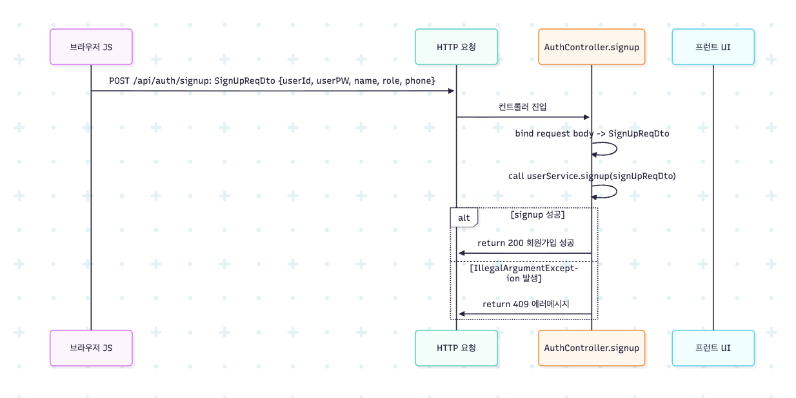

이 시퀀스 다이어그램은 사용자가 회원가입 정보를 입력하고 서버로 전송하는 과정을 나타낸 것이다. 사용자가 회원가입 화면에서 아이디, 비밀번호, 이름, 역할, 전화번호를 입력한 후 “회원가입” 버튼을 클릭하면, 브라우저(JavaScript)는 POST /api/auth/signup 요청을 HTTP 프로토콜을 통해 서버로 보낸다. 이때 요청 본문은 SignUpReqDto 형태로 직렬화되어 전송되며, 서버에서는 해당 요청을 AuthController.signup() 메서드가 처리한다.

컨트롤러는 수신한 요청 바디를 SignUpReqDto 객체로 바인딩한 뒤, 내부적으로 UserService.signup(signUpReqDto)를 호출한다. UserService는 실제 회원가입 비즈니스 로직을 수행하며, 입력값 검증 및 데이터베이스 저장 과정을 포함한다. 로직 수행 중 예외가 발생하지 않으면 컨트롤러는 ResponseEntity.ok("회원가입 성공") 응답을 반환하고, 클라이언트는 HTTP 상태 코드 200과 함께 “회원가입 성공” 메시지를 수신한다.

반면, 중복된 아이디나 전화번호와 같은 유효성 오류로 인해 IllegalArgumentException이 발생할 경우, 컨트롤러는 409(CONFLICT) 상태 코드와 예외 메시지를 반환한다. 브라우저는 이를 받아 사용자에게 오류 메시지를 표시하고, 프런트엔드 UI는 해당 상태에 따라 입력값 수정 또는 재시도 화면을 안내한다.

이와 같은 흐름을 통해 클라이언트와 서버 간의 회원가입 요청과 응답 처리가 완결된다.

### **4.1.2.** **아이디 중복 검사 수행**

이 시퀀스 다이어그램은 회원가입 요청 처리 과정에서 사용자 아이디의 중복 여부를 검사하는 절차를 나타낸다.
AuthController가 UserService.signup(SignUpReqDto req) 메서드를 호출하면, 서비스는 내부적으로 UserRepository.existsByUserId(req.getUserId())를 실행하여 입력된 아이디가 이미 데이터베이스에 존재하는지를 확인한다. 해당 메서드는 Boolean 값을 반환하며, true일 경우 이미 동일한 아이디가 등록되어 있음을 의미한다.

existsByUserId()의 반환값이 true인 경우, UserService는 IllegalArgumentException("이미 존재하는 아이디입니다.") 예외를 발생시킨다. 이 예외는 컨트롤러의 try-catch 블록에 의해 처리되며, 클라이언트로는 HTTP 409(CONFLICT) 상태 코드와 함께 예외 메시지가 반환된다.
반면, 반환값이 false일 경우 아이디가 중복되지 않은 것으로 판단되어 다음 단계인 전화번호 중복 검사 로직으로 넘어간다.

이 과정은 사용자의 입력 데이터가 중복되지 않도록 보장함으로써 회원가입 시 데이터 무결성을 유지하고, 중복 계정 생성을 방지하기 위한 핵심 검증 단계로 작동한다.

### **4.1.3. 전화번호 중복 여부 확인 및 형식 검증**

이 시퀀스 다이어그램은 사용자가 입력한 전화번호가 이미 등록되어 있는지 중복 여부를 검사하고, 동시에 입력된 전화번호의 형식이 올바른지 검증하는 과정을 나타낸다.

사용자가 회원가입 화면에서 아이디, 비밀번호, 이름, 전화번호 등을 입력한 후 “회원가입” 버튼을 클릭하면, 브라우저(프론트엔드)는 POST /api/auth/signup 요청을 SignupReqDto 형태로 서버의 AuthController.signup() 메서드에 전송한다.

컨트롤러는 요청 바디를 바인딩한 뒤, 내부적으로 UserService.signup(req)를 호출한다.

UserService 내부에서는 먼저 UserRepository.existsByPhone(req.getPhone())을 호출하여 동일한 전화번호가 이미 존재하는지 확인한다.

이때 exists == true일 경우, 이미 등록된 전화번호로 판단하여 IllegalArgumentException("이미 등록된 회원입니다.") 예외를 발생시키고, 컨트롤러는 409(Conflict) 상태 코드를 응답한다.

반면, 전화번호가 등록되어 있지 않은 경우(exists == false), 서비스는 다음 단계로 전화번호의 형식을 검증한다.

정규식 "\\d{11}"을 활용하여 입력된 번호가 **숫자만으로 구성되어 있으며 정확히 11자리인지**를 검사한다.

만약 형식이 올바르지 않다면 IllegalArgumentException("전화번호는 숫자로만 입력 가능하며, 11자리여야 합니다.") 예외를 발생시키고, 컨트롤러는 400(Bad Request) 상태 코드를 반환한다.

모든 검증을 통과한 경우(ok == true), 로직은 정상적으로 다음 단계(예: 비밀번호 암호화, 사용자 저장 등)로 이어진다.

이 과정을 통해 시스템은 **데이터베이스 중복 방지**와 **입력 유효성 보장**을 동시에 달성하며, 잘못된 입력으로 인한 서버 오류를 사전에 차단할 수 있다.

### **4.1.4. 비밀번호 암호화 처리**

이 시퀀스 다이어그램은 회원가입 시 사용자가 입력한 비밀번호를 암호화하여 데이터베이스에 안전하게 저장하는 과정을 보여준다.
UserService.signup() 메서드에서는 PasswordEncoder.encode()를 이용해 사용자의 평문 비밀번호를 암호화한다.
코드는 다음과 같이 수행된다.

encodedPw = passwordEncoder.encode(req.getUserPW());

PasswordEncoder는 BCrypt 해시 함수를 사용하여 비밀번호를 단방향 암호화한다. 이때 결과는 예를 들어 $2a$10$abcdef...와 같은 형태의 문자열로 반환된다.
UserService는 반환된 encodedPw를 User 엔티티의 필드로 설정한다. 즉, user.setUserPW(encodedPw) 메서드를 통해 암호화된 비밀번호를 저장한다.

이후 user 객체의 나머지 필드(userId, name, role, phone 등)를 요청 DTO의 값으로 채워 넣고, UserRepository.save()를 통해 데이터베이스에 저장할 준비를 마친다.
이 단계는 보안상 중요한 절차로, 사용자의 원본 비밀번호가 데이터베이스나 로그에 노출되지 않도록 보호하는 역할을 한다.

### **4.1.5. 사용자 정보 저장 및 예외 처리**

이 시퀀스 다이어그램은 회원가입 과정의 마지막 단계로, UserService에서 생성된 사용자 정보를 데이터베이스에 저장하는 과정을 나타낸다.
UserService는 비밀번호 암호화와 필드 설정이 완료된 User 엔티티를 userRepository.save(user) 메서드를 통해 저장한다. 이때 내부적으로는 JPA가 INSERT 쿼리를 실행하여 user_id, user_pw, name, role, phone 등의 데이터를 user 테이블에 삽입한다.

데이터베이스가 정상적으로 요청을 처리하면, 저장된 행의 기본키(id)가 자동 생성되어 User 엔티티에 매핑된다. 예를 들어 id=123이 생성되면, UserService는 이를 받아 최종적으로 user.getId() 값을 반환한다.

그러나 DB 저장 중 unique 제약 조건 위반(예: 동일한 user_id나 phone 존재) 또는 연결 오류가 발생할 수 있다. 이 경우 DataIntegrityViolationException 등의 런타임 예외가 발생하며, 현재 구조에서는 IllegalArgumentException만 컨트롤러에서 처리하도록 되어 있으므로, 다른 예외들은 500 내부 서버 오류로 전달될 가능성이 있다.

따라서 안정적인 예외 처리를 위해서는 이러한 DB 예외를 IllegalArgumentException 형태로 변환하거나, 별도의 예외 처리 로직을 추가하여 클라이언트에 명확한 오류 메시지를 반환할 필요가 있다. 정상적으로 저장이 완료된 경우에는 AuthController에서 200 OK 응답과 함께 “회원가입 성공” 메시지를 반환하고 프로세스가 종료된다.

### **4.1.6. 회원가입 결과 응답 및 클라이언트 후속 처리**

이 시퀀스 다이어그램은 회원가입 요청 이후 서버가 클라이언트에 응답을 반환하고, 클라이언트(프론트엔드)가 그에 따라 동작하는 전체 과정을 나타낸다.

UserService.signup() 로직이 정상적으로 수행되면, AuthController.signup()은 HTTP 200 OK 상태 코드와 함께 “회원가입 성공” 메시지를 ResponseEntity로 반환한다. 이때 브라우저의 자바스크립트(Client JS)는 응답을 수신하여 성공 이벤트를 처리한다. 프론트엔드에서는 자동 로그인 페이지로의 이동, 확인 알림창 표시, 또는 로그인 화면으로 리다이렉트(navigate(”/main”)) 등의 후속 동작을 수행할 수 있다.

반면, 회원가입 과정에서 IllegalArgumentException이 발생한 경우(예: 아이디 중복, 전화번호 중복, 형식 오류 등), 컨트롤러의 catch 블록에서 예외 메시지와 함께 HTTP 409(CONFLICT) 응답을 반환한다. 클라이언트는 이 응답을 수신하면 예외 메시지를 화면에 표시한다. 예를 들어 “이미 존재하는 아이디입니다.” 또는 “전화번호는 숫자만 입력 가능하며, 11자리여야 합니다.” 등의 경고 문구를 표시하고, 오류 입력 필드에 focus를 이동시켜 사용자가 즉시 수정할 수 있도록 돕는다.

또한 예상치 못한 런타임 예외나 처리되지 않은 오류가 발생할 경우, 서버는 HTTP 500(Internal Server Error) 응답을 반환한다. 이때 프론트엔드는 “서버 오류가 발생했습니다. 잠시 후 다시 시도하세요.”와 같은 일반적인 오류 안내 메시지를 표시하며, 사용자가 다시 요청을 시도할 수 있도록 한다.

이 단계는 사용자 경험(UX) 향상과 오류 발생 시 즉각적인 피드백 제공을 위한 핵심 부분으로, 백엔드와 프론트엔드 간 상호작용을 명확히 정의하고 있다.

# 4.2. SNS Sign up

### 4.2.1. Provider 인증 및 애플리케이션 콜백 처리 흐름

이 시퀀스 다이어그램은 사용자가 Google, Naver 등 외부 OAuth Provider를 통해 인증을 수행하고, 해당 결과가 애플리케이션 서버(Spring Boot)로 전달되어 사용자 정보를 로드하는 과정을 나타낸 것이다.

사용자가 프론트엔드 화면에서 “SNS 로그인” 버튼을 클릭하면 브라우저는 OAuth Provider의 인증 페이지로 이동하여 로그인을 수행한다. 인증이 성공적으로 완료되면, Provider는 등록된 redirect URI를 통해 애플리케이션으로 콜백 요청을 전송한다.

서버 측에서는 Spring Security의 OAuth2LoginFilter가 이 콜백 요청을 수신하고, 내부적으로 loadUser(OAuth2UserRequest) 메서드를 호출하여 사용자 정보를 가져오도록 한다. 이 과정에서 CustomOAuth2UserService가 호출되며, super.loadUser()를 통해 Provider의 UserInfo Endpoint로부터 사용자 프로필 데이터를 요청하고, 이를 파싱하여 OAuth2User 객체로 반환한다.

반환된 OAuth2User 객체에는 Provider ID, 이름, 이메일 등 사용자의 기본 정보가 포함되어 있으며, 이 데이터는 이후 회원가입 또는 로그인 검증 단계에서 사용된다. 또한 이 시점에서 Spring Security는 해당 사용자 정보를 기반으로 임시 인증 객체(Authentication)를 구성하여 이후의 사용자 검증 절차로 전달한다.

이와 같은 흐름을 통해 외부 Provider의 인증 정보가 내부 시스템에서 처리 가능한 형태로 변환되며, 결과적으로 OAuth 기반 로그인 또는 회원가입의 첫 단계를 완료하게 된다.

### 4.2.2. 사용자 존재 확인 및 로컬 DB 반영 + Authentication 생성

이 시퀀스 다이어그램은 외부 Provider를 통해 인증된 사용자의 정보를 내부 데이터베이스에 반영하고, 인증(Authentication) 객체를 생성하여 Spring Security 컨텍스트에 등록하는 과정을 나타낸 것이다.

CustomOAuth2UserService는 앞선 단계에서 Provider로부터 전달받은 사용자 식별자(socialname)를 기준으로 UserRepository.findBySocialname() 메서드를 호출하여 데이터베이스 내 존재 여부를 조회한다.

alt 구문을 통해 두 가지 흐름이 구분된다.

첫째, 기존 사용자가 존재하는 경우, 조회된 사용자 정보를 기반으로 필요한 필드(예: 이름, 이메일 등)를 갱신하고, 해당 데이터를 CustomOAuth2UserDTO 형태로 매핑한다. 이 DTO 객체는 이후 Spring Security의 인증(Authentication) 객체로 변환되어, 이미 등록된 사용자의 로그인 처리를 수행한다.

둘째, 신규 사용자일 경우, UserRepository.save() 메서드를 호출하여 새로운 사용자 정보를 데이터베이스에 저장한다. 데이터베이스는 새로운 사용자 레코드를 생성하고, 저장된 사용자 정보를 반환한다. 이후 반환된 정보를 바탕으로 CustomOAuth2UserDTO를 생성하여 Authentication 객체를 구성한다.

마지막으로, 생성된 Authentication 객체는 Spring Security에 반환되어 현재 사용자의 인증 상태를 확립한다. 이로써 외부 Provider의 인증 결과가 내부 시스템의 사용자 인증 정보로 완전하게 연계되며, 이후 JWT 발급 및 쿠키 설정 과정으로 이어지게 된다.

이와 같은 흐름을 통해 시스템은 외부 인증 사용자를 로컬 사용자 엔티티와 동기화하고, 내부 인증 체계 내에서 안전하게 관리할 수 있도록 한다.

### 4.2.3. JWT 발급 및 초기 설정 페이지로 클라이언트 리디렉션

이 시퀀스 다이어그램은 외부 Provider를 통한 OAuth 인증이 성공적으로 완료된 후, 서버가 사용자 정보를 기반으로 JWT(Json Web Token)를 생성하고 이를 클라이언트에게 전달하는 과정을 나타낸 것이다.

Spring Security의 OAuth 필터는 인증이 성공적으로 완료되면 CustomSuccessHandler의 onAuthenticationSuccess() 메서드를 호출한다. 이 메서드는 로그인에 성공한 사용자의 인증 객체(Authentication)를 인자로 받아 JWT 생성 로직을 수행한다.

CustomSuccessHandler는 내부적으로 JWTService.createToken(userId, tokenVersion, expiry)를 호출하여 사용자 식별자(userId)와 토큰 버전(tokenVersion), 만료 시간(expiry)을 기반으로 새로운 JWT를 생성한다. JWTService는 해당 정보를 암호화하여 jwtToken 문자열을 반환하고, 이 토큰을 Authorization 쿠키에 담아 HttpServletResponse 객체에 설정한다.

생성된 JWT는 HttpOnly 속성이 부여된 쿠키 형태로 클라이언트에 저장되어, 이후의 요청에서 자동으로 인증 정보를 전달할 수 있도록 한다.

마지막으로, CustomSuccessHandler는 클라이언트를 초기 설정 페이지(/initial-setup) 혹은 보호된 리소스 페이지(/protected)로 리디렉션한다. 이를 통해 사용자는 추가 정보 입력 또는 권한에 따라 지정된 화면으로 자동 이동하게 된다.

이와 같은 과정을 통해 사용자의 인증 상태가 JWT 기반 세션으로 전환되며, 이후의 모든 요청은 쿠키에 저장된 JWT를 통해 서버에서 인증 절차를 수행할 수 있게 된다.

### 4.2.4. 초기 설정 요청 시 토큰 검증 및 Fast-Fail 처리

이 시퀀스 다이어그램은 사용자가 로그인 직후 최초로 초기 설정(Initial Setup) 페이지에서 전화번호와 역할(role)을 입력할 때, 서버가 JWT 토큰의 유효성을 검증하고 빠른 실패(Fast-Fail) 로직을 수행하는 과정을 나타낸 것이다. 사용자가 초기 설정 화면에서 정보를 입력한 후 “확인” 버튼을 클릭하면, 프론트엔드는 해당 데이터를 포함하여 /api/auth/initial-setup 엔드포인트로 POST 요청을 전송하며, 이때 인증용 JWT 토큰은 쿠키 형태로 함께 전송된다.

서버에서는 AuthInitialSetupController가 요청을 수신하고, 내부적으로 AuthInitialSetupService.extractAndValidate(tokenFromCookie) 메서드를 호출하여 쿠키에 포함된 토큰의 유효성을 검사한다. 만약 토큰이 만료되었거나 변조된 경우, 즉시 401 Unauthorized 응답을 반환하며 요청을 종료한다. 토큰이 정상적으로 유효한 경우, JWTService.findById(userIdFromToken)을 통해 토큰에 포함된 사용자 ID로 데이터베이스를 조회하고, 해당 사용자가 존재하는지를 검증한다.

인증이 완료된 후에는 입력된 전화번호(phone)와 역할(role) 정보의 형식 검증이 진행된다. 만약 형식이 잘못되었거나 필수 값이 누락된 경우, 컨트롤러는 400 Bad Request 응답을 반환하여 클라이언트 측에서 즉시 수정할 수 있도록 한다. 검증이 통과되면, UserRepository.existsByPhone(phone) 메서드를 호출하여 해당 전화번호가 이미 등록되어 있는지를 확인한다. 이미 존재하는 전화번호라면 409 Conflict 상태 코드와 함께 중복 오류 메시지를 반환하고, 사용 가능한 번호일 경우 이후 단계인 사용자 정보 갱신 및 초기 설정 완료 단계로 진입한다.

이와 같은 Fast-Fail 구조는 JWT 인증, 입력 검증, 데이터 중복 검사 단계를 순차적으로 수행하되, 오류 발생 시 즉시 요청을 종료하여 불필요한 데이터베이스 접근이나 비즈니스 로직 수행을 방지한다. 이를 통해 서버 자원을 효율적으로 사용하고 응답 속도를 향상시키며, 동시에 사용자 입력 오류나 인증 실패를 신속히 피드백할 수 있도록 설계되었다.

### 4.2.5. 사용자 정보 업데이트 및 JWT 재발급

이 시퀀스 다이어그램은 사용자가 초기 설정 단계에서 입력한 정보를 서버에 저장하고, 저장이 성공적으로 완료된 후 새로운 JWT를 재발급하는 과정을 나타낸 것이다. 앞선 Fast-Fail 검증을 통과한 이후, AuthInitialSetupController는 AuthInitialSetupService를 호출하여 사용자의 정보를 업데이트하도록 요청한다.

AuthInitialSetupService는 전달받은 사용자 데이터를 기반으로 UserRepository.save(updatedUser) 메서드를 호출하며, 이 과정은 트랜잭션(Transactional) 내에서 수행된다. 이는 다중 요청이나 동시성 문제로 인한 데이터 충돌을 방지하기 위함이다. 만약 데이터베이스에서 고유 제약 조건(unique constraint) 위반이나 동시 저장(concurrent save) 으로 인해 DataIntegrityViolationException이 발생할 경우, 서비스는 이를 감지하여 409 Conflict 또는 500 Internal Server Error 상태 코드로 클라이언트에 반환한다.

반대로, 데이터 저장이 정상적으로 완료되면 UserRepository는 saved User 객체를 반환하며, AuthInitialSetupService는 이 정보를 바탕으로 JWTService.createToken(savedUserId, currentTokenVersion, expiry) 메서드를 호출하여 새로운 JWT를 생성한다. 새로 발급된 토큰은 이전 토큰의 버전을 유지하거나 갱신하며, HttpServletResponse 객체를 통해 Authorization 쿠키에 저장된다. 이 쿠키는 HttpOnly 속성이 적용되어 보안성을 강화한다.

마지막으로 서버는 200 OK 응답과 함께 “초기 설정 완료” 상태를 클라이언트에 반환하고, 사용자는 이후 보호된 API나 메인 페이지로 이동할 수 있다.

이 과정은 트랜잭션 기반 데이터 무결성 보장과 JWT 재발급을 통한 세션 지속성 확보를 동시에 실현하며, 예외 상황에 대한 철저한 분기 처리(Conflict, Server Error)를 통해 안정적인 초기 설정 절차를 완성한다. 결과적으로 본 시퀀스는 사용자 정보 저장과 인증 토큰 갱신을 안전하고 일관성 있게 처리하는 핵심 로직의 흐름을 표현한다.

# 4.3. Home login

### **4.3.1. 로그인 요청 처리 및 사용자 검증 흐름**

이 시퀀스 다이어그램은 사용자가 로그인 화면에서 아이디와 비밀번호를 입력한 후 서버로 로그인 요청을 전송하고, 서버가 이를 처리하는 전체 과정을 나타낸다.

프런트엔드는 /api/auth/signin 경로로 SignInReqDto 객체를 포함한 POST 요청을 전송한다. AuthController는 요청을 받아 userService.login(req)를 호출하여 로그인 로직을 수행한다.

UserService는 우선 UserRepository를 통해 입력된 아이디(req.userId)로 사용자를 조회한다. 데이터베이스에 해당 아이디가 존재하지 않으면 IllegalArgumentException("아이디 또는 비밀번호가 올바르지 않습니다.")를 발생시키며, 컨트롤러는 이 예외를 잡아 401 Unauthorized 응답을 반환한다.

아이디가 존재하는 경우에는 PasswordEncoder를 사용해 입력된 비밀번호(req.userPW)와 저장된 암호화된 비밀번호(user.getUserPW())를 비교한다. 비밀번호가 일치하지 않으면 동일한 예외가 발생하며, 마찬가지로 401 응답을 전송한다.

모든 검증을 통과하면 서비스는 새로운 JWT 토큰을 생성하고, 사용자 이름과 역할(role) 정보를 포함한 SignInResDto(token, name, role) 객체를 반환한다. 컨트롤러는 응답 본문과 함께 Authorization 헤더 및 쿠키에 토큰을 설정하여 클라이언트에 전송한다.

결과적으로 이 다이어그램은 로그인 시 아이디 또는 비밀번호 오류와 정상 로그인 흐름이 분기되는 전체 검증 절차를 명확히 시각화한 것이다.

### **4.3.2. JWT 생성 및 인증 토큰 발급**

이 시퀀스 다이어그램은 사용자가 로그인에 성공한 이후 JWT 토큰이 생성되는 내부 과정을 보여준다. 핵심은 사용자 정보를 기반으로 한 claims 구성과 tokenVersion을 통한 토큰 유효성 관리이다.

로그인 검증을 통과한 UserService는 JWTService의 createToken(userId, roleName, tokenVersion) 메서드를 호출한다. 이 요청에는 인증된 사용자의 고유 식별자(userId), 역할(roleName), 그리고 토큰 버전(tokenVersion)이 함께 전달된다.

JWTService는 내부적으로 JWTUtil을 호출하여 실제 토큰을 생성한다. 이때 createJwt(userId, roleName, 24hExpiry, tokenVersion) 메서드가 실행되며, JWT의 payload에는 사용자 식별자, 역할, 토큰 만료 시간(24시간), 그리고 버전(ver) 값이 포함된다.

JWTUtil은 이러한 정보를 기반으로 HMAC 서명 알고리즘을 적용하여 최종적인 JWT 문자열(tokenString)을 반환하고, JWTService를 거쳐 UserService로 전달된다.

이 과정을 통해 발급된 토큰은 이후 모든 보호된 API 요청에서 인증의 핵심 근거로 사용되며, tokenVersion 필드를 활용함으로써 로그아웃이나 토큰 무효화 정책을 유연하게 관리할 수 있다.

### **4.3.3. 보호된 API 접근 시 필터 검증**

이 시퀀스 다이어그램은 클라이언트가 JWT 기반 인증이 필요한 보호된 API에 접근할 때, 필터가 요청을 어떻게 검증하고 처리하는지를 단계적으로 보여준다.

클라이언트가 요청을 보내면 JWTFilter가 가장 먼저 요청 경로를 검사하여 공개 경로(signin, signup, initial-setup 등)인지 확인한다. 공개 경로일 경우 인증 절차 없이 요청이 통과된다. 보호된 경로라면, 필터는 Authorization 헤더를 우선 확인하고, 헤더가 없으면 쿠키에서 JWT 토큰을 추출한다.

토큰이 존재하지 않으면 필터는 익명 사용자로 간주하고 다음 필터로 요청을 전달한다. 토큰이 존재할 경우, JWTService의 isExpired(token) 메서드를 통해 만료 여부를 검사한다. 만료되었거나 파싱 오류가 발생하면, 헤더 기반 요청인 경우 401(Token invalid/expired) 오류를 반환하고, 쿠키 기반 요청인 경우에는 쿠키를 삭제한 뒤 익명으로 전환하여 요청을 계속 처리한다.

유효한 토큰일 경우, 필터는 JWTService의 parseUserId(token)을 호출하여 사용자 ID를 추출하고, UserRepository의 findById(userId)를 통해 해당 사용자를 조회한다. 사용자가 존재하지 않으면 동일하게 401(User not found) 응답을 반환하거나 쿠키 인증 시 쿠키를 제거하고 익명으로 전환한다.

사용자가 존재하면 JWTService의 parseTokenVersion(token)을 호출해 토큰에 포함된 버전 값을 파싱하고, DB에 저장된 user.getTokenVersion() 값과 비교한다. 두 버전이 불일치하면 해당 토큰은 무효로 간주되어, 헤더 인증 시 401(Token revoked) 오류를 반환하고, 쿠키 인증 시 쿠키를 삭제한다.

모든 검증을 통과한 경우, 필터는 SecurityContextHolder에 인증 정보를 설정하여 인증된 사용자로 요청을 처리한다. 쿠키 기반 인증의 경우, 세션 지속성을 위해 쿠키의 만료 시간을 연장한 후 응답에 다시 설정한다.

결과적으로 이 시퀀스는 JWTFilter가 헤더 및 쿠키 인증을 구분하여 만료, 존재, 버전 불일치 등의 다양한 예외 상황을 처리하고, 유효한 경우에만 인증된 사용자로 요청을 전달하는 전체 흐름을 시각적으로 표현한다.

# 4.4. SNS login

### **4.4.1. 사용자 SNS 로그인 요청 및 Provider 리디렉션 처리**

이 시퀀스 다이어그램은 사용자가 SNS 로그인 버튼을 클릭한 후 OAuth 인증 절차가 시작되는 초기 단계를 나타낸다. 사용자는 웹 페이지 내에서 “Google 로그인” 또는 “Naver 로그인” 등의 버튼을 클릭하고, 프론트엔드는 해당 요청을 감지하여 Spring Security가 관리하는 OAuth2 인증 경로(/oauth2/authorization/{provider})로 리디렉션한다.

리디렉션이 발생하면 브라우저는 지정된 Provider의 인증 페이지로 이동하게 된다. 예를 들어 Google을 선택한 경우, 브라우저는 Google OAuth2 인증 화면으로 전환되어 사용자 계정 정보를 입력하도록 안내한다.

이 과정은 OAuth 인증의 첫 번째 단계로, 사용자의 의도에 따라 외부 Provider에게 인증 책임을 위임하는 절차이다. 따라서 이 시퀀스는 사용자의 버튼 클릭에서 Provider 인증 페이지로 이동하기까지의 흐름을 설명하며, 이후 Provider의 응답을 통한 실제 인증 승인 단계로 이어지게 된다.

### **4.4.2. Provider 인증 완료 후 애플리케이션 콜백 수신**

이 시퀀스 다이어그램은 사용자가 Provider(Google, Naver, Kakao 등)에서 인증을 완료한 후, 애플리케이션(Spring Boot 서버)으로 다시 리디렉션되는 과정을 나타낸다.

사용자는 Provider의 인증 페이지에서 계정 로그인과 접근 권한 동의 절차를 수행한다. 인증이 성공하면 Provider는 클라이언트(브라우저)로 Authorization Code를 포함한 리디렉션 응답을 반환한다. 이때 브라우저는 자동으로 애플리케이션의 콜백 URL(/login/oauth2/code/{provider}?code=...)로 이동하게 된다.

Spring Security는 이 요청을 OAuth2Login 필터를 통해 처리하며, 콜백 요청에 포함된 Authorization Code를 사용해 Provider의 토큰 엔드포인트에 접근하여 Access Token을 교환한다. 반대로 인증이 실패하거나 사용자가 동의를 거부한 경우, Provider는 error 파라미터를 포함하여 브라우저를 리디렉션하고, 애플리케이션은 이를 감지해 인증 실패 응답을 처리한다.

따라서 이 단계는 Provider에서의 사용자 인증이 완료된 뒤, Spring 애플리케이션이 콜백을 통해 인증 정보를 전달받아 OAuth2 로그인 프로세스를 이어받는 전환 지점에 해당한다.

### **4.4.3. Spring OAuth 처리 및 CustomOAuth2UserService.loadUser 호출**

이 시퀀스 다이어그램은 OAuth 인증 과정에서 Spring Security가 Provider로부터 사용자 정보를 받아 CustomOAuth2UserService를 통해 내부 사용자 객체로 매핑하는 절차를 보여준다.

Spring Security의 OAuth2Login 필터가 인증 코드를 검증한 후, CustomOAuth2UserService.loadUser() 메서드를 호출한다. 이 메서드는 먼저 super.loadUser(userRequest)를 실행하여 Provider의 사용자 정보 엔드포인트로 요청을 보낸다. Provider(Google, Naver, Kakao 등)는 사용자의 프로필 정보(예: id, email, name 등)를 포함한 attributes를 응답으로 반환한다.

CustomOAuth2UserService는 이 attributes 데이터를 기반으로 OAuth2ResDTO(NaverResponse, GoogleResponse, KakaoResponse 등)를 생성하고, Provider 이름과 Provider ID를 조합해 고유 식별자인 socialname을 만든다. 예를 들어 “google 1234567890” 형태로 생성된다.

이 단계는 외부 Provider의 사용자 정보를 내부 도메인 모델로 변환하는 핵심 과정이며, 이후 해당 socialname을 이용해 데이터베이스에서 사용자 존재 여부를 확인하고 신규 등록 또는 업데이트를 수행하는 다음 단계로 이어진다.

### **4.4.4. socialname 생성 및 사용자 존재 여부 확인**

이 시퀀스 다이어그램은 OAuth 로그인 시 Provider로부터 받은 사용자 정보를 기반으로, 데이터베이스에 사용자가 존재하는지 검사하고 그 결과에 따라 새로운 사용자 생성 또는 기존 사용자 정보를 업데이트하는 과정을 나타낸다.

CustomOAuth2UserService는 Provider 응답에서 생성한 socialname을 이용해 UserRepository.findBySocialname() 메서드를 호출한다. 이때 데이터베이스에 동일한 socialname을 가진 사용자가 존재하지 않으면 null이 반환되고, 서비스는 새로운 User 엔티티를 생성한다. 새 사용자는 socialname, name, role = null 상태로 초기화되며, UserRepository.save()를 통해 데이터베이스에 저장된다. 이때 JPA는 새 ID를 부여하고 저장된 사용자 엔티티를 반환한다.

반면 이미 존재하는 사용자인 경우, 서비스는 기존 사용자 정보를 불러와 Provider에서 받은 최신 이름(name)으로 업데이트한 뒤 다시 save()를 수행한다. 이로써 SNS 계정의 이름이 변경된 경우에도 데이터베이스의 사용자 정보가 동기화된다.

즉, 이 단계는 SNS 로그인 과정에서 외부 Provider의 사용자 식별 정보(socialname)를 중심으로 신규 사용자 등록과 기존 사용자 정보 갱신을 분기 처리하여 일관된 사용자 데이터를 유지하는 핵심 절차를 보여준다.

### **4.4.5. CustomOAuth2UserDTO 생성 및 Authentication 객체 반영**

이 시퀀스 다이어그램은 OAuth 로그인 과정에서 사용자 정보가 데이터베이스에 반영된 이후, Spring Security가 인증 처리를 완료하기 위해 사용자 정보를 DTO 형태로 전달받는 과정을 보여준다.

CustomOAuth2UserService는 앞선 단계에서 신규 사용자가 생성되었는지, 혹은 기존 사용자가 업데이트되었는지를 구분한다.
새로운 사용자가 생성된 경우(new user created), 서비스는 저장된 User 엔티티로부터 UserDTO 객체를 생성한다. 이 DTO는 사용자 ID, 이름, 역할(Role), 소셜 식별자(socialname) 등을 포함하며, 이후 CustomOAuth2UserDTO(new user) 형태로 반환된다.

기존 사용자가 존재해 업데이트만 수행된 경우(existing user updated), 동일한 절차로 existData를 기반으로 DTO를 빌드하고, CustomOAuth2UserDTO(existing user)로 반환한다.

이렇게 반환된 DTO는 Spring Security 내부의 Authentication 객체로 래핑되어 보안 컨텍스트(SecurityContext)에 저장된다. 결과적으로 이 단계는 OAuth 로그인 완료 직전의 “사용자 인증 정보 생성” 구간에 해당하며, 애플리케이션 전반에서 인증된 사용자 세션을 유지하는 핵심 역할을 수행한다.

### **4.4.6. 인증 성공 후 JWT 생성 및 쿠키 설정**

이 시퀀스 다이어그램은 OAuth 인증이 성공적으로 완료된 후, Spring Security가 JWT를 생성하고 클라이언트 측에 쿠키로 전달하는 과정을 설명한다.

Spring Security는 사용자 인증 절차를 마친 뒤 CustomSuccessHandler.onAuthenticationSuccess()를 호출한다. 이 핸들러는 전달된 Authentication 객체에서 사용자 정보를 추출하고(principal.getId(), getAuthorities()), 이를 기반으로 사용자 ID와 역할(Role)을 식별한다.

그다음 UserRepository.findById()를 통해 데이터베이스에서 해당 사용자의 tokenVersion 값을 조회한다. 이는 JWT 무효화(로그아웃 등) 검증 시 사용되는 버전 정보로, 서버 측에서 사용자의 토큰 유효성을 관리하기 위한 장치다.

조회된 정보를 바탕으로 JWTService.createToken(userId, roleName, tokenVersion)이 호출되어 새로운 JWT 문자열이 생성된다. 생성된 토큰은 Authorization이라는 이름으로 쿠키에 저장되며, HttpOnly, path="/", maxAge=24시간 속성이 설정되어 클라이언트 스크립트에서 접근할 수 없고 보안이 강화된다.

최종적으로 이 쿠키가 응답에 포함되어 브라우저로 전달되면, 이후 사용자는 별도의 로그인 과정 없이 해당 JWT를 통해 인증이 필요한 API에 접근할 수 있다.
이 단계는 SNS 로그인의 마지막 절차로, 인증 세션을 안전하게 유지하기 위한 JWT 발급 및 전송 메커니즘을 담당한다.

# 4.5. Logout

### **4.5.1. 로그아웃 요청 처리 및 토큰 검증**

이 시퀀스 다이어그램은 사용자가 로그아웃을 시도할 때 발생하는 전체 요청 흐름을 상세히 나타낸다.

클라이언트는 POST /api/auth/logout 요청을 전송하며, JWT 토큰은 우선적으로 요청 헤더(Authorization)에서 추출되고, 없을 경우 쿠키에서 대체적으로 읽힌다. AuthController.logout()은 이 토큰을 받아 존재 여부를 우선 검사한다.

토큰이 존재하지 않으면 서버는 즉시 400 오류(invalid token)를 반환한다. 토큰이 존재할 경우 JWTService.isExpired(token)을 호출하여 만료 여부를 확인한다. 만약 만료된 토큰이라면 401 응답(token expired)을 반환하며, 만료되지 않은 경우 parseUserId(token)을 호출하여 사용자 식별자를 추출한다.

이때 파싱에 실패하면 토큰 형식 오류로 간주되어 다시 400 응답이 발생한다. 정상적으로 userId가 추출되면 LogoutService.logoutByUserId(userId)가 실행되며, 이 서비스는 내부적으로 UserRepository.findById(userId)를 통해 사용자를 조회한다. 이후 해당 사용자의 tokenVersion을 현재 값보다 1 증가시켜 저장(save(user))함으로써, 기존 JWT를 모두 무효화한다.

마지막으로 AuthController.logout()은 브라우저에 저장된 Authorization 쿠키를 삭제하기 위해 maxAge를 0으로 설정한 쿠키를 응답에 포함시키며, “200 logout success” 응답을 반환한다.

이 흐름을 통해 사용자는 로그아웃 직후 더 이상 기존 JWT를 사용할 수 없게 되며, 이후 보호된 API 접근 시 JWTFilter는 토큰 버전 불일치로 접근을 거부하게 된다.

### **4.5.2. 로그아웃 이후 보호된 API 접근 시 JWTFilter의 토큰 버전 불일치 거부 처리**

이 시퀀스 다이어그램은 사용자가 로그아웃 이후 만료되거나 무효화된 JWT를 이용해 보호된 API에 접근할 때, JWTFilter가 이를 검증하고 접근을 차단하는 과정을 보여준다.

클라이언트는 헤더나 쿠키에 기존(old) 토큰을 포함해 보호된 API로 요청을 보낸다. JWTFilter.doFilterInternal()이 실행되면, 필터는 먼저 토큰을 추출한다. 우선순위는 헤더이며, 헤더에 없을 경우 쿠키에서 가져온다.

토큰이 존재하지 않으면 인증되지 않은 익명 상태로 요청이 처리된다. 토큰이 존재할 경우, JWTService.isExpired(token)을 호출하여 만료 여부를 검증한다. 만료된 토큰이면 헤더 인증일 때는 401 응답(token expired)을 반환하고, 쿠키 인증일 때는 쿠키를 제거한 뒤 익명 상태로 요청을 계속 진행한다.

만료되지 않았다면 JWTService.parseUserId(token)을 통해 사용자 ID를 추출하고, UserRepository.findById(userId)를 호출해 해당 사용자를 조회한다. 사용자가 존재하지 않으면 동일하게 401 응답(user not found)을 반환하거나, 쿠키 기반인 경우 쿠키를 제거 후 익명으로 전환한다.

사용자가 존재할 경우, JWTService.parseTokenVersion(token)을 통해 토큰 내 버전 정보를 추출하고, DB에 저장된 현재 user.getTokenVersion 값과 비교한다. 로그아웃 시 이 버전이 증가했기 때문에, 이전 토큰의 버전(tokenVerProvided)이 다를 경우 토큰은 무효로 간주된다.

헤더 인증의 경우 401 응답(Token has been revoked)이 반환되고, 쿠키 인증의 경우 쿠키를 삭제한 뒤 익명 상태로 처리된다. 반대로, 토큰 버전이 일치하면 정상적인 인증으로 간주되어 SecurityContextHolder에 Authentication이 설정된다.

마지막으로 쿠키 기반 인증의 경우 만료 시간을 갱신하여 세션을 유지하며, 요청은 “인증된 사용자”로서 보호된 API에 정상 접근할 수 있다.

즉, 이 흐름은 로그아웃 이후에도 이전 토큰을 사용하려는 시도를 tokenVersion 검증을 통해 차단하며, 헤더와 쿠키 인증 방식을 구분하여 유연하게 처리함으로써 보안성을 강화하는 과정을 상세히 표현한다.

# 4.6. Choose store

### **4.6.1 매장 목록 조회 및 선택 (GET /api/restaurants) → Restaurants**

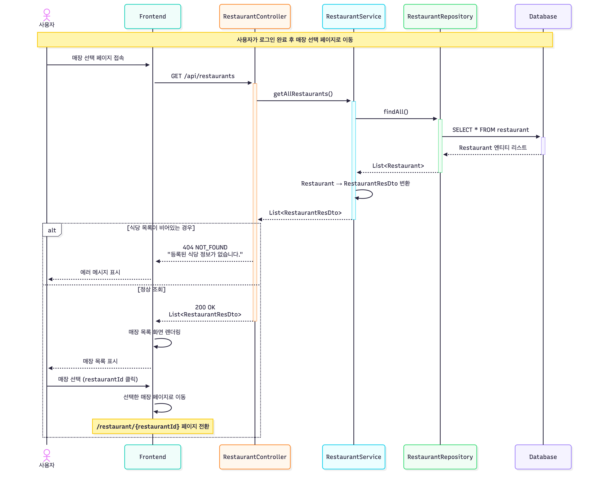

이 시퀀스 다이어 그램은 사용자가 로그인 후 식권을 구매하기 위해 매장을 선택하는 과정을 나타낸 것이다. 사용자가 로그인에 성공하면 자동으로 매장 선택 페이지로 이동된다. 프론트엔드 애플리케이션을 페이지가 로드되는 시점에 `GET /api/restaurants API` 를 호출하여 시스템에 등록된 모든 식당 목록을 요청한다. 이 요청을 HTTP GET 방식으로 전송되며, Authorization 헤더에 JWT 토큰을 포함하여 인증된 사용자임을 증명한다.

`RestaurantController`는 이 요청을 받아 `RestaurantService.getAllRestaurants()` 메서드를 호출한다. `RestaurantService`는 `RestaurantRepository`의 `findAll()` 메서드를 호출한다. 

`RestaurantResDto` 를 통해 응답을 반환한다. 식당 목록이 비어있는 경우는 컨트롤러가 HTTP 상태코드 404 NOT FOUND와 함께 “등록된 식당 정보가 없습니다.”를  반환한다.

그리고 식당이 하나 이상 존재하는 경우, 컨트롤러는 HTTP 상태 코드 200 OK와 함께 `List<RestaurantResDto>` 를 JSON 형태로 직렬화 하여 응답 본문에 포함시킨다.

또한 예상치못한 예외가 발생하면 HTTP 상태 코드 500 INTERNAL SERVER ERROR를 반환한다. 

# 4.7. Buy ticket

### 4.7.1. 매장 메뉴 및 인기 메뉴 조회

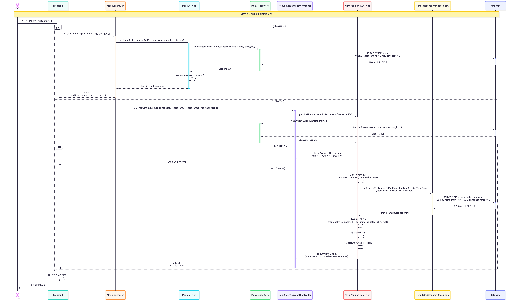

이 시퀀스 다이어그램은 사용자가 특정 매장을 선택한 후 해당 매장의 메뉴 목록과 실시간 인기 메뉴를 조회하는 과정을 나타낸 것이다. 사용자가 매장을 선택하면, 프론트엔드는 해당 매장의 상세 페이지로 이동된다. 페이지가 로드되는 시점에 두 개의 API 요청이 병렬로 전송된다. 

첫 번째 요청은 메뉴 목록 조회이다. `GET /api/menus/{restaurantId}/{category}` API를 호출하는데 `restaurantId` 는 선택한 매장의 ID이고, `category` 는 메뉴 카테고리이다. 해당 시스템에서 메뉴를 여러 카테고리를 분류하는데, 기준은 실제 학식당과 동일하다.

예를 들어 KOREAN'(한식), 'SPECIAL'(특식), 'PORK'(돼지고기), 'A', 'C1', 'C2', 'D' 등이 있다. 프론트엔드는 사용자가 선택한 카테고리나 기본 카테고리를 매개변수로 전달한다. `MenuController` 는 이 요청을 받아 `MenuService.getMenuByRestaurantAndCategory()` 메서드를 호출한다. 서비스는 `MenuRepository` 를 통해 데이터 베이스를 조회한다.

두번째 요청은 인기 메뉴 조회이다. `GET /api/menus/sales-snapshots/restaurant/{restaurantId}/popular-menus` API를 호출하여 해당 매장의 실시간 인기 메뉴를 조회한다. `MenuSalesSnapshotController`는 이 요청을 받아 `MenuPopularityService`에 위임한다. `MenuPopularityService`는 먼저 해당 레스토랑의 모든 메뉴를 조회한다. `MenuRepository.findByRestaurantId()`를 호출하여 `RestaurantId` 를 통해 레스토랑을 조회한뒤 만약 메뉴가 하나도 없으면 `IllegalArgumentException`을 발생시켜 400 BAD_REQUEST 응답을 반환한다. 

메뉴가 존재하면, 서비스는 현재 시각에서 20분을 뺀 시각을 계산한다. `LocalDateTime.now().minusMinutes(20)`을 실행하여 `twentyMinutesAgo` 변수에 저장한다. 다음으로 `MenuSalesSnapshotRepository`를 통해 최근 20분간의 판매 스냅샷 데이터를 조회한다.

그리고 최대 판매량을 찾는다. `menuSalesMap`의 모든 값 중 최대값을 찾는데, 만약 스냅샷 데이터가 없으면 0으로 간주한다. 예를 들어 비빔밥 14개, 돈까스 10개, 김치찌개 14개라면 최대 판매량은 14개이다.

마지막으로 최대 판매량과 동일한 판매량을 가진 모든 메뉴를 필터링한다. 이는 동점 처리를 위한 것으로, 위 예시에서는 비빔밥과 김치찌개가 모두 14개로 동점이므로 두 메뉴 모두 인기 메뉴로 선정된다. 이렇게 필터링된 메뉴들의 이름을 추출하여 리스트로 만든다.

최종적으로 `PopularMenuListRes` DTO를 생성하여 반환한다.

인기메뉴 이름 리스트와 최근 20분간 총 판매량을 반환한다. 프론트엔드는 두 API 요청의 응답을 모두 받으면, 화면에 메뉴 목록과 인기 메뉴 배지를 함께 표시한다. 예를 들어  별도의 "인기 메뉴" 섹션을 상단에 표시할 수 있다. 사용자는 이를 통해 어떤 메뉴가 현재 많이 팔리고 있는지 실시간으로 확인할 수 있으며, 이는 메뉴 선택에 도움을 준다.

매진된 메뉴 처리도 자동으로 이루어진다. 매진된 메뉴는 더 이상 판매되지 않으므로 최근 20분간 판매량이 0이 되고, 자연스럽게 인기 메뉴 순위에서 제외된다. 만약 모든 메뉴가 0개 판매되었다면(예: 오전 개장 직후), 모든 메뉴가 동점 0으로 인기 메뉴가 되는데, 이 경우 프론트엔드에서는 "아직 판매 데이터가 없습니다"와 같은 안내를 표시할 수 있다.

### 4.7.2. 장바구니에 메뉴 추가

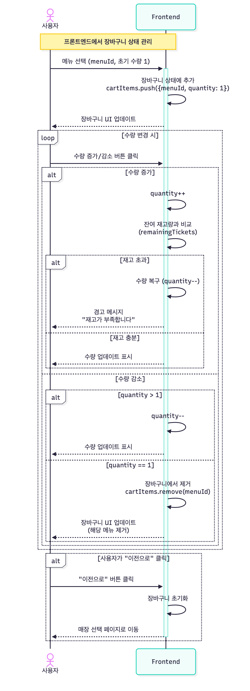

이 시퀀스 다이어그램은 사용자가 메뉴를 선택하여 장바구니에 추가하고 수량을 조정하는 과정을 나타낸 것이다. 이 모든 작업은 프론트엔드에서만 처리되며 서버와의 통신이 발생하지 않는다.

사용자가 메뉴 목록 화면에서 특정 메뉴 카드를 클릭하면, 프론트엔드는 해당 메뉴를 장바구니 상태에 추가한다. 메뉴가 추가될 때 기본 수량은 1로 설정되며, 장바구니 객체는 `{menuId: 1, quantity: 1}` 형태로 저장된다. 장바구니 UI는 즉시 업데이트되어 사용자에게 선택한 메뉴가 추가되었음을 시각적으로 보여준다.

사용자가 장바구니를 열면 담긴 메뉴 목록과 각 메뉴의 수량 조절 버튼(+ / -)이 표시된다. 수량 증가 버튼을 클릭하면 프론트엔드는 먼저 현재 메뉴의 남은 재고량(`remainingTickets`)을 확인한다. 만약 요청하려는 수량이 남은 재고를 초과하면, 프론트엔드는 수량 증가를 거부하고 다시 원래 값으로 되돌린다. 동시에 사용자에게 "재고가 부족합니다" 와 같은 경고 메시지를  표시한다.

수량 감소 버튼을 클릭하면 두 가지 경우가 발생한다. 현재 수량이 2개 이상이면 단순히 1 감소시키고 화면을 업데이트한다. 그러나 현재 수량이 정확히 1개인 상태에서 감소 버튼을 클릭하면, 프론트엔드는 해당 메뉴를 장바구니에서 완전히 제거한다. 그리고 장바구니에서 메뉴가 제거되면 해당 메뉴 카드가 사라지고, 장바구니 총 수량과 금액이 재계산된다.

사용자가 장바구니 화면에서 "이전으로" 버튼을 클릭하면, 프론트엔드는 장바구니 상태를 초기화(빈 배열로 설정)하고 매장 선택 페이지로 리다이렉션한다.

### 4.7.3. 장바구니 요약 요청 전송

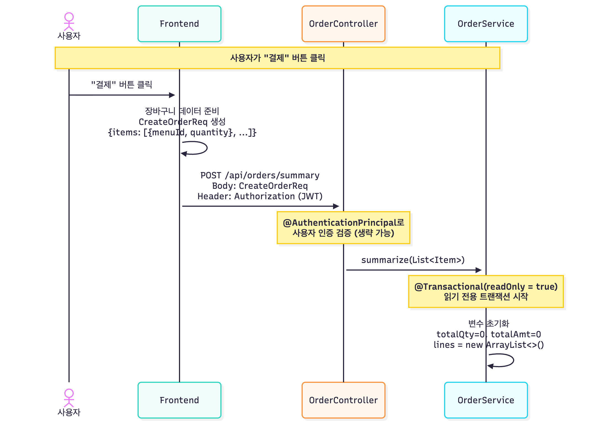

이 시퀀스 다이어그램은 사용자가 장바구니에서 "결제" 버튼을 클릭하여 주문 요약 정보를 서버에 요청하는 초기 단계를 나타낸 것이다. 사용자가 장바구니 화면에서 담긴 메뉴들을 확인한 후 "결제" 또는 "주문하기" 버튼을 클릭하면, 프론트엔드는 서버와의 첫 번째 통신을 시작한다. 이전까지의 모든 작업은 클라이언트 메모리에서만 이루어졌으며, 서버는 사용자가 무엇을 장바구니에 담았는지 전혀 알지 못한다.

프론트엔드는 먼저 장바구니 상태 데이터를 `CreateOrderReq` DTO를 통해 `items` ,`menuId` ,`quantity` 필드에 매핑한다.

변환이 완료되면 프론트엔드는 `POST /api/orders/summary` API를 호출한다. 이 엔드포인트는 실제 주문을 생성하지 않고, 단지 주문 요약 정보(각 메뉴의 가격, 총 수량, 총 금액)를 계산하여 반환하는 역할만 한다. 이를 통해 사용자는 최종 결제 전에 한 번 더 주문 내역을 확인할 수 있다.

HTTP 요청의 헤더에는 `Authorization: Bearer {JWT}` 형태로 JWT 토큰이 포함된다.

컨트롤러는 요청 본문을 `CreateOrderReq` 객체로 자동 역직렬화하여 받고, 이를 `OrderService`의 `summarize()` 메서드에 전달한다. 정확히는 `CreateOrderReq` 전체가 아니라 그 안의 `items` 리스트만 전달할 수도 있다.

`OrderService`의 `summarize()` 메서드는 읽기 전용 트랜잭션으로 데이터베이스에 어떠한 변경도 가하지 않으며, 단지 데이터를 조회하고 계산만 수행한다. 트랜잭션이 시작되면, 서비스는 합계를 계산하기 위한 변수들을 초기화한다. `totalQty` (총 수량), `totalAmt` (총 금액), `lines` (각 메뉴별 상세 정보 리스트)를 0 또는 빈 컬렉션으로 설정한다.

이제 다음 단계에서 장바구니 항목을 순회하며 검증과 계산을 수행한다.

### 4.7.3.1 장바구니 요약 처리

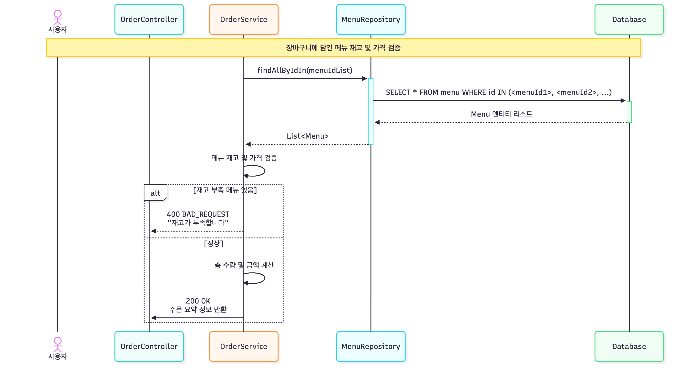

이 시퀀스 다이어그램은 사용자가 장바구니 요약 요청을 전송한 후, 서버에서 재고와 가격을 검증하고 주문 요약 정보를 계산하여 반환하는 과정을 나타내고 있다.

사용자가 "결제" 버튼을 클릭하면 프론트엔드는 `POST /api/orders/summary` API를 호출한다. 이때 요청 본문에는 장바구니에 담긴 메뉴 ID와 수량 정보가 포함된 `CreateOrderReq` DTO가 전송된다.

서버는 요청을 받으면 먼저 JWT 토큰을 검증하여 인증된 사용자임을 확인한다. 이후 요청 본문을 `CreateOrderReq` 객체로 역직렬화하고, `OrderService`의 `summarize()` 메서드를 호출한다.

`summarize()` 메서드는 다음과 같은 순서로 동작을 진행한다.

1. 메뉴 ID 리스트 추출: `CreateOrderReq`에서 메뉴 ID 리스트를 추출한다.
2. 메뉴 정보 조회: `MenuRepository.findAllByIdIn(menuIdList)`를 호출하여 데이터베이스에서 해당 메뉴들의 정보를 조회한다.
3. 재고 및 가격 검증: 조회된 메뉴 정보로 재고와 가격을 검증한다. 이때 각 메뉴의 수량이 0보다 크고, 재고가 충분한지 확인한다.
4. 총 수량 및 금액 계산: 모든 메뉴의 수량을 합산하여 총 수량을 계산하고, 각 메뉴의 가격에 수량을 곱하여 총 금액을 계산한다.
5. 주문 요약 정보 반환: 계산된 총 수량과 총 금액, 그리고 각 메뉴별 정보가 포함된 주문 요약 정보를 컨트롤러에 반환한다.

재고 및 가격 검증로직은 다음과 같다. 각 메뉴에 대해 수량이 0보다 큰지 확인한다. 만약 0 이하인 경우, 잘못된 요청이므로 400 BAD_REQUEST 응답을 반환한다.

각 메뉴의 재고량(`remainingTickets`)이 요청된 수량보다 크거나 같은지 확인한다. 만약 재고가 부족한 경우, 해당 메뉴 ID와 함께 "재고가 부족합니다"라는 메시지를 포함하여 400 BAD_REQUEST 응답을 반환한다. 모든 메뉴에 대해 재고와 가격 검증이 완료되면, 서비스는 총 수량과 총 금액을 계산한다. 이때 각 메뉴의 가격은 `Menu` 엔티티의 `price` 필드를 사용하고, 수량은 `CreateOrderReq`에서 전달받은 값을 사용한다.

최종적으로 컨트롤러는 이 주문 요약 정보를 HTTP 200 OK 응답으로 반환한다. 프론트엔드는 이 응답을 받아 최종 결제 화면에 주문 요약 정보를 표시한다. 사용자는 여기서 최종 금액과 주문 내용을 확인하고, "결제하기" 버튼을 클릭하여 실제 주문을 확정할 수 있다.

### 4.7.3.2. 메뉴 존재 여부 검사

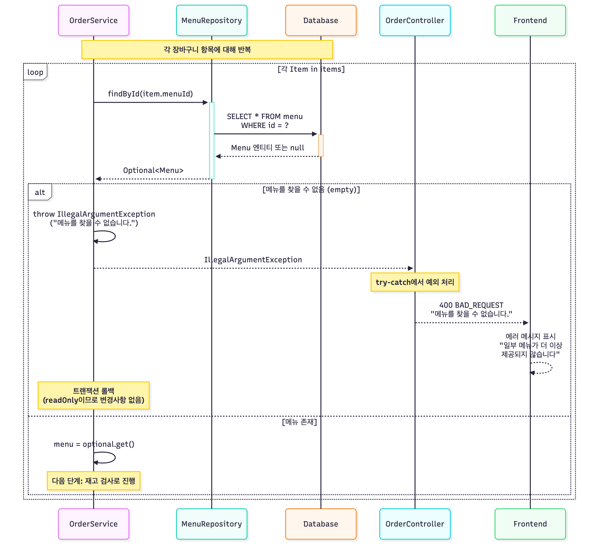

이 시퀀스 다이어그램은 장바구니 요약 과정에서 각 메뉴의 존재 여부를 확인하는 첫 번째 검증 단계를 나타낸다. 이는 데이터 무결성을 보장하기 위한 필수적인 검증 절차이다. `OrderService`의 `summarize()` 메서드는 클라이언트로부터 받은 장바구니 항목 리스트를 순회하며, 각 항목의 `menuId`를 추출하여 `MenuRepository.findById()` 메서드를 호출한다. 데이터 베이스에서 해당 명령어로 바뀐 SQL 쿼리를 통해 해당 ID를 가진 메뉴 행을 찾아 반환하거나, 존재하지 않으면 null을 반환한다. `MenuRepository`는 이 결과를 `Optional<Menu>` 타입으로 감싸서 `OrderService`에 반환한다.

`Optional.empty()`는 값이 없음을 나타내며, `Optional.of(value)`는 값이 있음을 나타낸다. 서비스는 `optional.isEmpty()` 또는 `!optional.isPresent()`를 통해 메뉴가 존재하지 않는지 확인한다.

메뉴를 찾을 수 없으면, `OrderService`는 즉시 `IllegalArgumentException`을 발생시킨다. 예외 메시지는 "메뉴를 찾을 수 없습니다."와 같이 명확하게 작성되어, 사용자가 문제를 이해할 수 있도록 한다. 이 예외는 호출 스택을 타고 `OrderController`로 전파된다.

`OrderController`는 try-catch 블록 또는 `@ExceptionHandler`를 통해 이 예외를 처리하며 상태 코드를 400 BAD_REQUEST로 설정하여 반환한다.

정상적으로 통과했다면 다음 단계로 넘어가 추가적인 검증을 거친다.

### 4.7.3.3. 재고 부족 검사

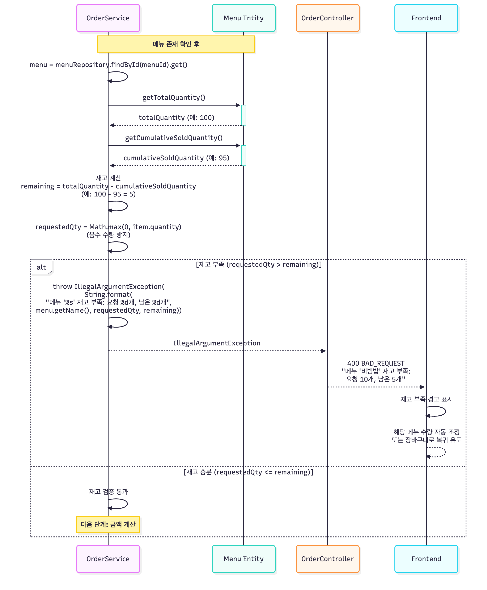

이 시퀀스 다이어그램은 메뉴 존재 확인 후, 각 메뉴의 현재 재고량과 사용자가 요청한 수량을 비교하여 주문 가능 여부를 검증하는 두 번째 검증 단계를 나타내고 있다. `OrderService`는 앞 단계에서 조회한 `Menu` 엔티티 객체를 사용하여 재고 정보를 확인한다. 먼저 `menu.getTotalQuantity()` 메서드를 호출하여 해당 메뉴의 총 재고량을 가져온다. 다음으로 `menu.getCumulativeSoldQuantity()` 메서드를 호출하여 누적 판매량을 가져온다. 이 값은 해당 메뉴가 지금까지 몇 개나 팔렸는지를 나타낸다.  이 값은 주문이 확정될 때마다 증가하며, `menu.sellTicket()` 메서드를 통해 1씩 증가한다.

서비스는 이 두 값을 사용하여 현재 남은 재고를 계산한다. `remaining = totalQuantity - cumulativeSoldQuantity` 공식을 사용한다.

다음으로 사용자가 요청한 수량을 정규화한다. `Math.max(0, item.getQuantity())`를 사용하여 음수 값을 방지한다. 만약 클라이언트 버그나 악의적인 요청으로 수량이 음수로 전달되었다면, 이를 0으로 변환한다. 0인 경우에는 해당 항목을 건너뛰고 다음 항목으로 넘어갈 수 있다.

이제 재고와 요청 수량을 비교한다. `requestedQty > remaining`이면 재고가 부족한 상황이다. 이 경우 `OrderService`는 `IllegalArgumentException`을 발생시킨다. 이 예외는 `OrderController`로 전파되고, 컨트롤러의 예외 처리 로직에 의해 HTTP 400 BAD_REQUEST 응답으로 변환된다. 응답 본문에는 예외 메시지가 포함되어 클라이언트로 전송된다.

읽기 전용 트랜잭션이므로 이 단계에서 실제 재고가 차감되지는 않는다. 단지 현재 재고를 읽어서 확인만 할 뿐이다. 실제 재고 차감은 주문 확정 단계의 `menu.sellTicket()` 메서드에서 비관적 락을 획득한 상태로 안전하게 수행된다.

재고가 충분한 경우(`requestedQty <= remaining`), 검증을 통과하고 다음 단계인 금액 계산으로 진행한다.

### 4.7.3.4. 라인 금액 계산 및 합계 누적

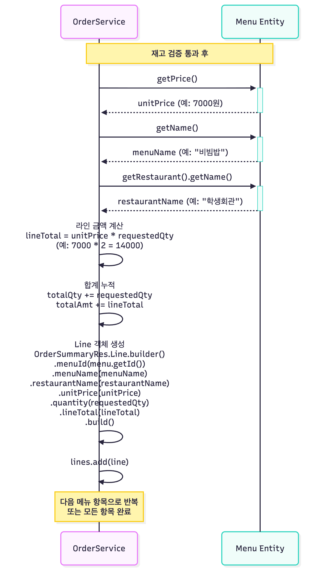

이 시퀀스 다이어그램은 메뉴 존재 확인과 재고 검증을 모두 통과한 각 메뉴 항목에 대해 금액을 계산하고, 전체 주문의 합계에 누적하는 과정을 나타내고 있다.

`OrderService`는 검증을 통과한 `Menu` 엔티티로부터 필요한 정보를 추출한다. 첫 번째로 `menu.getPrice()` 메서드를 호출하여 메뉴의 단가를 가져온다. 이 가격은 메뉴 등록 시 관리자가 설정한 값이며, `Menu` 엔티티의 `price` 필드에 저장되어 있는 값이다.

두 번째로 `menu.getName()` 메서드를 호출하여 메뉴명을 가져온다. "비빔밥", "돈까스" 등의 문자열이 `menuName` 변수에 저장된다.

세 번째로 `menu.getRestaurant().getName()` 메서드를 호출하여 식당 이름을 가져온다. 이는 JPA의 연관관계를 타고 들어가는 것으로, `Menu` 엔티티의 `restaurant` 필드가 `Restaurant` 엔티티를 참조하고 있으며, 이 참조를 통해 `getName()` 메서드를 호출한다. "학생회관", "자연계" 등의 식당명이 `restaurantName` 변수에 저장된다.

이제 금액을 계산한다. 라인 금액(line total)은 단가(unit price)에 수량(quantity)을 곱한 값이다. 수식은 `lineTotal = unitPrice * requestedQty` 이다. 계산된 라인 금액은 전체 주문 합계에 누적된다. `totalQty += requestedQty` 문장은 전체 주문 수량에 현재 항목의 수량을 더한다. 마찬가지로 `totalAmt += lineTotal` 문장은 전체 주문 금액에 현재 항목의 금액을 더한다.

다음으로 `Line` 객체를 생성한다. 이는 `OrderSummaryRes` DTO의 내부 클래스로, 각 주문 항목의 상세 정보를 담는다. 생성된 `Line` 객체는 `lines` 리스트에 추가되며 이 리스트는 나중에 `OrderSummaryRes` 객체의 `lines` 필드로 설정되어, 클라이언트에게 각 주문 항목의 상세 내역을 전달한다. 그리고 이 정보들을 다음 단계에서 `OrderSummaryRes` 객체로 포장하여 클라이언트에 반환한다.

### 4.7.3.5. 최종 요약 응답 생성 및 반환

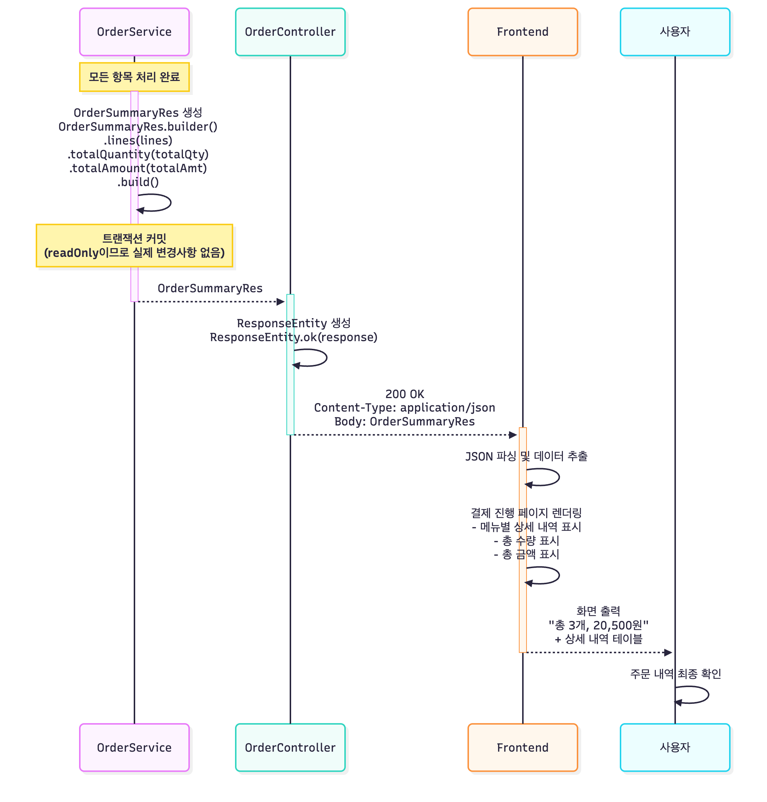

이 시퀀스 다이어그램은 모든 장바구니 항목에 대한 검증과 계산이 완료된 후, 최종 요약 정보를 담은 응답 객체를 생성하여 클라이언트에 반환하고, 사용자에게 결제 확인 화면을 표시하는 과정을 나타낸 것이다.

사용자가 "결제하기" 버튼을 클릭하면 프론트엔드는 `GET /api/orders/summary` API를 호출한다. `OrderController`는 이 요청을 받아 `OrderService`의 `getOrderSummary()` 메서드를 실행한다.

서비스는 로직 수행에 앞서, JWT 토큰이 없거나 만료되었는지(401 UNAUTHORIZED), 또는 사용자가 해당 요청에 대한 권한이 있는지(403 FORBIDDEN)를 먼저 확인한다.

보안 검증을 통과하면, 장바구니가 비어있거나, 메뉴를 찾을 수 없거나, 재고가 부족한 경우 등 비즈니스 로직 상 유효하지 않은 주문 항목이 존재할 경우 400 BAD REQUEST를 반환한다. 

만약 이 모든 검증을 성공적으로 통과하면, 서비스는 검증된 항목들을 바탕으로 상세 주문 내역 리스트(`lines`), 총수량(`totalQty`), 총금액(`totalAmt`)을 최종 계산한다. 이 정보들은 빌더 패턴을 통해 `OrderSummaryRes` DTO로 포장되어 컨트롤러에 반환되며, 컨트롤러는 `ResponseEntity.ok()`를 사용해 이 DTO를 본문에 담아 `HTTP 200 OK` 응답을 프론트엔드로 전송한다. (만약 이 과정에서 QR 생성 실패 등 예측하지 못한 서버 내부 오류가 발생하면 500 INTERNAL SERVER ERROR가 반환된다.)

최종적으로 200 응답을 받은 프론트엔드는 "총 3개, 20,500원"과 같이 계산된 요약 정보를 사용자에게 표시하여 결제 전 최종 확인을 받는다.

### 4.7.4. 주문 확정 및 식권 발급

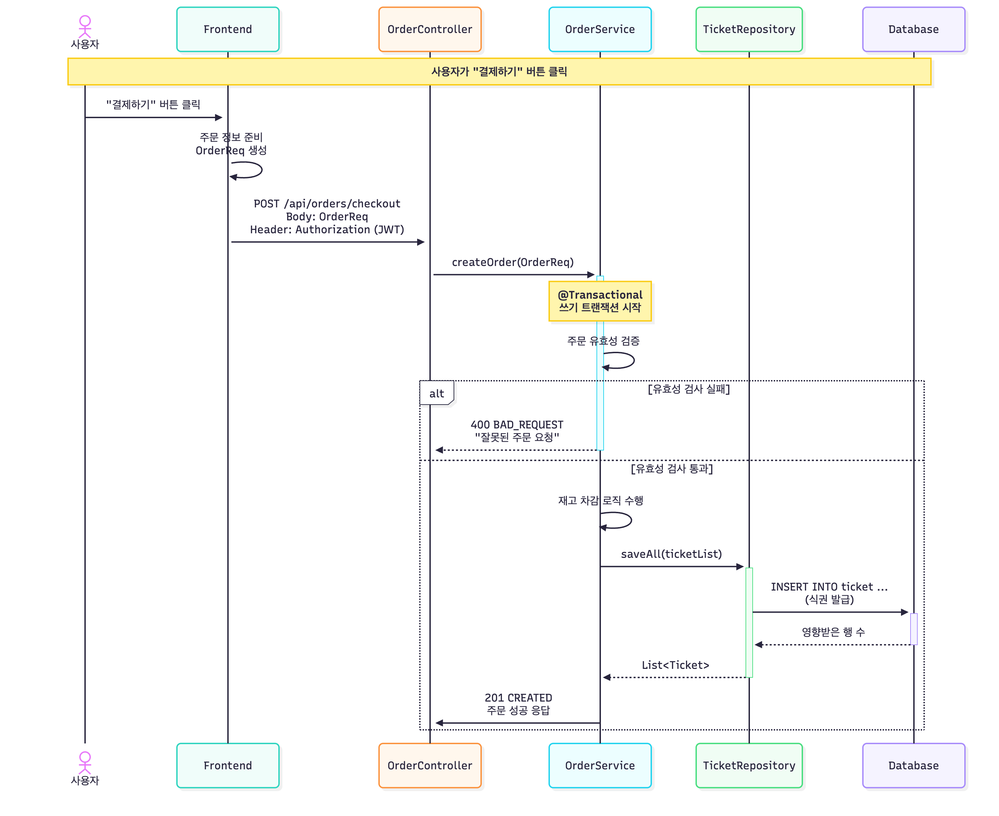

이 시퀀스 다이어그램은 사용자가 주문을 확정하고 식권이 발급되는 과정을 나타내고 있다.

사용자가 장바구니 화면에서 "결제하기" 버튼을 클릭하면, 프론트엔드는 `POST /api/orders/checkout` API를 호출한다. 이 요청에는 JWT 토큰과 함께 주문 정보가 포함된 `OrderReq` DTO가 전송된다.

서버는 요청을 받으면 먼저 JWT 토큰을 검증하여 인증된 사용자임을 확인한다. 이후 요청 본문을 `OrderReq` 객체로 역직렬화하고, `OrderService`의 `createOrder()` 메서드를 호출한다.

`OrderService`의 `createOrder()` 메서드는 주문 요청에 대한 유효성 검사를 수행한 후, 재고 차감 로직을 수행하고 최종적으로 식권을 발급한다. 유효성 검사에서는 주문 항목의 유효성, 재고 유무, 가격 변동 등을 확인한다. 만약 유효성 검사에 실패하면, 400 BAD_REQUEST 응답과 함께 오류 메시지를 반환한다.

유효성 검사를 통과하면, 서비스는 다음과 같은 재고 차감 로직을 수행한다.

1. 장바구니에 담긴 각 메뉴에 대해 재고를 차감한다. 이때 `Menu` 엔티티의 `remainingTickets` 필드를 감소시킨다.
2. 만약 재고가 0 이하가 되는 경우, 해당 메뉴는 더 이상 주문할 수 없으므로 예외를 발생시킨다. 이 예외는 `@ExceptionHandler`에 의해 처리되어 400 BAD_REQUEST를 반환한다.
3. 모든 메뉴에 대해 재고 차감이 완료되면, 변경된 `Menu` 엔티티를 데이터베이스에 저장한다.

재고 차감이 완료되면, 서비스는 다음과 같은식권 발급 로직을 수행한다.

1. 주문에 대한 식권 정보를 담은 `Ticket` 엔티티 리스트를 생성한다. 이때 각 식권은 UUID 형태의 QR 코드를 가진다.
2. `TicketRepository.saveAll(ticketList)`를 호출하여 모든 식권을 데이터베이스에 저장한다.
3. 발급된 식권 리스트가 `Ticket` 엔티티 형태로 반환된다.

모든 과정이 정상적으로 완료되면, 서비스는 HTTP 201 CREATED 응답과 함께 주문 성공 정보를 반환한다. 프론트엔드는 이 정보를 받아 주문 완료 화면을 표시하고, 사용자는 발급된 식권을 확인할 수 있다.

# 4.8. Check ticket

### 4.8.1. 미사용 식권 조회

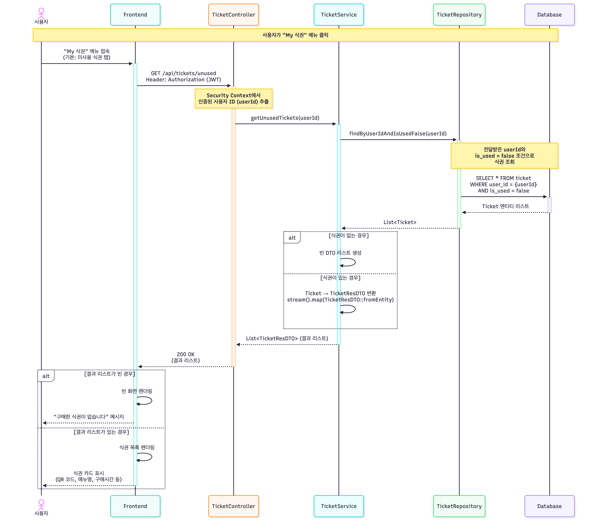

이 시퀀스 다이어그램은 사용자가 "My 식권" 메뉴에서 자신이 구매한 미사용 식권 목록을 조회하는 과정을 나타내고 있다.

사용자가  "My 식권"메뉴에 접근하면, 프론트엔드는 `GET /api/tickets/unused` API를 호출하며 `Authorization` 헤더에 JWT 토큰을 함께 전송한다. 이 요청은 Spring Security의 필터 체인을 통과하며, JWT 토큰 검증 후 추출된 사용자 정보가`SecurityContext`에 저장된다. 

`TicketController`는 `SecurityContext` 에서 사용자 ID를 가져와 `TicketService`의 `getUnusedTickets(userId)` 메서드를 호출한다. 그리고 `TicketService`는 `TicketRepository`의 `findByIsUsedFalse()` 메서드를 호출한다. 서비스는 `TicketRepository`를 통해 `user_id`가 일치하고 `is_used`가 `false`인 식권 데이터를 데이터베이스에서 조회합니다. 이때, 조회된 식권이 하나도 없다면 레포지토리는 빈 리스트를 반환하고, 식권이 하나 이상 존재한다면 해당 엔티티 리스트를 반환한다.

서비스 레이어는 이 리스트를 `List<TicketResDTO>`로 변환하는데, 식권이 없는 경우에는 빈 DTO 리스트를, 식권이 있는 경우에는 각 엔티티를 DTO로 매핑한 리스트를 생성한다. 컨트롤러는 이 DTO 리스트를 HTTP 200 OK 응답으로 프론트엔드에 반환한다.

최종적으로 프론트엔드는 반환된 리스트가 비어있으면 "구매한 식권이 없습니다"라는 메시지를, 데이터가 있다면 식권 목록(QR 코드, 메뉴명 등)을 화면에 렌더링하여 사용자에게 보여준다.

### 4.8.2. 만료된 식권 조회

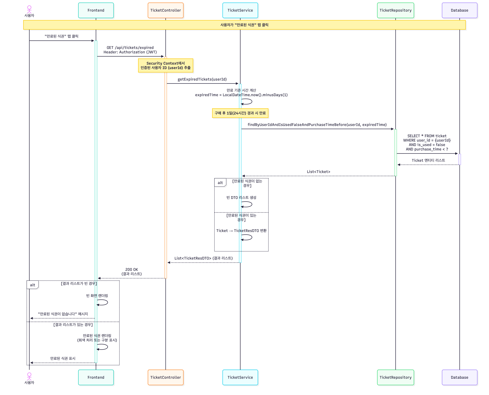

이 시퀀스 다이어그램은 사용자가 "My 식권" 페이지에서 "만료된 식권" 탭을 클릭하여, 구매 후 24시간이 경과한 미사용 식권 목록을 조회하는 과정을 나타내고 있다.

사용자가 탭을 클릭하면 프론트엔드는 `GET /api/tickets/expired` API를 `Authorization` 헤더에 JWT 토큰을 담아 호출한다. 서버에서는 Spring Security가 토큰을 검증하고 `SecurityContext`에 사용자 정보를 저장하며, `TicketController`는 이 컨텍스트에서 `userId`를 가져와 `TicketService`의 `getExpiredTickets(userId)` 메서드를 호출한다.

서비스 레이어는 '구매 후 24시간(1일) 초과'라는 만료 정책에 따라, `LocalDateTime.now().minusDays(1)`을 실행하여 만료 기준 시간(`expiredTime`)을 먼저 계산한다. 그런 다음, `TicketRepository`의 `findByUserIdAndIsUsedFalseAndPurchaseTimeBefore(userId, expiredTime)` 메서드를 호출하여, 해당 사용자의 식권 중 **(1) 아직 사용되지 않았고(is_used=false)** **(2) 구매 시간이 만료 기준 시간보다 이전**인 식권들만 데이터베이스에서 조회합니다.

레포지토리로부터 `List<Ticket>`을 전달받은 서비스는 이를 `List<TicketResDTO>`로 변환하여 컨트롤러에 반환합니다. 컨트롤러는 이 DTO 리스트를 `HTTP 200 OK` 상태와 함께 JSON 배열로 프론트엔드에 응답합니다. 최종적으로 프론트엔드는 반환된 리스트가 비어있으면 "만료된 식권이 없습니다" 같은 안내 메시지를, 데이터가 있다면 만료되었음을 시각적으로 구분(예: 회색 처리)하여 목록을 화면에 렌더링합니다.

# **4.9. Use Ticket**

### 4.9.1. 식권 사용(QR 사용)

사용자가 매장에서 식권을 사용하는 과정을 나타내는 sequence diagram이다. 사용자가 식권 사용을 위해 QR 코드를 스캔하면 누르면 `QrController`로 식권 사용 요청이 전송된다.

`QrController`는 요청을 처리하기 위해 `QrService`에 권한 검증 및 식권 사용 처리를 요청한다.

`QrService`는 `SecurityUtil`을 통해 현재 로그인한 사용자의 권한을 조회하고, 권한이 없을 경우 예외를 발생시켜 `403` 응답을 반환한다.권한이 확인되면 `QrService`는 `TicketRepository`를 호출하여 데이터베이스에서 QR 코드에 해당하는 식권 정보를 조회한다.

조회 결과가 존재하지 않으면 예외를 발생시켜 “QR을 찾을 수 없습니다.” 메시지와 함께 `404 Not Found`응답을 반환한다. 조회된 식권이 이미 사용된 상태일 경우 “이미 사용된 QR입니다.” 메시지를 반환하고, 추가 처리를 수행하지 않는다. 정상적인 식권일 경우 `QrService`는 식권의 사용 상태를 변경하고(사용 여부, 사용 시간) `TicketRepository`를 통해 변경된 정보를 데이터베이스에 업데이트한다.

그리고 `QrService`는 병렬적으로 `S3Service`에 QR 이미지 삭제를 요청한다. 모든 과정이 완료되면 `QrService`는 식권 사용 성공 응답을 `QrController`에 반환하고, 최종적으로 사용자에게 `200` 응답과 함께 “QR 사용 성공” 메시지가 표시된다. 이 과정을 통해 사용자는 식권을 성공적으로 사용하여 학식을 이용할 수 있으며, 시스템은 식권 상태를 실시간으로 업데이트하고 불필요한 QR 이미지를 정리한다.

### 4.9.2. 음식 수령 완료

사용자가 매장에서 음식을 수령했을 때, 식권 상태를 수령 완료 상태로 변경하는 과정을 나타내는 시퀀스 다이어그램이다. 사용자에게 음식 수령 요청을 보내고 사용자가 음식 수령 버튼을 누르면 `TicketController`로  요청이 전송된다. `TicketController`는 요청을 전달받아 `TicketService`의 티켓 수령 메서드를 호출한다.

`TicketService`는 먼저 `TicketRepository`를 통해 해당 ID의 식권을 데이터베이스에서 조회한다.

조회 결과가 없을 경우 “식권을 찾을 수 없습니다.”라는 메시지와 함께 `404 Not Found` 응답을 반환한다.

조회된 식권이 이미 수령 완료 상태라면 “이미 수령 처리된 식권입니다.”라는 메시지를 반환하며, 더 이상 처리하지 않는다.

아직 사용되지 않은 식권이거나, 사용이 완료되지 않은 경우에도 “사용 완료된 식권만 수령 가능합니다.” 메시지와 함께 `400` 응답을 반환한다. 정상적으로 사용 완료된 식권이라면, `TicketService`는 수령 완료 메서드를 호출하여 수령 시간을 현재 시각으로 설정하고 상태를 변경한다. 변경된 식권 정보는 `TicketRepository`의 `save()` 메서드를 통해 데이터베이스에 저장된다. 

저장된 식권 엔티티가 반환되면, `TicketService`는 이를 `TicketResDTO`로 변환하여 `TicketController`로 전달한다. 마지막으로 `TicketController`는 사용자에게 `200 OK` 응답과 함께 “음식 수령 완료” 메시지를 반환한다.

이 과정을 통해 사용자는 실제 매장에서 음식을 수령한 사실을 시스템에 반영할 수 있으며, 데이터베이스에는 수령 시각이 기록되어 이후 통계 및 관리에 활용된다.

# **4.10. Manage Store**

### **4.10.1. 식당 목록 반환**

사용자가 시스템에서 전체 식당 목록을 조회하는 과정을 나타내는 sequence diagram이다.

사용자가 식당 목록 조회를 요청하면 `RestuarantController`는 해당 요청을 받아 `RestaurantService`의 `getAllRestaurants()` 메서드를 호출한다. `RestaurantService`는 `RestaurantRepository`를 통해 데이터베이스에서 모든 식당 정보를 조회한다. 데이터베이스는 전체 식당 리스트를 반환하며, 서비스 계층은 이를 컨트롤러로 전달한다.

등록된 식당 정보가 없을 경우, 컨트롤러는 `404 Not Found` 응답과 함께 “등록된 식당 정보가 없습니다.” 메시지를 반환하고, 식당 목록이 존재하는 경우 `200` 응답과 함께 조회 결과를 사용자에게 반환한다.

### **4.10.2. 식당 생성**

사용자가 새로운 식당을 등록하는 과정을 나타내는 sequence diagram이다.

사용자가 식당 생성을 요청하면 `RestuarantController`는 전달받은 DTO를 `RestaurantService`에 전달한다. `RestaurantService`는 `SecurityUtil`을 호출하여 현재 사용자의 권한을 검증하며, 관리자 권한이 없을 경우 `403` 응답과 함께 “관리자 권한 필요” 메시지를 반환한다.

관리자 권한이 확인되면 서비스는 새로운 식당 객체를 생성하여 `RestaurantRepository`의 `save()`를 통해 데이터베이스에 저장한다. 저장 성공 시 `201` 응답이 반환되며, 사용자에게 “식당 생성 성공” 메시지가 표시된다.

### **4.12.3. 식당 수정**

사용자가 기존 식당 정보를 수정하는 과정을 나타내는 sequence diagram이다.

사용자가 식당 수정  요청을 보내면 `RestuarantController`는 요청 데이터를 `RestaurantService`로 전달한다. `RestaurantService`는 `SecurityUtil`을 이용하여 관리자 권한을 확인하고, 권한이 없을 경우 `403` 응답을 반환한다. 권한이 확인되면 `RestaurantRepository`를 통해 지정된 식당 ID를 조회한다.

해당 식당이 존재하지 않으면 `404 Not Found` 예외가 발생하며, 존재할 경우 수정된 정보를 반영한 후 `save()` 메서드를 통해 데이터베이스를 업데이트한다. 업데이트가 완료되면 `200` 응답이 반환되어 “식당 수정 성공” 메시지가 사용자에게 전달된다.

### **4.12.4. 식당 삭제**

사용자가 시스템에서 특정 식당을 삭제하는 과정을 나타내는 sequence diagram이다.

사용자가 식당 삭제 요청을 보내면 `RestuarantController`는 요청을 `RestaurantService`로 전달한다.

`RestaurantService`는 `SecurityUtil`을 통해 관리자 권한을 검증하며, 권한이 없을 경우 `403` 응답을 반환한다.

관리자 권한이 확인되면 `RestaurantRepository`의 `findById()`를 통해 삭제 대상 식당을 조회한다. 조회 결과가 없을 경우 `404 Not Found` 예외가 발생하며, 식당이 존재하면 `deleteById()`를 통해 데이터베이스에서 해당 식당 정보를 삭제한다.

삭제가 완료되면 `204` 응답이 반환되어 “식당 삭제 성공” 메시지가 사용자에게 표시된다.

# **4.11. Register Menu**

사용자가 시스템에 새로운 메뉴를 등록하는 과정을 나타내는 sequence diagram이다.

사용자가 메뉴 등록 화면에서 메뉴명, 가격, 카테고리, 설명, 이미지 등을 입력한 후 등록하기 버튼을 누르면

`MenuController`로 메뉴 등록 요청 이 전송된다. `MenuController`는 요청을 처리하기 위해 `MenuService`를 호출하며, 서비스 계층에서 관리자 권한 검증과 메뉴 등록 로직을 수행한다. `MenuService`는 먼저 `SecurityUtil`을 호출하여 현재 로그인한 사용자의 권한을 확인하고, 관리자 권한이 없는 경우 `403 Forbidden` 예외를 발생시켜 “관리자 권한 필요” 메시지를 사용자에게 반환한다.

권한이 확인되면 `MenuService`는 전달받은 이미지 파일을 S3에 업로드하기 위해 `S3Service`를 호출한다.

`S3Service`는 이미지를 저장한 후 해당 파일의 공개 접근 URL을 반환한다. 이 URL은 추후 메뉴 조회 시 이미지 표시를 위해 메뉴 엔티티에 포함된다. 이미지 업로드가 완료되면 `MenuService`는 `MenuRepository`의 `save()` 메서드를 호출하여 메뉴 정보(이름, 가격, 카테고리, 이미지 URL 등)를 데이터베이스에 저장한다.

데이터베이스는 저장된 메뉴 엔티티를 반환하고 서비스 계층은 이를 컨트롤러로 전달한다. `MenuController`는 등록이 완료되면 사용자에게 “메뉴 생성 성공” 메시지와 함께 `201 Created` 응답을 반환한다. 사용자는 성공적으로 새 메뉴를 등록할 수 있다.

# **4.12. Delete Menu**

사용자가 시스템에서 등록된 메뉴를 삭제하는 과정을 나타내는 sequence diagram이다.

사용자가 메뉴 삭제 버튼을 누르면 `MenuController`로 메뉴 삭제 요청이 전송된다. `MenuController`는 요청을 처리하기 위해 `MenuService`에 메뉴 삭제를 요청하며, 서비스 계층에서 권한 검증과 삭제 로직이 수행된다. `MenuService`는 먼저 `SecurityUtil`을 호출하여 현재 로그인한 사용자의 권한을 조회한다.

권한이 없는 경우 `403` 예외를 발생시켜 “관리자 권한 필요” 메시지를 사용자에게 반환한다. 관리자 권한이 확인되면 `MenuService`는 `MenuRepository`를 통해 해당 메뉴 ID로 데이터베이스를 조회한다.

조회 결과가 존재하지 않으면 `404 Not Found` 응답과 함께 “메뉴를 찾을 수 없습니다.” 메시지를 반환한다.

삭제 대상 메뉴가 존재하는 경우 `MenuService`는 S3 서버에 저장된 메뉴 이미지를 삭제하기 위해 `S3Service`를 호출한다. 이미지 삭제 과정에서 예외가 발생하더라도 메인 로직에 영향을 주지 않도록 처리한다.

이후 `MenuService`는 `MenuRepository`의 `deleteById()` 메서드를 호출하여 데이터베이스에서 해당 메뉴를 삭제한다. 삭제가 완료되면 `MenuService`는 `204` 응답을 `MenuController`로 반환하고 컨트롤러는 사용자에게 삭제 성공 메시지와 함께 최종 응답을 전송한다. 관리자는 불필요한 메뉴 정보를 관리할 수 있다.

# **4.13.Edit Menu**

사용자가 시스템에서 기존 메뉴 정보를 수정하는 과정을 나타내는 sequence diagram이다.

사용자가 메뉴 수정 버튼을 클릭하고 변경할 메뉴명, 가격, 카테고리, 설명, 이미지 등을 입력하여 요청을 전송하면 `MenuController`가 이를 수신한다. `MenuController`는 요청 데이터를 `MenuService`에 전달하여 권한 검증 및 수정 처리를 요청한다. `MenuService`는 `SecurityUtil`을 호출하여 현재 로그인한 사용자의 권한을 확인하고관리자 권한이 없는 경우 `403` 예외를 발생시켜 관리자 권한 필요 메시지를 반환한다.

권한이 확인되면 `MenuService`는 `MenuRepository`의 `findById()` 메서드를 호출하여 해당 메뉴의 존재 여부를 확인한다. 조회 결과가 존재하지 않으면 `404 Not Found` 예외가 발생하며, “메뉴를 찾을 수 없습니다.” 메시지가 사용자에게 반환된다. 수정 대상 메뉴가 존재하고 권한이 유효할 경우 `MenuService`는 요청된 변경사항을 반영하여 메뉴 정보를 업데이트한다.

사용자가 새로운 이미지를 업로드한 경우 `S3Service`를 통해 새 이미지를 업로드하고 그 URL을 받아 메뉴 정보에 반영한다. 이전 이미지 파일은 `S3Service`를 통해 삭제 요청을 보낸다. 삭제 중 예외가 발생하더라도 메인 로직에 영향을 주지 않는다.

이미지 처리와 데이터 변경이 완료되면 `MenuService`는 `MenuRepository`의 `save()`를 통해 변경된 메뉴 정보를 데이터베이스에 업데이트한다. 업데이트가 성공적으로 수행되면 `200` 응답과 함께 수정 성공 메시지가 사용자에게 반환된다. 이 과정을 통해 관리자는 메뉴 정보를 수정할 수 있다.