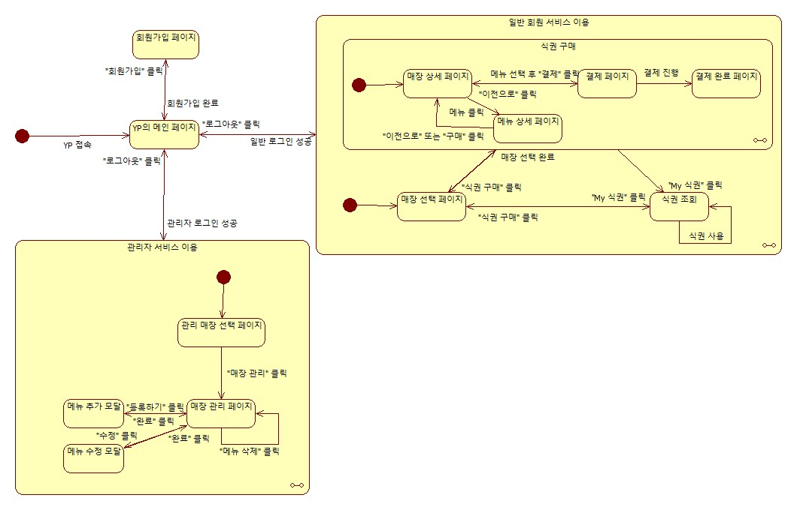

# State Machine Diagram
아래의 첨부된 이미지는 “Yummy Pass" 시스템의 State machine diagram을 그린 것이다. 웹사이트 특성을 고려하여, 사용자가 특정 페이지로 이동하거나 모달을 여는 것을 ”상태“라고 보고 diagram을 작성하였다. 

| **State** | **설명** |
| --- | --- |
| **YP의 메인 페이지** | YP에 처음 접속했을 때 이용자가 볼 수 있는 페이지를 가리키는 상태다. 해당 페이지에서 회원가입 버튼을 클릭하면 “회원가입 페이지” 상태로 이동한다. 로그인을 성공했을 때 사용자가 관리자라면 “관리자 서비스 이용” 상태로, 아니라면 “일반 회원 서비스 이용” 상태로 이동한다.  |
| **회원가입 페이지** | YP 서비스에 등록되지 않은 사용자가 회원가입을 할 수 있는 페이지로 이동한 상태다. 회원가입이 완료되면 “YP의 메인 페이지” 상태로 이동한다. |
| **관리자 서비스 이용** | "관리 매장 선택 페이지“, ”매장 관리 페이지“, ”메뉴 추가 모달“, “메뉴 수정 모달”을 포함하는 복합 상태다. 이 복합 상태에서는 언제든지 “로그아웃”을 클릭해 “YP의 메인 페이지” 상태로 이동할 수 있다. |
| **관리 매장 선택 페이지** | 관리자 계정으로 YP에 로그인했을 때 가장 먼저 확인할 수 있는 페이지를 가리키는 상태다. 관리하고자 하는 매장을 클릭하면 해당하는 매장의 “매장 관리 페이지” 상태로 이동할 수 있다. |
| **매장 관리 페이지** | 매장의 메뉴를 나타내는 목록에서 어느 항목을 삭제하거나 수정, 추가할 수 있는 페이지로 이동한 상태다. 해당 페이지에서 “메뉴 삭제”를 클릭할 경우 다른 상태로 이동하지 않고 삭제만 수행한다. “등록하기” 버튼을 클릭할 경우 “메뉴 추가 모달” 상태로 이동하며, 목록에서 “수정”을 클릭할 경우 “메뉴 수정 모달” 상태로 이동한다.  |
| **메뉴 추가 모달** | 원하는 메뉴를 추가할 수 있는 모달을 연 상태다. 메뉴를 추가한 후 “완료”를 클릭하면 “매장 관리 페이지” 상태로 이동한다. 이동한 상태에서 추가된 메뉴를 조회할 수 있다. |
| **메뉴 수정 모달** | 원하는 메뉴를 수정할 수 있는 모달을 연 상태다. 메뉴를 수정한 뒤 “완료”를 클릭하면 “매장 관리 페이지” 상태로 이동한다. 이동한 상태에서 수정된 메뉴를 조회할 수 있다. |
| **일반 회원 서비스 이용** | "식권 구매“라는 복합 상태와 “결제 완료 페이지”, “식권 조회”를 포함하는 복합 상태다. 이 복합 상태에서는 언제든지 “로그아웃”을 클릭해 “YP의 메인 페이지” 상태로 이동할 수 있다. |
| **매장 선택 페이지** | YP에 로그인했을 때 가장 먼저 확인할 수 있는 페이지를 가리키는 상태다. 이 상태에서 일반 사용자는 식권을 구매하고자 하는 매장을 선택할 수 있다. 매장을 선택해 클릭하면 선택한 매장의 “매장 상세 페이지” 상태로 이동한다. |
| **식권 구매** | "매장 상세 페이지“, “메뉴 상세 페이지”,  ”결제 페이지“, ”결제 완료 페이지“를 포함하는 복합 상태다. 이 복합 상태에서는 내비게이션바에 존재하는 “식권 구매” 또는 “My 식권”을 클릭하여 언제든지 “매장 선택 페이지” 상태와 “식권 조회” 상태로 이동할 수 있다.  |
| **매장 상세 페이지** | 특정 매장에서 판매중인 메뉴를 조회할 수 있는 페이지로 이동한 상태다. 해당 페이지에서 원하는 메뉴를 클릭해 “메뉴 상세 페이지” 상태로 이동해 세부사항을 조회하고, 결제 항목에 추가할 수 있다. 선택한 메뉴 결제를 위하여 “결제”를 클릭하면 “결제 페이지” 상태로 이동한다.  |
| **메뉴 상세 페이지** | 특정 매장에서 판매중인 메뉴의 세부사항을 조회 가능한 페이지로 이동한 상태다. 해당 페이지에서는 메뉴의 잔여 식권 수량, 메뉴 가격, 수령까지의 대기 시간을 확인할 수 있다. 이 상태에서 “이전으로”를 클릭하면 “매장 상세 페이지” 상태로 이동하고, “구매”를 클릭하면 “매장 상세 페이지” 상태로 이동한다. 후자의 경우, “매장 상세 페이지” 상태에 구매를 위해 선택한 메뉴가 표시된다. |
| **결제 페이지** | 사용자가 원하는 메뉴의 식권을 구매하기 위하여 결제 페이지로 이동한 상태다. 이 페이지에서는 결제와 관련된 정보를 확인할 수 있다. “이전으로”를 클릭하면 “매장 상세 페이지” 상태로 돌아가 메뉴를 다시 선택할 수 있다. “결제”를 클릭하면 결제가 진행되며 “결제 완료 페이지” 상태로 이동한다. |
| **결제 완료 페이지** | 사용자가 “결제”를 클릭해 실제 결제를 완료하고 식권의 QR코드가 생성된 상태다. 이 페이지의 본문에서 “메인으로”를 클릭하면 “매장 선택 페이지” 상태로 이동하며, “My 식권”을 클릭하면 “식권 조회 페이지” 상태로 이동한다. |
| **식권 조회 페이지** | 사용자가 현재까지 구매한 식권의 목록을 확인할 수 있는 상태다. 이 페이지에서는 만료된 식권과 사용가능한 식권 두 가지 상태의 식권을 조회할 수 있다. 사용자는 매장의 QR 스캐너에 사용 가능한 식권의 QR코드를 인식시키는 것으로 식권을 사용하여 “식권 사용 확인 모달” 상태로 이동한다. 내비게이션바의 “식권 구매”를 클릭하면 “매장 선택 페이지” 상태로 이동한다. |
| **식권 사용 확인 모달** | 사용자가 식권을 사용했을 때 모달이 열리는 상태다. 사용자는 이 상태에서 본인이 식권을 사용하고 학식을 수령했음을 인증하기 위해 “확인”을 클릭할 수 있다. “확인”을 클릭하면 “식권 조회 페이지” 상태로 이동한다. |